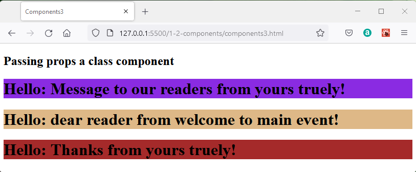

## React Components

An advantgage of react is that it allows the programmer to divide the application into a number of reusable components.  So once you have created, say, a counter component you can use it in several places in the app or in other apps.

If components are to be moveable to other apps it is important that they are completely stand-alone or "pure".

React allows for *class* components and *function* components.  

The obvious advantage of a class is that it is stand-alone, it will feature methods and properties and will be able to retain values.  This remembering values between usages of the class is called "maintaining state".  Unfortunately extensive usage of classes can make larger programmes difficult to understand and the modern approach is to become less reliant on classes.

The advantage of a function is that it is easy to see arguments going in and a response happening or value being returned.  In older usage styles, global variables might have been read by functions meaning that the output of the function was not entirely controlled by the arguments.  The modern style is to avoid this and ensure that the result of a function is dependant only on the arguments so that same values in produce the same result.  This describes a "pure" function.

The drawback of a function is that it is created in memory when it is called and disposed of when it has run.  The function running for the 100th time has no way of knowing any details from the first 99 calls.  So a function does not maintain state.

React Hooks are a way of maintaining state outside the function and then allowing the called function to hook into this state memory.  
Allowing a function to maintain state means that the function component becomes much more useful and preferred in the modern style.

Class components have been around for a long time and so are established in codebases and are described in books and blogs.  You must be aware of class components and how they work.  However, as you proceed in developing your own react code I recommend using function components in preference.

So in the next section the basic syntax of the two types of components is described.

Examples will continue to work without a development environment using the following standard code in the head of the HTML document to link to Javascript libraries provided through a content distribution network.


```HTML
 <!DOCTYPE html>
<html>
  <head>
    <meta charset="UTF-8" />
    <title>Components1</title>
    <script crossorigin src="https://unpkg.com/react@18/umd/react.development.js"></script>
    <script crossorigin src="https://unpkg.com/react-dom@18/umd/react-dom.development.js"></script>
    <script src="https://unpkg.com/babel-standalone@6.26.0/babel.js"></script>
    <script src="example.js" type="text/babel"></script>
    <link rel="stylesheet" type="text/css" href="style.css">
</head>
  <body>
    <h2>Descriptive note </h2>
    <main   id="main"></main>
  </body>
</html>
```

This approach is slow and should only be used for development and not production.  

## React Components

One of the benefits of React is that code is built up from reusable components.  A component built for one application should be easily ported into another.  As a page developer we will gather a library of components which we have written or adapted which we can use as starting points for new projects.

The react compnents come in two varieties:

### Class Component

Working files **components1.html** and **components1.js**

A class component is a class which features a render method which returns the user interface typically expressed in JSX.

```javaScript
const main   = ReactDOM.createRoot(document.getElementById("main"));

class Message extends React.Component {
    render() {
        return <h1>Hello world from Class Component!</h1>;
    }
  } 

main.render(<Message />);
```
In this example the class is referenced by the `<Message />` element and this is substituted by the returned text from the message renderer method.

This is displayed as:


### Class Component Props

Working files **components2.html** and **components2.js**

Class components are able to respond to props to modify the rendered JSX.  

Within a class the *this* keyword is use to refer to items belonging to the current instance of the class.  A particular prop is named within brackets as {this.props.propName}.

In calling the component the `<Classname>` is estended by adding attributes as name value pairs matching the prop names in the class `<Message propName1="value1" propName2="value2"/>`

In this example the props named reader and author are passed.

```javaScript
const main   = ReactDOM.createRoot(document.getElementById("main"));

class Message extends React.Component {
    render() {
        return <h1>Hello {this.props.reader} from {this.props.author}!</h1>;
    }
  } 

main.render(<Message reader="dear reader" author="yours truely"/>);
```

The prop values are passed to the class when it is invoked within the root.render which places the returned code into a container.

This renders as:


### Class components props and containers

Working files **components3.html** and **components3.js**

The class can be invoked in different renderers to write different messages to three distinct containers.

```javaScript
const header   = ReactDOM.createRoot(document.getElementById("header"));
const main     = ReactDOM.createRoot(document.getElementById("main"));
const footer   = ReactDOM.createRoot(document.getElementById("footer"));

class Message extends React.Component {
    render() {
        return <h1>Hello: {this.props.reader} from {this.props.author}!</h1>;
    }
  } 

header.render(<Message reader="Message to our readers" author="yours truely"/>);  
main.render(  <Message reader="dear reader"            author="welcome to main event"/>);
footer.render(<Message reader="Thanks"                 author="yours truely"/>);
```

This shows the effect of different prop values being passed to a single class.

This renders as:



### Function Components

Working files **components4.html** and **components4.js**

A function component is a function which returns the user interface typically expressed in JSX.

The syntax of the function is simpler than the react class component, here it simply has a return statement passing back JSX.

The calling of the function component is exactly the same as the calling of the class component and is represented here by the element `<Message />`.

```javaScript
const main   = ReactDOM.createRoot(document.getElementById("main"));

function Message() {
  return <h1>Hello world from Function Component!</h1>;
}

main.render(<Message />);
```

This renders as:


### Props as Function Arguments

Working files **components5.html** and **components5.js**

A function class is able to respond to props passed to it as arguments.  Take note that the props are passed through a single {} argument containing the list of props, and are read without the keywords *this* and *props*.

```javaScript
const main   = ReactDOM.createRoot(document.getElementById("main"));

function Message({reader, author} ) {
  return <h1>Hello {reader}  from  {author} </h1>;
} 

main.render(<Message reader="dear sleuth" author="Sir Arthur Conan Doyle"/>);
```

This renders as:


### Function Components props and containers

Working files **components6.html** and **components6.js**


The message  function can be called by invoking the message component in three different root renderers with different props to write unique content to three distinct containers.

```javascript
const header   = ReactDOM.createRoot(document.getElementById("header"));
const main     = ReactDOM.createRoot(document.getElementById("main"));
const footer   = ReactDOM.createRoot(document.getElementById("footer"));

function Message({reader, author} ) {
  return <h1>Hello: {reader}  from  {author} </h1>;
} 

header.render(<Message reader="Message in the header"       author="yours truely"/>);  
main.render(  <Message reader="Message in the main element" author="yours faithfully"/>);
footer.render(<Message reader="Thanks"                      author="Sir Arthur Conan Doyle"/>);
```

This renders as:


