# Develop a React Client Side App

[React](https://reactjs.org) is a javascript library for building user interfaces.

It is isomorphic, which means it may run on the server or on the client.  In this section a client app examples are developed on a local machine.

## React with a development environment

Since React is a javascript library it can be run in a simple way as we have done so far using script files.


```javascript
<script crossorigin src="https://unpkg.com/react@18/umd/react.development.js"></script>
      <script crossorigin src="https://unpkg.com/react-dom@18/umd/react-dom.development.js"></script>
      <script src="https://unpkg.com/babel-standalone@6.26.0/babel.js"></script>
```

However, this approach is inefficient.  

The normal approach is to develop client sideReact Apps within a node environment and then build them to produce a final codebase which stands alone and can be run from a simple HTML server with no reference to node.


## Node environment on PC

Javascript is a scripting language, which means that it runs inside an application and does not compile down to stand-alone executable code.  Normally that environment is a browser, but browsers are sandboxed and constrain javascript is allowed to do.

If you are working on a development machine you can use a javascript run time environment to develop code.

If you wish javascript to run on a server, this can be done if a javascript run time is available.

The most popular run time is nodejs.  This is built upon Chrome's V8 javaScript engine.  There is usually a current version (18) and a Long Term Support version (16), the latter is recommended for most users.

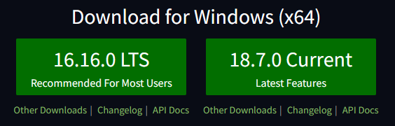

So I will follow through with node version 18 in these notes.

There are now two alternative javascript run times, [deno](https://deno.land/) and [bun](https://bun.sh/).

Deno has been developed to overcome some of the drawbacks of node, but it is not fully backward compatible with node.

Bun uses the webkit javascript core engine, which is claimed to run faster than V8, it also claims to be backwards compatible with node.  However this is still only at version 0.1.8.

Both of these alternative run times are worthy of investigation, but for the present purpose I will work with the stable node version 16.

Node ia also associated with the package manager [npm](https://www.npmjs.com/) this is a repository which holds thousands of node modules which can be drawn into javascript applications.

Node is good, but it relies on installing these small node modules.  If you are careful you should make a distinction between modules which are installed globally, and therefore become part of your base node environment and those which are installed within the node-modules folder of your application.

Applications may be dependant on different versions of these node modules, so it is essential to be careful with version installation. Node dependencies are an important consideration in getting an application to run. This takes care to manage on a personal machine, but on a multi-user machine could become impracticable.

If you are using gitHub, there is no need to store node modules as part of your repository code, so a .gitnore file is often used to prevent this.

Because of dependancies you may run into problems if you try to develop a number of applications in the same node environment.

You could use a number of virtual linux machines to hold separate node environments for different applications.  This would work, but the codebase which is being duplicated for each machine is large.

I prefer to us lightweight linux based Docker containers to hold isolated node environments.

>If after that warning you still want to run node locally on windows you can install node locally but I generally prefer not to.  I suggest you read through this section but then follow the docker approach as below.

Install [node](https://nodejs.org/en/download/) latest stable (LTS) version.

This installs both node and node package manager (npm) onto your machine.  

NPM can be used to install node modules easily from the a repository.  One such module is [create-react-app](https://www.npmjs.com/package/create-react-app)

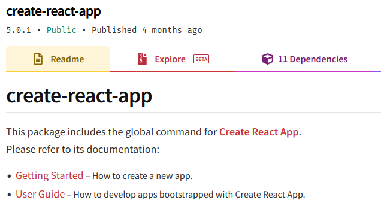

This may be installed by opening a terminal and typing

>npm i create-react-app

However there is also a node package runner NPX wich can be used to install and run a module.  

Before you run this change directory (cd) into the folder which you want to contain all your react applications.

>npx create-react-app my-app  
>cd my-app  
>npm start

create-react-app will create a folder named my-app whithin which is a default starter react app.  This includes standard files and folder structures.  

cd my-app will move the terminal view into the root directory of the react app (named my-app or whatever name you substituted).  Within this folder is enough information for npm start to know what to start and the app commences.

## The docker development environment

Docker setup has already been so run docker desktop and wait until it is fully running.  Sometimes I find it best to start docker before loading the machine with other applications such as code editors and browsers.  Whe whale icon in the system tray becomes static when the docker engine is running and the icon in docker dashboard turns from amber to green.


At the time of writing the current docker version is 4.11.1

If you want to run a sample container or look to see what tutorial materials are provided for docker take a brief detour before continuing.

## Running React with Docker

Docker is good for development and deployment.  The development environment works well with github and visual studio code.

Containers need a more detailed knowledge of docker to use, but applications running in containers can be uploaded and run on many web services including [Heroku](https://www.heroku.com/deploy-with-docker), [Amazon Web Services](https://www.docker.com/partners/aws/), [Azure](https://azure.microsoft.com/en-gb/services/kubernetes-service/docker/) and [Digital Ocean](https://www.digitalocean.com/community/tutorials/what-is-docker)

Docker can be difficult at times and using it can seem to put a layer of code between you and your application under development.  However, docker has become so widely used that you should know it and its' benefits are worth the initial discomfort.

For this section I am going to use the docker development environment.  Although this is listed as Beta, it has been available for over a year and widely tested.

### Prepare github repository

Start by logging in to your github account online and creating a new repository named **tictac**.


I have made my repository private, that does not matter too much, but it is important to add a .gitnore file choosing node from the drop down list of templates.


In the github browser, from the Add file button create a new file named **.docker/config.json** Take care not to omit the full stop before docker.

Add the text:

```json
{
    "image": "node"
}
```

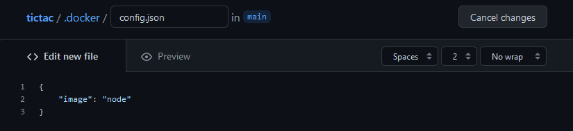

This is probably the simplest config file you could state and it just refers to the current version of node.

Scroll down and commit the new file.


you now have two files and one folder in your repository.

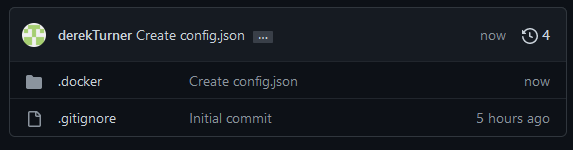

Now a docker environment will be created which is linked to the github site.  Code written on Docker will be stored to github.  That means Docker can be discarded and nothing is lost.  It is easy to open Docker fresh on a new machine and continue working.

### create a docker environment

Open the docker environment page and click to create a new environment.

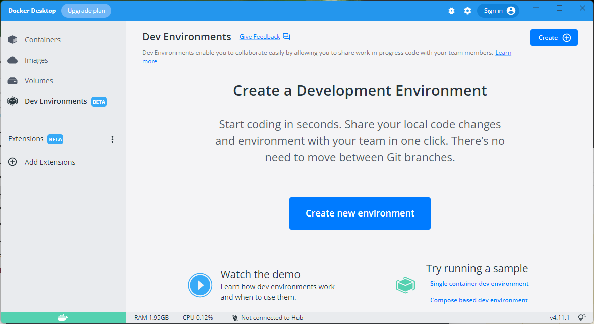

Step one just lists some benefits of the environment.


Click "Get started".

Enter the address of your own existing git repository. Following the pattern:
> https://github.com/yourName/tictac

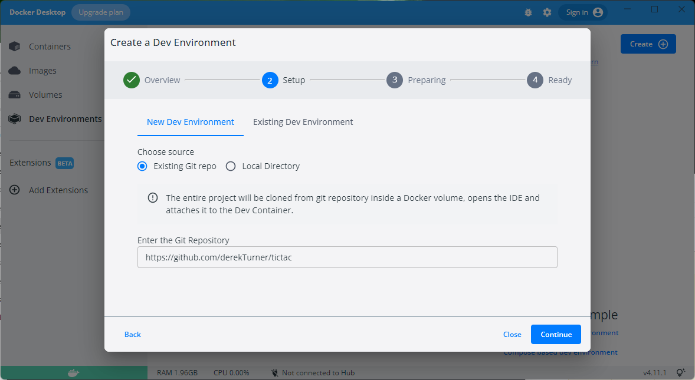

Click "continue".


It takes a while to complete the preparation stage,  this involves downloading a linux environment with node from docker hub.  All this happens behind the scenes.

Docker will try to detect what language your repository is using, but we have not written any code yet so it can't succeed in that.

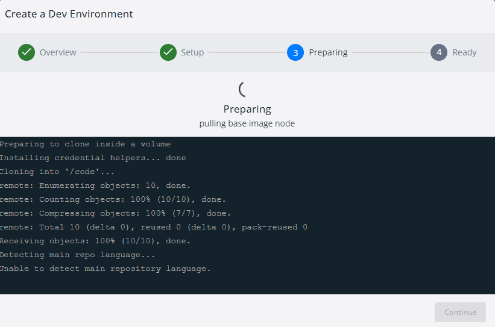

When the "preparing" message is replaced with "successful" click "continue".

The development system will have some auto-generated names which will vary from mine, but they should still start with tictac.

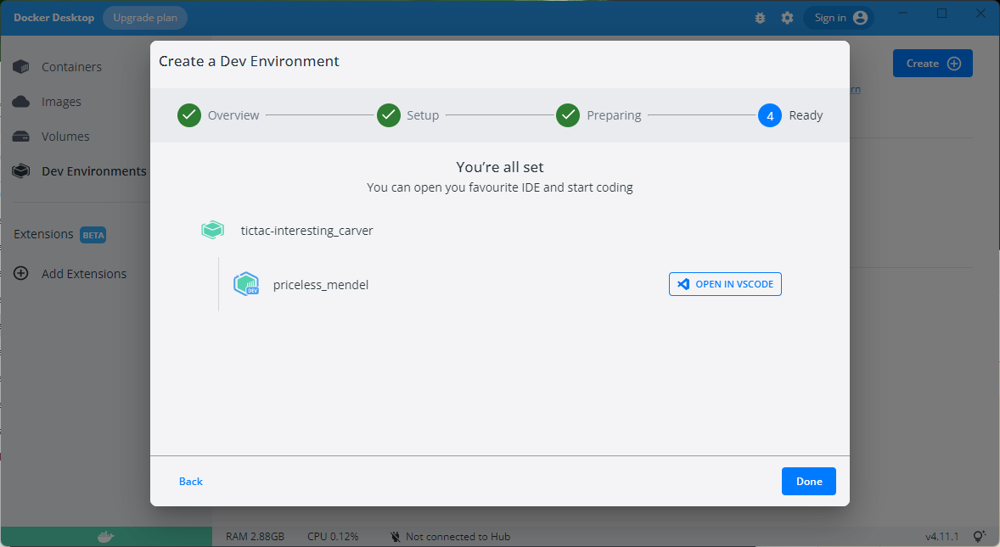

Click on "done".

You can hang the mouse to the right of the dev icon to open in vscode.


If you missed out any to the stages in the setup you will be prompted to install pre-requisites.  Once the setup is correct you should see your view of the container.

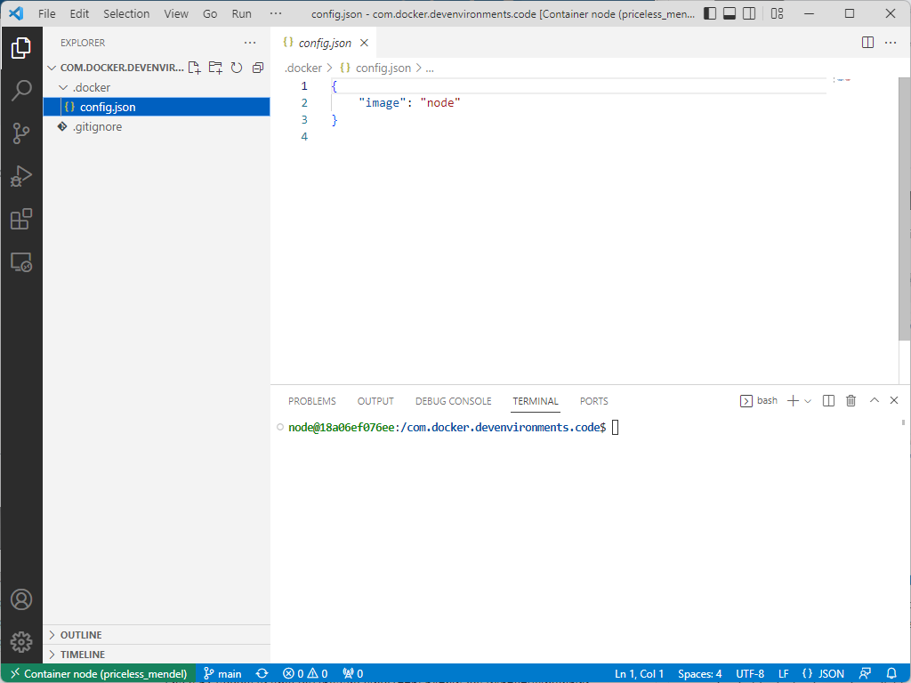

You can see the files you added to github and below these you have a bash shell (because you are now working inside a linux environment in the container).

If the bash shell does not appear you can open it by clicking on the the toggle layout CTRL + J button.

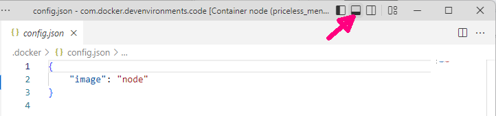

In the shell enter

>node@18a06ef076ee:/com.docker.devenvironments.code$ node --version

```code
v18.7.0
```
The most recent node version is used unless a different one is specified in the config file.

Check the file structure of the shell and see Linux folders and files.

> node@18a06ef076ee:/com.docker.devenvironments.code$ cd ..

>node@18a06ef076ee:/$ ls

```code
bin   com.docker.devenvironments.code  etc   lib    media  opt   root  sbin  sys  usr
boot  dev                              home  lib64  mnt    proc  run   srv   tmp  var
```

Try out some linux commands and refer to a [Linux command cheat sheet](https://phoenixnap.com/kb/linux-commands-cheat-sheet)

When you have had a look around move back to the com.docker.devenvironments.code folder and work on from there.

### create-react-app

Issue the command following the guidance at [create react app](https://create-react-app.dev/) to create a template for a react app.  Other more advanced templates are available at other sites, but create-react-app is the normal starting point.

>npx create-react-app my-app

```code
Need to install the following packages:
  create-react-app@5.0.1
Ok to proceed? (y)
```

>y

This takes a while and you may see some deprecated warnings.

```code
npm WARN deprecated tar@2.2.2: This version of tar is no longer supported, and will not receive security updates. Please upgrade asap.
```
```code
6 high severity vulnerabilities
```

Nonetheless you have success.

```code
Success! Created my-app at /com.docker.devenvironments.code/my-app
Inside that directory, you can run several commands:

  npm start
    Starts the development server.

  npm run build
    Bundles the app into static files for production.

  npm test
    Starts the test runner.

  npm run eject
    Removes this tool and copies build dependencies, configuration files
    and scripts into the app directory. If you do this, you can’t go back!

We suggest that you begin by typing:

  cd my-app
  npm start

Happy hacking!
npm notice 
npm notice New minor version of npm available! 8.15.0 -> 8.17.0
npm notice Changelog: https://github.com/npm/cli/releases/tag/v8.17.0
npm notice Run npm install -g npm@8.17.0 to update!
```

Note the npm commands which will start and build the application.

Create-react app has created a folder structure within the my-app folder.

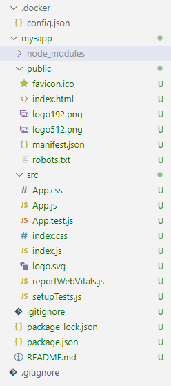

The README.md file includes more details of the commands which can be issued to run the created app.

```code
# Getting Started with Create React App

This project was bootstrapped with [Create React App](https://github.com/facebook/create-react-app).

## Available Scripts

In the project directory, you can run:

### `npm start`

Runs the app in the development mode.\
Open [http://localhost:3000](http://localhost:3000) to view it in your browser.
...
```


Notice that some files have green U along side.  This means that these are in the docker container but have not been saved to github.

A look back at the tictac repository shows that it has not changed.

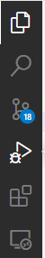

Go to the sourceControl icon showing 18 changes here or CTRL + shift + G

Add a comment and review the changes.


Click on "Commiit"

Confirm that you want to stage all changes and commit them directly.

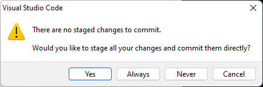

Now sync changes to put this commit on the gitHub repository.

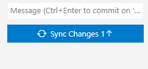

Confirm that this action will push commits to main.

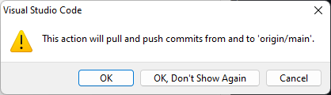

Now refreshing github on the browser shows the my-app folder.

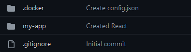

Clicking into my-app shows that the files and structure of the app have been uploaded, but not the node-modules, thanks to .gitnore.


Remember this process to keep the repository up to date with changes in the local container code.

Looking back to VSC you can see that the number of node modules is huge.

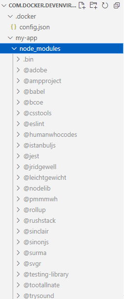

It is good that these are confined within the container.  If the container is disposed they will all go away and the code will be safe in the repository.

The details in the **package.json** file are enough to reconstitute the node modules.

This file shows that the most recent version of react is being used.

```JSON
{
  "name": "my-app",
  "version": "0.1.0",
  "private": true,
  "dependencies": {
    "@testing-library/jest-dom": "^5.16.5",
    "@testing-library/react": "^13.3.0",
    "@testing-library/user-event": "^13.5.0",
    "react": "^18.2.0",
    "react-dom": "^18.2.0",
    "react-scripts": "5.0.1",
    "web-vitals": "^2.1.4"
  },
  "scripts": {
    "start": "react-scripts start",
    "build": "react-scripts build",
    "test": "react-scripts test",
    "eject": "react-scripts eject"
  },
  "eslintConfig": {
    "extends": [
      "react-app",
      "react-app/jest"
    ]
  },
  "browserslist": {
    "production": [
      ">0.2%",
      "not dead",
      "not op_mini all"
    ],
    "development": [
      "last 1 chrome version",
      "last 1 firefox version",
      "last 1 safari version"
    ]
  }
}

```

The scripts section shows the commands which can be issued to start and build the app.

The src folder is where the app is developed and within this you can see the **App.js** file holding the main section of the app.

```javascript
import logo from './logo.svg';
import './App.css';

function App() {
  return (
    <div className="App">
      <header className="App-header">
        
        <p>
          Edit <code>src/App.js</code> and save to reload.
        </p>
        <a
          className="App-link"
          href="https://reactjs.org"
          target="_blank"
          rel="noopener noreferrer"
        >
          Learn React
        </a>
      </header>
    </div>
  );
}

export default App;
```

Note that the App is using the function format.

The imports and exports implement the javascript module pattern.  Logo is imported and used as {logo}

The app which is exported can be called from the **index.js** file which instantiates the app.

```javascript
import React from 'react';
import ReactDOM from 'react-dom/client';
import './index.css';
import App from './App';
import reportWebVitals from './reportWebVitals';

const root = ReactDOM.createRoot(document.getElementById('root'));
root.render(
  <React.StrictMode>
    <App />
  </React.StrictMode>
);

// If you want to start measuring performance in your app, pass a function
// to log results (for example: reportWebVitals(console.log))
// or send to an analytics endpoint. Learn more: https://bit.ly/CRA-vitals
reportWebVitals();

```
The app is called to render in the root element.

The public folder includes the **index.html** file and this has a `<div id="root"></div>` which will be the target for rendering the app.

At this stage the public folder is not really active.  When the final build phase is completed the public folder will contain all the files required to run the application.

To try out the appication we can start it by

> cd my-app

> npm start

```code
Compiled successfully!

You can now view my-app in the browser.

  Local:            http://localhost:3000
  On Your Network:  http://172.17.0.2:3000

Note that the development build is not optimized.
To create a production build, use npm run build.

webpack compiled successfully
```

This can be viewed in a browser.

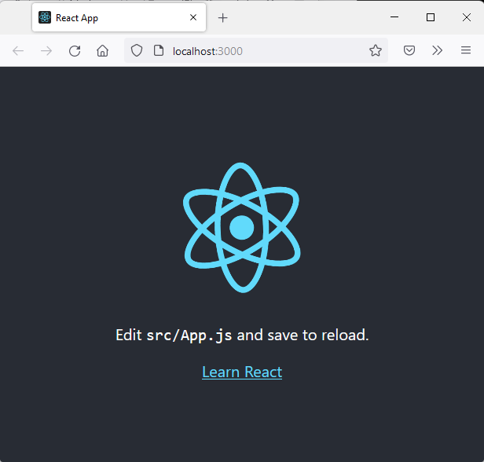

### Simple code edit

Let's edit **src/app.js** in a minor way to add a header for Internet technologies.

```javascript
function App() {
  return (
    <div className="App">
      <header className="App-header">
        <h1>Internet Technologies</h1>
        
```
Save this change and not that the app updates live.

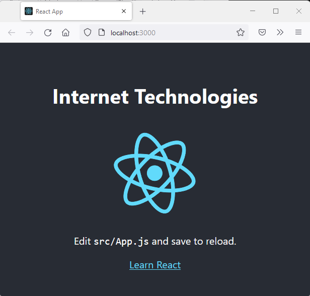


To stop the development server 

> CTRL + C


At the moment we are in a development mode.  However by using the npm run build command a final minified version of the app will be built in the public folder and that will be the folder which eventually is needed online to run the app.


The **manifest.json** includes details of the names, display parameters and starting url for the app.  It also identifies a favicon file. By default the favicon.ico is a 64 x 64 pixel image which you can replace with your own artwork. 

```json
{
  "short_name": "React App",
  "name": "Create React App Sample",
  "icons": [
    {
      "src": "favicon.ico",
      "sizes": "64x64 32x32 24x24 16x16",
      "type": "image/x-icon"
    },
    {
      "src": "logo192.png",
      "type": "image/png",
      "sizes": "192x192"
    },
    {
      "src": "logo512.png",
      "type": "image/png",
      "sizes": "512x512"
    }
  ],
  "start_url": ".",
  "display": "standalone",
  "theme_color": "#000000",
  "background_color": "#ffffff"
}
```

Before you leave this section commit and upload the changes to github.

That ammounts to the "hello world" of react in a docker container!