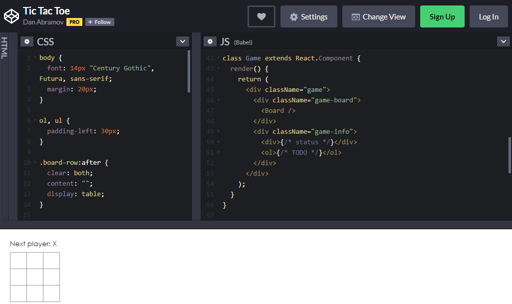
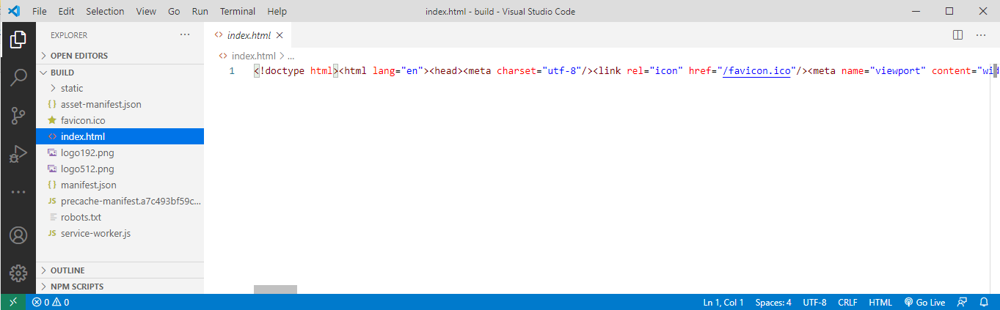

___
title: "Build and deploy"  
metaTitle: "IT 03"  
metaDescription: "Week 3 Lab part B"
___


# Make and deploy a simple react app

[React](https://reactjs.org) is a javascript library for building user interfaces.

A docker container has been created as a development environment in which we can edit and finally build a simple app.

Once the app is made there will be a published artefact in the build folder, all the rest (including thousands of node modules) will be superfluous.

After building we will use a second docker container running a web server and transfer only the built artefact into it.  This will produce a much smaller image which should serve the final (production) version of the app.

## Building a simple app

I will follow through the develop and build stages of simple tutorial on the react website.  All the code will be in my react1App folder.

### Set up Tic Tac Toe (alias noughts and crosses)

In the react1App src directory duplicate copies of App.js and App.css (just so you can get back to the starting point if you need to).

The full tutorial can be found [here](https://reactjs.org/tutorial/tutorial.html#overview
)

The starter code for the tutorial is [here](https://codepen.io/gaearon/pen/oWWQNa?editors=0010).

Double click or drag on the left hand side codepen labels to open up the css and js tabs.

The tutorial uses a class called game and causes it to be rendered. Areas to edit are labelled such as /* TODO */ 



You will need to make a codepen account then return to this page.  At the very bottom of the page is an export buton which allows a zip file of the starter code to be downloaded. Or you could just cut and paste - there is not much code here.  Running on CodePen we are relying on the react dependancies being supplied by the platform.  For us we need the dependencies in our reactApp1 folder.

I am going to use the code of the reactApp1 as the starting point for the noughts and crosses app so I will just copy my folder reactApp1 to ticTacToe.

I am duplicating node modules so this will take around 7 minutes.


Open the folder in visual studio code (or your preferred editor) and look in the src folder.

The default app already has a class called App which is rendered so the code from the game class will be overwritten into the App class.  The rendering lines are discarded.  We need to keep the imports at the top of the file.

App.js becomes:

```javascript
// tic tac toe tutorial
import React from 'react';
// eslint-disable-next-line
import logo from './logo.svg';
import './App.css';

class Square extends React.Component {
  render() {
    return (
      <button className="square">
        {/* TODO */}
      </button>
    );
  }
}

class Board extends React.Component {
  renderSquare(i) {
    return <Square />;
  }

  render() {
    const status = 'Next player: X';

    return (
      <div>
        <div className="status">{status}</div>
        <div className="board-row">
          {this.renderSquare(0)}
          {this.renderSquare(1)}
          {this.renderSquare(2)}
        </div>
        <div className="board-row">
          {this.renderSquare(3)}
          {this.renderSquare(4)}
          {this.renderSquare(5)}
        </div>
        <div className="board-row">
          {this.renderSquare(6)}
          {this.renderSquare(7)}
          {this.renderSquare(8)}
        </div>
      </div>
    );
  }
}


function App() {
  return (  
    <div className="game">
    <div className="game-board">
      <Board />
    </div>
    <div className="game-info">
      <div>{/* status */}</div>
      <ol>{/* TODO */}</ol>
    </div>
  </div>
  );
}

export default App;

```
The tutorial had style which can be copied to the bottom of App.css.  Any sections describing game have been merged into the App styles.

App.css becomes:

```css
.App {
  text-align: center;
  display: flex;
  flex-direction: row;
}

.App-info {
  margin-left: 20px;
}

.App-logo {
  animation: App-logo-spin infinite 20s linear;
  height: 40vmin;
  pointer-events: none;
}

.App-header {
  background-color: #282c34;
  min-height: 100vh;
  display: flex;
  flex-direction: column;
  align-items: center;
  justify-content: center;
  font-size: calc(10px + 2vmin);
  color: white;
}

.App-link {
  color: #61dafb;
}

@keyframes App-logo-spin {
  from {
    transform: rotate(0deg);
  }
  to {
    transform: rotate(360deg);
  }
}

body {
  font: 14px "Century Gothic", Futura, sans-serif;
  margin: 20px;
}

ol, ul {
  padding-left: 30px;
}

.board-row:after {
  clear: both;
  content: "";
  display: table;
}

.status {
  margin-bottom: 10px;
}

.square {
  background: #fff;
  border: 1px solid #999;
  float: left;
  font-size: 24px;
  font-weight: bold;
  line-height: 34px;
  height: 34px;
  margin-right: -1px;
  margin-top: -1px;
  padding: 0;
  text-align: center;
  width: 34px;
}

.square:focus {
  outline: none;
}

.kbd-navigation .square:focus {
  background: #ddd;
}


```
In powershell change directory into the new ticTacToe folder.

Save the files and run in the container

To start the container running again type:

>docker run -it -v ${pwd}:/usr/src -w /usr/src -p "3000:3000" teracy/create-react-app /bin/bash

The container has now loaded up the files from the ticTacToe directory.  The container is the development environment, you don't need a new container for each app you make. Then start the app serving.

>HOST=0.0.0.0 && npm start

View the App in the browser


--- 

### Complete code for Tic Tac Toe (alias noughts and crosses)

The next section of the tutorial is about [passing through the props](https://reactjs.org/tutorial/tutorial.html#passing-data-through-props).

In App.js modify 

```javascript
class Board extends React.Component {
  renderSquare(i) {
    return <Square />;
  }
```
to

```javascript
class Board extends React.Component {
  renderSquare(i) {
    return <Square value={i} />;
  }
```
so that a prop named value is passed to the Square component.

Then update the \/\*todo*/ section of the Square class

```javascript
class Square extends React.Component {
  render() {
    return (
      <button className="square">
        {/* TODO */}
      </button>
    );
  }
}
```
to


```javascript
class Square extends React.Component {
  render() {
    return (
      <button className="square">
        {this.props.value}
      </button>
    );
  }
}
```
so that the value will be passed written onto the button when the Square is rendered.

renderSquare is a method of the board class so from within the board is referenced as this.renderSquare().  Numbers are passed as parameters which are assigned to the value prop of each instance of the Square.

```javascript
 <div className="board-row">
          {this.renderSquare(0)}
          {this.renderSquare(1)}
          {this.renderSquare(2)}
        </div>
        <div className="board-row">
          {this.renderSquare(3)}
          {this.renderSquare(4)}
          {this.renderSquare(5)}
        </div>
        <div className="board-row">
          {this.renderSquare(6)}
          {this.renderSquare(7)}
          {this.renderSquare(8)}
        </div>
```


The next section of the tutorial is about [making an interactive component](https://reactjs.org/tutorial/tutorial.html#making-an-interactive-component).

Add an onClick event to the button to call the function alert using arrow function syntax.

```javascript
class Square extends React.Component {
  render() {
    return (
      <button className="square"  onClick={() => alert('click')}>
        {this.props.value}
      </button>
    );
  }
}
```
Add a constructor to the class Square so that it can have a state named value initilised to null.

```javascript
class Square extends React.Component {
  
  constructor(props) {
    super(props);
    this.state = {
      value: null,
    };
  }
  
  render() {
    return (
      <button className="square"  onClick={() => alert('click')}>
        {this.props.value}
      </button>
    );
  }
}
```
OK the alert function is just a built in javascript function to open an alert window that says click.  We need to swap this for the setState function which will change the value state to 'X' to denote a clicked square.

```javascript
 <button
        className="square"
        onClick={() => this.setState({value: 'X'})}
      >
```

Now modify the button tag so that it will cause the state.value to be displayed instead of the property value. (That's just to reinforce awareness of the difference between props and states).

```javascript
        {this.state.value}
```
Putting this together:

```javascript
  render() {
    return (
      <button
        className="square"
        onClick={() => this.setState({value: 'X'})}
      >
        {this.state.value}
      </button>
    );
  }
}
```
Now clicking squares inserts X's.


The next section of the tutorial is about [completing the game](https://reactjs.org/tutorial/tutorial.html#completing-the-game).

'X' and 'O' should be added in turn and a winner identified.

The board component will be modified to keep track of an array of 9 states corresponding to squares.  The state will be passed down from the board (as parent) to each square as a child).

Add a constructor to board and initialise its state with a squares array set to nulls.

```javascript
class Board extends React.Component {
  renderSquare(i) {
    return <Square value={i} />;
  }
```
becomes
```javascript
class Board extends React.Component {
  constructor(props) {
    super(props);
    this.state = {
      squares: Array(9).fill(null),
    };
  }

  renderSquare(i) {
    return <Square value={i} />;
  }
```
The array elements start as null and will be set to 'X' or 'O' as the game is played.

The boards method renderSquare is modified from:

```javascript
 renderSquare(i) {
    return <Square value={i} />;
  }
```
to

```javascript
 renderSquare(i) {
    return <Square value={this.state.squares[i]} />;
  }
```
to pass the array states down to the value prop of the square.

Now the Square class needs to display the value prop passed down rather than its own state.  

```javascript
{this.state.value}
```
becomes
```javascript
{this.props.value}
```

The *board* needs to control the onClick response.  The board will set a prop of the square named onClick.  By passing i as a parameter to handleClick the board handleClick method in the board will wb able to identify which square was clicked.  So the renderSquare method is changed from

```javascript
 renderSquare(i) {
    return <Square value={this.state.squares[i]} />;
  }
```
to

```javascript
renderSquare(i) {
    return (
      <Square
        value={this.state.squares[i]}
        onClick={() => this.handleClick(i)}
      />
    );
  }
```


The *Square* constructor can be *deleted* because the state of the square is no longer of interest.

The button tag in the Square class will now respond to the prop passed to it.

```javascript
onClick={() => this.setState({value: 'X'})}
```
will become

```javascript
onClick={() => this.props.onClick()}
```
Using the word onClick in two different contexts is a bit confusing here!

The board will need a handeClick method to read i to see which button was clicked and then add the response (for now 'X' ) to the appropriate array element.

```javascript
handleClick(i) {
    const squares = this.state.squares.slice();
    squares[i] = 'X';
    this.setState({squares: squares});
  }
```

In handleClick() the [javaScript slice function](https://www.w3schools.com/jsref/jsref_slice_array.asp) is used to create a copy of the state.squares array and assign this into the const squares.  (Again using the word squares for two different things is confusing).
The copy is then modified and written back to the state.squares array by setState.

React state data is treated as immutable, it should not be manipulated other than by setState.

If old copies of state are saved the programme will have a data history which can be undone.

An old copy could be compared with a new copy to see if it has changed.

Functional programming is a style in which the functions are pure.  

Pure functions:
 * return a value which depends only on input paramenters.
 * the same input parameters to a certain function always return the same value.

A pure function which multiplies the input by 4 cant be made to multiply by 3 by changing the value of a property.

React has an advanced concept of pure components.  Immutable data is a step towards this.

So Board becomes:
```javascript
class Board extends React.Component {
  constructor(props) {
    super(props);
    this.state = {
      squares: Array(9).fill(null),
    };
  }

  handleClick(i) {
    const squares = this.state.squares.slice();
    squares[i] = 'X';
    this.setState({squares: squares});
  }

  renderSquare(i) {
    return (
      <Square
        value={this.state.squares[i]}
        onClick={() => this.handleClick(i)}
      />
    );
  }

  render() {
    const status = 'Next player: X';

    return (
      <div>
        <div className="status">{status}</div>
        <div className="board-row">
          {this.renderSquare(0)}
          {this.renderSquare(1)}
          {this.renderSquare(2)}
        </div>
        <div className="board-row">
          {this.renderSquare(3)}
          {this.renderSquare(4)}
          {this.renderSquare(5)}
        </div>
        <div className="board-row">
          {this.renderSquare(6)}
          {this.renderSquare(7)}
          {this.renderSquare(8)}
        </div>
      </div>
    );
  }
}  

```

and Square becomes

```javascript
class Square extends React.Component {
  render() {
    return (
      <button
        className="square"
        onClick={() => this.props.onClick()}
      >
        {this.props.value}
      </button>
    );
  }
}
```
The square class does not have any state and only has a render method.  Since the board has a render all we need is to return the JSX to the board.  

There is no need for Square to be a class, expressing it as a (pure) function component makes it simpler without changing the result.

```javascript
function Square(props) {
  return (
    <button className="square" onClick={props.onClick}>
      {props.value}
    </button>
  );
}
```
The visual operation of the app has not changed.


The next section of the tutorial is about [taking turns](https://reactjs.org/tutorial/tutorial.html#function-components).

A boolean state xIsNext is added to the board.  This is initially true, so the first square clicked is set to 'X', then it is toggled the handleClick() method to allow 'O', 'X' and so on.

The board constuctor:

```javascript
class Board extends React.Component {
  constructor(props) {
    super(props);
    this.state = {
      squares: Array(9).fill(null),
      xIsNext: true,
    };
  }
```
and handleClick():

```javascript
handleClick(i) {
    const squares = this.state.squares.slice();
    squares[i] = this.state.xIsNext ? 'X' : 'O';
    this.setState({
      squares: squares,
      xIsNext: !this.state.xIsNext,
    });
  }
```

Also update boards status from

```javascript
render() {
    const status = 'Next player: X';
```
to

```javascript
render() {
    const status = 'Next player: ' + (this.state.xIsNext ? 'X' : 'O');
```
So the full board code becomes:

```javascript
class Board extends React.Component {
  constructor(props) {
    super(props);
    this.state = {
      squares: Array(9).fill(null),
      xIsNext: true,
    };
  }

  handleClick(i) {
    const squares = this.state.squares.slice();
    squares[i] = this.state.xIsNext ? 'X' : 'O';
    this.setState({
      squares: squares,
      xIsNext: !this.state.xIsNext,
    });
  }

  renderSquare(i) {
    return (
      <Square
        value={this.state.squares[i]}
        onClick={() => this.handleClick(i)}
      />
    );
  }

  render() {
    const status = 'Next player: ' + (this.state.xIsNext ? 'X' : 'O');

    return (
      <div>
        <div className="status">{status}</div>
        <div className="board-row">
          {this.renderSquare(0)}
          {this.renderSquare(1)}
          {this.renderSquare(2)}
        </div>
        <div className="board-row">
          {this.renderSquare(3)}
          {this.renderSquare(4)}
          {this.renderSquare(5)}
        </div>
        <div className="board-row">
          {this.renderSquare(6)}
          {this.renderSquare(7)}
          {this.renderSquare(8)}
        </div>
      </div>
    );
  }
}  
```
The game now operates turns


The next section of the tutorial is about [declaring a winner](https://reactjs.org/tutorial/tutorial.html#declaring-a-winner).

A function calculateWinner is added to App.js below class Board.

The array of lines represents the sequence of sqares which would be covered drawing a lines across, down or cornerwise.
Each of these sequences needs to be tested in turn for the criterion of winning which is that three array elements in the sequence are identical and not null.

Null represents false so if(squares[a]) tests if the array is non-null.


```javascript
function calculateWinner(squares) {
  const lines = [
    [0, 1, 2],
    [3, 4, 5],
    [6, 7, 8],
    [0, 3, 6],
    [1, 4, 7],
    [2, 5, 8],
    [0, 4, 8],
    [2, 4, 6],
  ];
  for (let i = 0; i < lines.length; i++) {
    const [a, b, c] = lines[i];
    if (squares[a] && squares[a] === squares[b] && squares[a] === squares[c]) {
      return squares[a];
    }
  }
  return null;
}
```

The calculateWinner() function is called in the Boards render function and then either the next go or congrats can be displayed.  The player who entered the last move is the winner.

```javascript
render() {
    const winner = calculateWinner(this.state.squares);
    let status;
    if (winner) {
      status = 'Winner: ' + winner;
    } else {
      status = 'Next player: ' + (this.state.xIsNext ? 'X' : 'O');
    }
```

Once the game is won further clicks should be ignored,and also a square should not be able to be clicked twice so handleClick() is modified:

```javascript
handleClick(i) {
    const squares = this.state.squares.slice();
    if (calculateWinner(squares) || squares[i]) {
      return;
    }
    squares[i] = this.state.xIsNext ? 'X' : 'O';
    this.setState({
      squares: squares,
      xIsNext: !this.state.xIsNext,
    });
  }
 ``` 
This is slightly inefficient because calculateWinner is called again.

The game should now work.


Enough!  The tutorial goes on to refine the game (and I leave this as an exercise below) but what I wan't to do is build this stage of the game.

Close the game in the terminal

>CTRL + C

Build the game.

> yarn build

Watch the terminal output:

```code
yarn run v1.22.4
$ react-scripts build
Creating an optimized production build...
Compiled successfully.

File sizes after gzip:

  40.23 KB  build/static/js/2.41ab7e33.chunk.js
  1017 B    build/static/js/main.e2da8b43.chunk.js
  770 B     build/static/js/runtime-main.a7dc1534.js
  733 B     build/static/css/main.efafe645.chunk.css

The project was built assuming it is hosted at /.
You can control this with the homepage field in your package.json.

The build folder is ready to be deployed.
You may serve it with a static server:

  yarn global add serve
  serve -s build

Find out more about deployment here:

  bit.ly/CRA-deploy

Done in 127.25s.
root@16d0b58ec69c:/usr/src#
```

The built files are added to a build folder in the reactApp1 folder.


This is as static site.  It does not need node any more.  If you just point a browser directly at the index file to test it will not work.  A multifile page needs to be delivered by a server so that the browser can request all the files it needs.

You have a testing server in visual code.  So point visual code at the index file and open the file in the server.



Note that the browser port has changed indicating that this is running in the testing server (which is not running node).


You could upload this to any server you liked!

---

### Deploying to production

The docker image which is being used now contains the development system and more code than is needed.

To run the app from docker now, we should  
* close the development image.  
* Create a new image which contains a web server  
* Transfer built files to the server
  * Step 1 copy all files
  * Step 2 get rid of all but built files
* run this image and serve the app

Close the development container.

>exit

Check that no containers are left running.

>docker ps

```code
CONTAINER ID        IMAGE               COMMAND             CREATED             STATUS              PORTS               NAMES
```
OK none running.

Prepare a dockerfile in the ticTacToe folder.  (in future cases you will just be able to copy this).

The docker file will need to call in an image with a server.  In this case I will use NginX

```dockerfile
FROM nginx:alpine
COPY /build /usr/share/nginx/html
EXPOSE 80
```
Now run the dockerfile from the current directory (reactApp1)

> docker build  -t reactapp1 .

Note the repository name must be lower case.


Terminal output:

```code
Sending build context to Docker daemon  148.6MB
Step 1/4 : FROM nginx:alpine
alpine: Pulling from library/nginx
050382585609: Pull complete 
aa1504bc12ac: Pull complete 
Digest: sha256:482ead44b2203fa32b3390abdaf97cbdc8ad15c07fb03a3e68d7c35a19ad7595
Status: Downloaded newer image for nginx:alpine
 ---> 55ceb2abad47
Step 2/4 : COPY ./build /usr/share/nginx/html
 ---> 0d9ff27a3bd0
Step 3/4 : EXPOSE 80
 ---> Running in d56dff341d56
Removing intermediate container d56dff341d56
 ---> 17d2bad74e08
Step 4/4 : CMD [“nginx”, “-g”, “daemon off;”]
 ---> Running in 5bb00d0e7c6e
Removing intermediate container 5bb00d0e7c6e
 ---> 98481a84db1a
Successfully built 98481a84db1a
```
Check the image is made

> docker images

```code
REPOSITORY                  TAG                 IMAGE ID            CREATED             SIZE
reactapp1                   latest              98481a84db1a        5 minutes ago       21.6MB
```

Run the container

>docker run -p 8000:80 reactapp1

View the output in the browser pointing to port 8000


Terminal output shows the server responding to requests

```code
172.17.0.1 - - [28/Jul/2019:01:37:40 +0000] "GET / HTTP/1.1" 200 2045 "-" "Mozilla/5.0 (Macintosh; Intel Mac OS X 10_13_6) AppleWebKit/537.36 (KHTML, like Gecko) Chrome/76.0.3809.80 Safari/537.36" "-"
172.17.0.1 - - [28/Jul/2019:01:37:40 +0000] "GET /static/css/main.da2e1ab7.chunk.css HTTP/1.1" 200 1480 "http://127.0.0.1:8000/" "Mozilla/5.0 (Macintosh; Intel Mac OS X 10_13_6) AppleWebKit/537.36 (KHTML, like Gecko) Chrome/76.0.3809.80 Safari/537.36" "-"
172.17.0.1 - - [28/Jul/2019:01:37:40 +0000] "GET /static/js/2.56cb80cd.chunk.js HTTP/1.1" 200 120966 "http://127.0.0.1:8000/" "Mozilla/5.0 (Macintosh; Intel Mac OS X 10_13_6) AppleWebKit/537.36 (KHTML, like Gecko) Chrome/76.0.3809.80 Safari/537.36" "-"
172.17.0.1 - - [28/Jul/2019:01:37:40 +0000] "GET /static/js/main.f19aa33a.chunk.js HTTP/1.1" 200 2628 "http://127.0.0.1:8000/" "Mozilla/5.0 (Macintosh; Intel Mac OS X 10_13_6) AppleWebKit/537.36 (KHTML, like Gecko) Chrome/76.0.3809.80 Safari/537.36" "-"
172.17.0.1 - - [28/Jul/2019:01:37:40 +0000] "GET /manifest.json HTTP/1.1" 200 306 "http://127.0.0.1:8000/" "Mozilla/5.0 (Macintosh; Intel Mac OS X 10_13_6) AppleWebKit/537.36 (KHTML, like Gecko) Chrome/76.0.3809.80 Safari/537.36" "-"
172.17.0.1 - - [28/Jul/2019:01:37:40 +0000] "GET /favicon.ico HTTP/1.1" 200 3870 "http://127.0.0.1:8000/" "Mozilla/5.0 (Macintosh; Intel Mac OS X 10_13_6) AppleWebKit/537.36 (KHTML, like Gecko) Chrome/76.0.3809.80 Safari/537.36" "-"
```

To close the nginx server type:
>exit

---

## Deploy to the cloud

Having an app running in a docker container is useful because the container can be deployed to a cloud based server.

In this example the cloud service used will be Heroku, a Paltform as a service (PaaS) cloud server with a free account option.

I will go through this in two passes.  
1. Show how to upload the app to the cloud
  * Make an account
  * Go through steps of upload  
  * Identify how to call app in browser
  * View the error logs when the sucessfully uploaded app does not work
2. Revise the docker image to enable it to work in the cloud
  * Note that EXPOSE in dockerfile is not supported in Heroku
  * Deal with the Nginx configuration file
  * Revise the dockerfile
  * upload and retest

### Upload the app to run and fail on the cloud

Create an account on Heroku

[Sign up for a free account](https://signup.heroku.com)


install the heroku [command line interpreter](https://devcenter.heroku.com/articles/heroku-cli#download-and-install).

Choose your appropriate installation method.


From time to time this might need to be updated.

>heroku update

terminal output

```code
heroku: Updating CLI from 7.16.6 to 7.26.2... done
heroku: Updating CLI... done
Updating completions... done
```

The horoku installation can be verified by checking the version (this example is running on mac osx)

>heroku --version

Terminal output:

```code
heroku/7.26.2 darwin-x64 node-v11.14.0
```

Open your heroku dashboard.  I have some files already there from previous experimentation.  When the app is sucessflly installed it will appear in this list.  The dashboard is not part of the uploding process.

You have space for 5 apps on the free account. 


Check that docker is running before you porceed.
log in to heroku via the terminal.

>heroku login

Terminal output 
```code
heroku: Press any key to open up the browser to login or q to exit: 
Opening browser to https://cli-auth.heroku.com/auth/browser/0112e0c1-476f-424f-a7a9-34a87f11cdf8
heroku: Waiting for login... ⣻
```
Follow the prompt press a key and see the browser:


Click login and watch the browser change.  See that you are logged in under your own user name. 

```code
Opening browser to https://cli-auth.heroku.com/auth/browser/8f34bd8e-1115-4fd8-af57-4a3a2c8fd7c7
Logging in... done
Logged in as ******************
```


Also log in to the heroku container

> heroku container:login

```code
Login Succeeded
```


Heroku allows you to deploy docker images, which is what is needed here.  It also allows you to build docker images.

An empty heroku app must be created first into which the docker image will subsequently be uploaded. This needs to be a unique name amongst all heroku users so some name choices will result in a 'name already taken' message and you have to try again.

>heroku create x9tictactoe

The terminal output tells you the url to enter in your browser to address the app and where it is stored.

```code
Creating ⬢ x9tictactoe... done
https://x9tictactoe.herokuapp.com/ | https://git.heroku.com/x9tictactoe.git
```
The app should appear in the heroku dashboard


However it is not yet active.

I have made a minor change to the dockerfile to make before proceeding, commenting out the last line.

```dockerfile
FROM nginx:alpine
COPY /build /usr/share/nginx/html
# EXPOSE 80
```
This is because heroku does not support EXPOSE. (More changes will be needed to get the app up and running so this is still leading towards error messages).

First step when dealing with an existing docker image is to tag it.  I am going to start by building the app again and use the generated id to generate a tag.

Making sure that terminal is cd to the folder which holds the reactApp1 dockerfile.

> docker build .

The terminal output:

```code
Sending build context to Docker daemon  148.6MB
Step 1/2 : FROM nginx:alpine
 ---> 55ceb2abad47
Step 2/2 : COPY /build /usr/share/nginx/html
 ---> Using cache
 ---> 0d9ff27a3bd0
Successfully built 0d9ff27a3bd0
```

You will need to use the image id generated, in this case 0d9ff27a3bd0.

The format for tagging is:  
docker tag \<image> registry.heroku.com/\<app>/\<process-type>

>docker tag 0d9ff27a3bd0 registry.heroku.com/x9tictactoe/web

Check the tag has worked

> docker images

Read from the terminal display:

|REPOSITORY | TAG |  IMAGE ID | CREATED | SIZE |
|-----|-----|-----|-----|-----|
|registry.heroku.com/x9tictactoe/web | latest | 0d9ff27a3bd0  | 23 hours ago   | 21.6MB|  


Next push the tagged image to the Heroku container registry using the format docker push registry.heroku.com/\<app>/\<process-type>

>docker push registry.heroku.com/x9tictactoe/web

The terminal output is:

```code
bf7a13bc47c0: Pushed 
4fbb1bc8fd37: Pushed 
1bfeebd65323: Pushed 
latest: digest: sha256:5960615090166f558512537e3a0c00d25c89aedb359d55ae621bb8dd52ae6db0 size: 949
```

Release the app with format heroku container:release web -a \<app>

>heroku container:release web  --app x9tictactoe

Terminal output:
```code
Releasing images web to x9tictactoe... done
```

The release is confirmed in the dashboard.  Double click on the new app name to open up the details screen.


Now in the browser go to the url listed for this app
>https://x9tictactoe.herokuapp.com/


This indicates that the heroku logs should be inspected.

> heroku logs --app x9tictactoe --tail

And this inspection describes the crashing of the app, an extract of the log is shown here.

```code
2019-07-29T00:57:10.581439+00:00 heroku[web.1]: Starting process with command `nginx -g daemon\ off\;`
2019-07-29T00:57:12.948622+00:00 heroku[web.1]: State changed from starting to crashed
2019-07-29T00:57:12.954509+00:00 heroku[web.1]: State changed from crashed to starting
2019-07-29T00:57:12.930251+00:00 heroku[web.1]: Process exited with status 1
2019-07-29T00:57:12.835259+00:00 app[web.1]: 2019/07/29 00:57:12 [warn] 3#3: the "user" directive makes sense only if the master process runs with super-user privileges, ignored in /etc/nginx/nginx.conf:2
2019-07-29T00:57:12.835285+00:00 app[web.1]: nginx: [warn] the "user" directive makes sense only if the master process runs with super-user privileges, ignored in /etc/nginx/nginx.conf:2
2019-07-29T00:57:12.835294+00:00 app[web.1]: 2019/07/29 00:57:12 [emerg] 3#3: bind() to 0.0.0.0:80 failed (13: Permission denied)
2019-07-29T00:57:12.835301+00:00 app[web.1]: nginx: [emerg] bind() to 0.0.0.0:80 failed (13: Permission denied)
2019-07-29T00:57:13.794029+00:00 heroku[web.1]: Starting process with command `nginx -g daemon\ off\;`
2019-07-29T00:57:15.205522+00:00 heroku[web.1]: State changed from starting to crashed
```

### Recap

The process from dockerfile to heroku install was:
> heroku login  
> heroku container:login  
> heroku create uniqueName
> docker build .  
> docker tag image-id registry.heroku.com/uniqueName/web  
> docker images  
> docker push registry.heroku.com/uniqeName/web  
>heroku container:release web  --app uniqueName  
>Browse to https://uniqueName.herokuapp.com/
> heroku logs --app uniqueName --tail

Re-edit the app and do it all again till the app runs.

###  Altering the docker file to make the app run

You may need to go around this process a few times for a new app!

The problem with our app is that NginX needs some additional configuration to run on heroku.

In the original dockerfile EXPOSE 80 was included to make a port available, but this is not supported in heroku.  This is because heroku determines a port for the deployment and stores this into an environmental variable which NginX will need to be instructed to read.

Save a copy of the old dockerfile as dockerfilebak. The revised dockerfile becomes:

```dockerfile
FROM nginx:alpine
COPY /build /usr/share/nginx/html
COPY nginx.conf /etc/nginx/conf.d/default.conf
CMD sed -i -e 's/$PORT/'"$PORT"'/g' /etc/nginx/conf.d/default.conf && nginx -g 'daemon off;'
```
The reference to $PORT will read herokus environment variable and inform nginx by modifying the config file using [sed](https://www.gnu.org/software/sed/manual/sed.html), a stream editor.

That means we need a config file to edit! So add nginx conf to the same folder as the dockerfile.

```javascript
server {
    listen $PORT;

  location / {
    root   /usr/share/nginx/html;
    index  index.html;
  }
}
```
Let's give this a try!

Start by deleting the old app from the heroku dashboard


Click on the settings tab.  Scroll right down to reveal delete app.


Click and confirm delete.  Note that the app is deleted from the dashboard.

Now run through the build and upload process.  Here is the terminal output as I worked through this.

```code

Dr-Derek-Turners-MacBook-Pro:reactApp1 drderekturner$ heroku login
heroku: Press any key to open up the browser to login or q to exit: 
Opening browser to https://cli-auth.heroku.com/auth/browser/8207bbdf-4af2-4928-8735-6631a7d721aa
Logging in... done
Logged in as derek.turner@uws.ac.uk
Dr-Derek-Turners-MacBook-Pro:reactApp1 drderekturner$ heroku container:login
Login Succeeded
Dr-Derek-Turners-MacBook-Pro:reactApp1 drderekturner$ heroku create y9reactapp1
Creating ⬢ y9reactapp1... done
https://y9reactapp1.herokuapp.com/ | https://git.heroku.com/y9reactapp1.git
Dr-Derek-Turners-MacBook-Pro:reactApp1 drderekturner$ docker build .
Sending build context to Docker daemon  148.6MB
Step 1/4 : FROM nginx:alpine
 ---> 55ceb2abad47
Step 2/4 : COPY /build /usr/share/nginx/html
 ---> Using cache
 ---> 0d9ff27a3bd0
Step 3/4 : COPY nginx.conf /etc/nginx/conf.d/default.conf
 ---> 62e6f687243f
Step 4/4 : CMD sed -i -e 's/$PORT/'"$PORT"'/g' /etc/nginx/conf.d/default.conf && nginx -g 'daemon off;'
 ---> Running in f55a55496985
Removing intermediate container f55a55496985
 ---> b54a1afeac03
Successfully built b54a1afeac03
Dr-Derek-Turners-MacBook-Pro:reactApp1 drderekturner$ docker tag b54a1afeac03 registry.heroku.com/y9reactapp1/web
Dr-Derek-Turners-MacBook-Pro:reactApp1 drderekturner$ docker images
REPOSITORY                            TAG                 IMAGE ID            CREATED             SIZE
registry.heroku.com/y9reactapp1/web   latest              b54a1afeac03        11 minutes ago      21.6MB
…


Dr-Derek-Turners-MacBook-Pro:reactApp1 drderekturner$ docker push registry.heroku.com/y9reactapp1/web
The push refers to repository [registry.heroku.com/y9reactapp1/web]
4c0c4c0b757f: Pushed 
bf7a13bc47c0: Pushed 
4fbb1bc8fd37: Pushed 
1bfeebd65323: Pushed 
latest: digest: sha256:beb9e9b3f655c6bfbe27ee189c3ffb8c11d6de50cebc653e460146fb86f82e61 size: 1156
Dr-Derek-Turners-MacBook-Pro:reactApp1 drderekturner$ heroku container:release web  --app y9reactapp1
Releasing images web to y9reactapp1... done

```
Finally browse to the horoku app. In this case:

>https://y9reactapp1.herokuapp.com/  

And marvel at the wonders of internet technologies as it actualy works!


When finished

>heroku logout  

Also log out of heroku dashboard
---
### Exercise

>Follow the tutorial to add history to the game and package the updated game for production on Heroku.

> Now choose a simple app from a tutorial of your choice, develop, build and deploy it.
---
### references

[nginx on docker hub](https://hub.docker.com/_/nginx) 

[A re-introduction to JavaScript ](https://developer.mozilla.org/en-US/docs/Web/JavaScript/A_re-introduction_to_JavaScript) bringing you up to date with the current version

[Create React App + Docker — multi-stage build example](https://medium.com/@shakyShane/lets-talk-about-docker-artifacts-27454560384f) using NginX

[So you want to Dockerize your React app](https://medium.com/greedygame-engineering/so-you-want-to-dockerize-your-react-app-64fbbb74c217) using NginX

[Run a React App in a Docker Container](https://dev.to/peterj/run-a-react-app-in-a-docker-container-kjn) using serve.

[Pure Functional Components in React 16.6](https://logrocket.com/blog/pure-functional-components/)

[Heroku: Container Registry & Runtime (Docker Deploys)](https://devcenter.heroku.com/articles/container-registry-and-runtime)

[Running NGINX on Heroku with Docker](https://ntotten.com/2018/07/22/nginx-on-heroku/)

[nginx beginners guide](http://nginx.org/en/docs/beginners_guide.html)