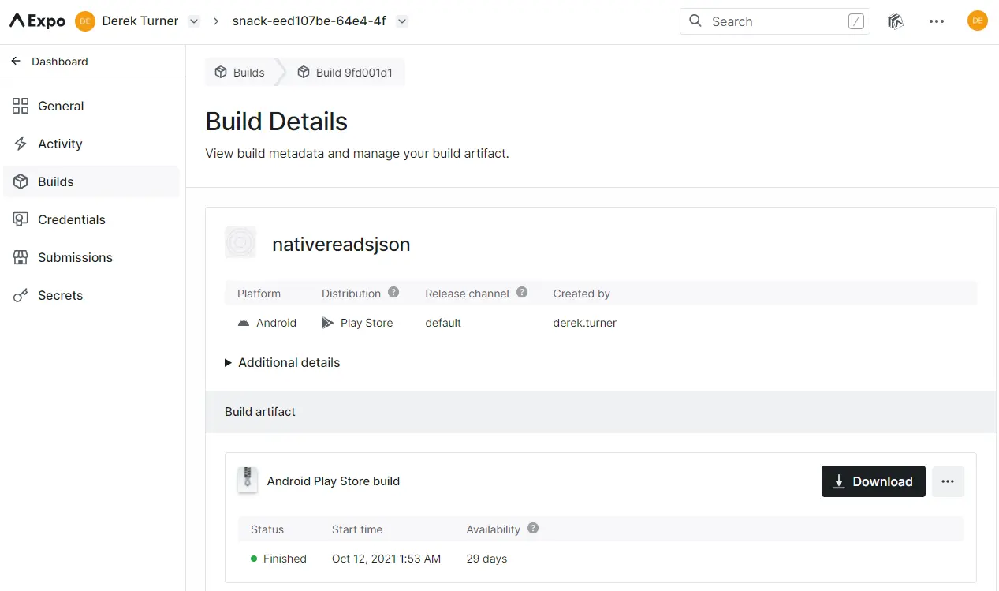

### Expo command line in Powershell

The expo command line interface is useful after a react-native application has been implemented and tested in expo.io

>PS C:\Users\derek> npm cache verify

This will [verify the contents of the cache folder](https://www.w3resource.com/npm/build-bundle-and-cache-commands.php), garbage collecting any data that is not needed, and verifies the integrity of the cache index and all the cached data.

```code
Cache verified and compressed (~\AppData\Roaming\npm-cache\_cacache):
Content verified: 4689 (230920543 bytes)
Content garbage-collected: 763 (44058864 bytes)
Index entries: 7512
Finished in 318.162s
```
Then opening powershell as administrator:
>npm install expo-cli --global --no-optional

This installs skipping optional dependancies, but still warns of some peeer dependancies.  However expo-cli@4.12.1 is installed.

```code
...


+ expo-cli@4.1.2
updated 1 package in 141.846s
```

To test if this is installed type:

> expo --version

This produces a error for me which relates to the execution policy in powershell.

To see the current policy enter:

> Get-ExecutionPolicy

For my machine this lists as:

```code
Restricted
```

[Restricted](https://docs.microsoft.com/en-gb/powershell/module/microsoft.powershell.core/about/about_execution_policies?view=powershell-7#restricted) 

The default execution policy for Windows client computers.

* Permits individual commands, but does not allow scripts. 
* Prevents running of all script files, including formatting and configuration files (.ps1xml), module script files (.psm1), and PowerShell profiles (.ps1).

To change the execution policiy issue:

> Set-ExecutionPolicy -ExecutionPolicy RemoteSigned

```code
Execution Policy Change
The execution policy helps protect you from scripts that you do not trust. Changing the execution policy might expose
you to the security risks described in the about_Execution_Policies help topic at
https:/go.microsoft.com/fwlink/?LinkID=135170. Do you want to change the execution policy?
[Y] Yes  [A] Yes to All  [N] No  [L] No to All  [S] Suspend  [?] Help (default is "N"): Y
```

[RemoteSigned](https://docs.microsoft.com/en-gb/powershell/module/microsoft.powershell.core/about/about_execution_policies?view=powershell-7#remotesigned)

The default execution policy for Windows server computers.

* Scripts can run.
* Requires a digital signature from a trusted publisher on scripts and configuration files that are downloaded from the internet which includes email and instant messaging programs.
* Doesn't require digital signatures on scripts that are written on the local computer and not downloaded from the internet.
* Runs scripts that are downloaded from the internet and not signed, if the scripts are unblocked, such as by using the Unblock-File cmdlet.
* Risks running unsigned scripts from sources other than the internet and signed scripts that could be malicious.

To see that expo-cli is running re-issue:

> expo --version

```code
4.12.1
```

When not using expo the level permission can be retuned to Restricted by:

> Set-ExecutionPolicy -ExecutionPolicy Restricted

The full list of expo-cli commands is available [here](https://docs.expo.io/workflow/expo-cli/), however key commands are likely to be:

* expo build:ios

    Build a standalone IPA for your project, signed and ready for submission to the Apple App Store.

* expo build:android
    Build a standalone APK or App Bundle for your project, signed and ready for submission to the Google Play Store.

## Build reactReadsJSON

Download the snack as a zip file and extract into a local directory.

Change the powershell to point to this folder. (This is conveniently done by adding a terminal in vs code). 

Make sure the executio policy is set to remote signed. (This needs powershell as an administrator).

> expo build:ios

A range of options is described [here](https://docs.expo.io/workflow/expo-cli/#expo-buildios).

I see an error asking to add the module 'expo' but yarn is not installed.  

The quickest way to install yarn is via the [yarn msi installer](https://classic.yarnpkg.com/en/docs/install#windows-stable)

Download this and run.


Now restart powershell as administrator and check that yarn is installed:

> PS C:\WINDOWS\system32> yarn

```code
yarn install v1.22.5
info No lockfile found.
[1/4] Resolving packages...
[2/4] Fetching packages...
[3/4] Linking dependencies...
[4/4] Building fresh packages...

success Saved lockfile.
Done in 0.73s.
```

Now try:

> yarn add expo

This takes a while to load.

```code
expo@42.0.4
info All dependencies
├─ @babel/compat-data@7.15.0
├─ @babel/core@7.9.0
├─ @babel/generator@7.15.8
├─ @babel/helper-builder-binary-assignment-operator-visitor@7.15.4
├─ @babel/helper-create-class-features-plugin@7.15.4
...
...
...
─ xtend@4.0.2
├─ yallist@4.0.0
└─ yocto-queue@0.1.0
Done in 122.11s.
```
Now cd into the app directory and try again 

> expo build:ios

This runs now and tries to upload to the apple store but I stopped the process as I don't have an  apple distribution certificate.

Try out android

> expo build:android

There is a large amount of output as this runs slowly.

When checking this code for 2021 version I saw an error as I had an out of date version of react native so I needed to update this from within my project directory to load node modules.

>yarn

After quite a wait...

```code
...
[4/4] Building fresh packages...
success Saved lockfile.
Done in 364.92s.
```

Then retrying 

> expo build:android

```code
�  Android package Learn more: https://expo.fyi/android-package

√ What would you like your Android package name to be? ... com.derek.turner.snackeed107be64e44f68b72a2f6c03a98311
√ Choose the build type you would like: » apk
Checking if there is a build in progress...

Accessing credentials for derek.turner in project snack-eed107be-64e4-4f68-b72a-2f6c03a98311
√ Would you like to upload a Keystore or have us generate one for you?
If you don't know what this means, let us generate it! :) » Generate new keystore
The `keytool` utility was not found in your PATH. A new Keystore will be generated on Expo servers.

› Expo SDK: 39.0.0
› Release channel: default
› Workflow: Managed

- Optimization: Project may contain uncompressed images. Optimizing image assets can improve app size and performance.
  To fix this, run npx expo-optimize. Learn more: https://docs.expo.dev/distribution/optimizing-updates/#optimize-images

Building optimized bundles and generating sourcemaps...
Using legacy Metro server to bundle your JavaScript code, you may encounter unexpected behavior if your project uses a custom metro.config.js file.
Please upgrade your project to Expo SDK 40+. If you experience CLI issues after upgrading, try using the env var EXPO_USE_DEV_SERVER=1.
Starting Metro Bundler
Building iOS bundle
Building Android bundle
iOS Bundling complete 78089ms
Building source maps
Android Bundling complete 42518ms
iOS Bundling complete 14007ms
Building asset maps
Android Bundling complete 1327ms
iOS Bundling complete 4233ms
Android Bundling complete 1773ms

Bundle                     Size
┌ index.ios.js          1.22 MB
├ index.android.js      1.22 MB
├ index.ios.js.map      3.94 MB
└ index.android.js.map  3.94 MB

� JavaScript bundle sizes affect startup time. Learn more: https://expo.fyi/javascript-bundle-sizes

Analyzing assets
Saving assets
No assets changed, skipped.

Processing asset bundle patterns:
- C:\Users\derek\downloads\nativereadsjson\nativereadsjson\**\*

Uploading JavaScript bundles
Publish complete

�  Manifest: https://exp.host/@derek.turner/snack-eed107be-64e4-4f68-b72a-2f6c03a98311/index.exp?sdkVersion=39.0.0 Learn more: https://expo.fyi/manifest-url
⚙️   Project page: https://expo.io/@derek.turner/snack-eed107be-64e4-4f68-b72a-2f6c03a98311 Learn more: https://expo.fyi/project-page

Checking if this build already exists...

Build started, it may take a few minutes to complete.
You can check the queue length at https://expo.dev/turtle-status

You can monitor the build at

 https://expo.dev/accounts/derek.turner/projects/snack-eed107be-64e4-4f68-b72a-2f6c03a98311/builds/9fd001d1-5eff-4d54-80ce-24a86ecae19e

Waiting for build to complete.
You can press Ctrl+C to exit. It won't cancel the build, you'll be able to monitor it at the printed URL.
√ Build finished.

Successfully built standalone app: https://expo.dev/artifacts/6d4263db-1b8c-48b2-9be4-45059f5b3d8f
PS C:\Users\derek\downloads\nativereadsjson\nativereadsjson>
```

At the end the build details can be viewed on expo




As this runs, logs can be inspected.
At the conclusion the apk file is uploaded to a site on aws

The download link for my file is https://exp-shell-app-assets.s3.us-west-1.amazonaws.com/android/%40derek.turner/snack-eed107be-64e4-4f68-b72a-2f6c03a98311-b96d23bc50e847238cfa1a417d1c3761-signed.apk 


The app downloads and can be installed.  Android complains about an unknown developer, but allow this to proceed.

Now open the installed app - it works!

### Manual build

If you need to incorporate directly written manual code into your app you can build locally, but for 95% of apps the managed build process above will be fine.

To finish, delete unwanted node modules.

