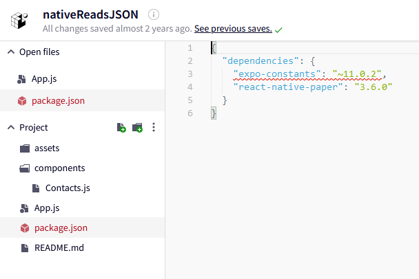
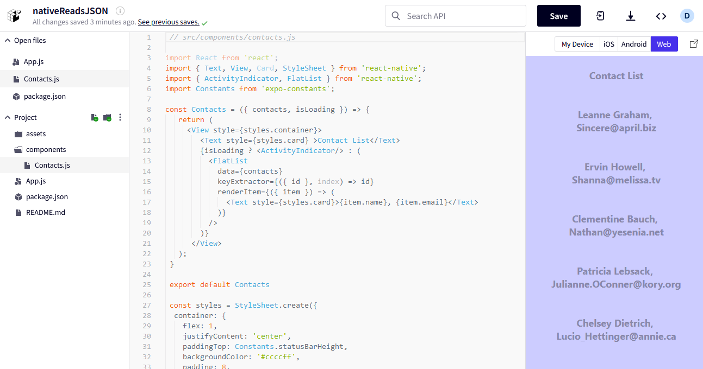
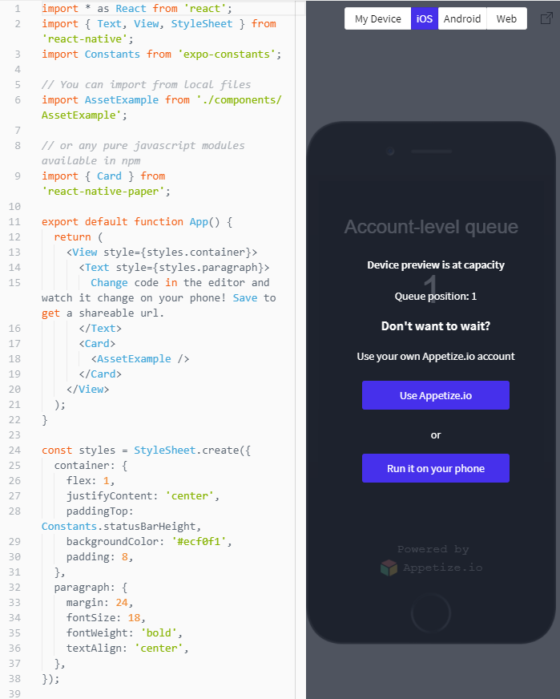
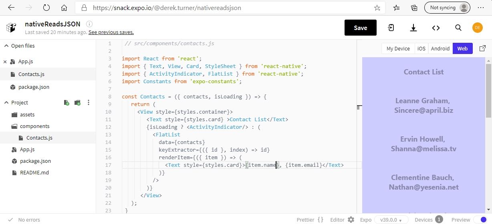
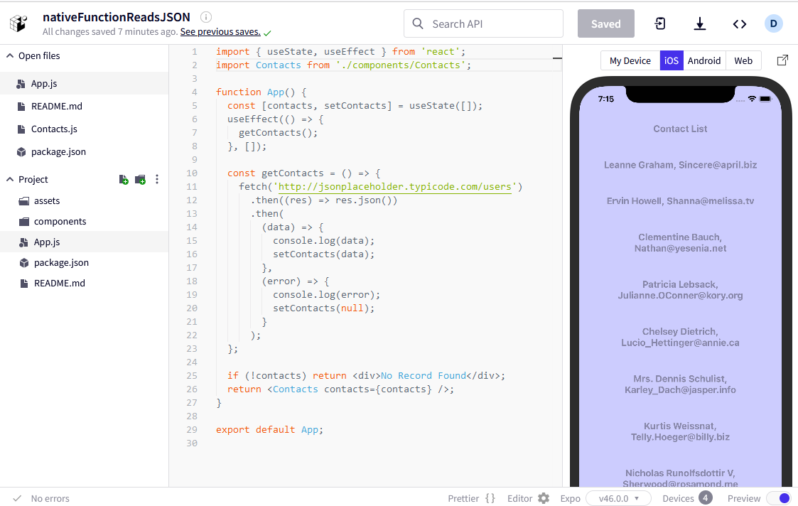

## Running native in EXPO

Expo provides features to support the development of react-native web apps.  Details of features can be followed in the [Expo blog](https://blog.expo.io/).  

[A recent blog entry](https://medium.com/the-exponent-log/expo-sdk-46-c2a1655f63f7) says that EXPO SDK 46 is available and supports [react native 0.69](https://reactnative.dev/) and React 18.

As well as allowing you to develop react native for mobile applications, expo also allows you to develop react code for web apps and these are Progressive Web Apps by default and so installable across platforms.  A blog entry describes the c[reation and deployment of a progressive web app](https://blog.expo.io/create-and-deploy-web-apps-and-pwas-with-expo-a286cc35d83c)

Whilst the main route to developing apps might be the expo CLI, there is an online facility which should be the starting point for development called [Snack](https://blog.expo.io/sketch-a-playground-for-react-native-16b2401f44a2).  This should be the starting point for try out.

So I am going to make a snack starting with the reactReadsJSON code and seeking to translate this to React-Native.

I have made an expo account so can sign in at https://expo.dev/ 

I have a snack already made called nativeReadsJSON


On opening this I see a message which says it was written on an old version of expo and so it is updated.

I also see a message 


I can see all the files in the App so I can view package.json and see where the change is needed.



Update this to read 

```javascript
{
  "dependencies": {
    "expo-constants": "~13.2.4",
    "react-native-paper": "3.6.0"
  }
}
```
My old snack is now ready to go. 

I can see a web preview of the app working.



I will save that now.

In order to view the app live on your phone go to the apple store or the play store and download the expo app to your phone.

When you first look you should see a starter app is set up ready.

If you don't have a phone handy you can run a simulator online, however, there is a limitted pool of simulators so you may need to wait for a minute or so to get one.



Once I have the online simulator the code is shown.


Editing the code causes a live update.


Much of the code from react will carry straight over into react native, but jsx representations of html tags  will need to be replaced by react-native  views and  widgets.

The syntax for maintaining state is also slightly different so refer to the react-native page describing [Fetch.](https://reactnative.dev/docs/network#using-fetch), and the [basics of state](https://reactnative.dev/docs/intro-react) for the class component.

This tutorial is using class components, but react native acn also use hooks.

The application starts with App.js

```javascript
import React, { Component }from 'react';
import Contacts from './components/Contacts';


class App extends Component {
  constructor(props) {
    super(props);

    this.state = {
      data: [],
      isLoading: true
    };
  }
 
  componentDidMount() {
    fetch('https://jsonplaceholder.typicode.com/users/')
      .then((response) => response.json())
      .then((json) => {
        this.setState({ data: json  });
      })
      .catch((error) => console.error(error))
      .finally(() => {
        this.setState({ isLoading: false });
      });
  }
   

render() {
    return (
      <Contacts contacts={this.state.data} isLoading={this.state.isLoading} />
    );
  }

}  


export default App;

```

The application starts by importing react Component and the Contacts component.

The class App which extends Component has a constructor which holds state as a data array and a boolean isLoading.

The method componentDidMount() used to trigger the fetch from jsonplaceholder when the app is running.  The boolean value isLoading is moved from true to false when the promised JSON code has been has been retrieved.

The retrived code is in the format of an array of objects:

```JSON
[
  {
    "id": 1,
    "name": "Leanne Graham",
    "username": "Bret",
    "email": "Sincere@april.biz",
    "address": {
      "street": "Kulas Light",
      "suite": "Apt. 556",
      "city": "Gwenborough",
      "zipcode": "92998-3874",
      "geo": {
        "lat": "-37.3159",
        "lng": "81.1496"
      }
    },
    "phone": "1-770-736-8031 x56442",
    "website": "hildegard.org",
    "company": {
      "name": "Romaguera-Crona",
      "catchPhrase": "Multi-layered client-server neural-net",
      "bs": "harness real-time e-markets"
    }
  },
  {
    "id": 2,
    "name": "Ervin Howell",
    "username": "Antonette",
    "email": "Shanna@melissa.tv",
    "address": {
      "street": "Victor Plains",
      "suite": "Suite 879",
      "city": "Wisokyburgh",
      "zipcode": "90566-7771",
      "geo": {
        "lat": "-43.9509",
        "lng": "-34.4618"
      }
    },
    "phone": "010-692-6593 x09125",
    "website": "anastasia.net",
    "company": {
      "name": "Deckow-Crist",
      "catchPhrase": "Proactive didactic contingency",
      "bs": "synergize scalable supply-chains"
    }
  },
  ...
]  
```
The render passes the array this.state.data  and the isLoading boolean to the Contacts component listed in the components directory.

```javascript
// src/components/contacts.js

import React from 'react';
import { Text, View, Card, StyleSheet } from 'react-native';
import { ActivityIndicator, FlatList } from 'react-native';
import Constants from 'expo-constants';

const Contacts = ({ contacts, isLoading }) => {
   return (
     <View style={styles.container}>
        <Text style={styles.card} >Contact List</Text>
        {isLoading ? <ActivityIndicator/> : (
          <FlatList 
            data={contacts}
            keyExtractor={({ id }, index) => id}
            renderItem={({ item }) => (
              <Text style={styles.card}>{item.name}, {item.email}</Text>
            )}
          />
        )}
      </View>
   );
 }

 export default Contacts

 const styles = StyleSheet.create({
  container: {
    flex: 1,
    justifyContent: 'center',
    paddingTop: Constants.statusBarHeight,
    backgroundColor: '#ccccff',
    padding: 8,
  },
  card: {
    margin: 24,
    fontSize: 18,
    color: '#8888aa',
    fontWeight: 'bold',
    textAlign: 'center',
  },
});
```
The first lines of contacts.js import react and the required screen widgets from react native.  The FlatList is suitable for listing out the array contents.

the constant Contacts variable holds a function which takes in the props contacts and isLoading.

The basic dispaly area in reactNative is the View.  It is essential that all ajacent display elements in react native are bracketed by a parent display element. So Text, Flatlist and further Text must be held within View.

Stylesheet code for the container element and the card element are included in this file, but could be moved into a separate .css file with refactoring.

The View container takes the style from the styles stylesheet for container.  Text containers are drawing style from card.

The isLoading boolean is used with a ? true : false syntax so that if the data is still loading the ActivityIndicator is displayed.  This is typically a rotating arrow.

When isLoading becomes false Flatlist renders the array.  Recalling the JSON data:

```JSON
```JSON
[
  {
    "id": 1,
    "name": "Leanne Graham",
    "username": "Bret",
    ...
```
The keyExtractor iterates through the data using the id as index.  The iterated item is then passed to a fuction which uses the react native text element to dispay the item.name and item email.    

To list other elements of data simply add terms such as {item.username} or {item.address.street}

The output is captured in webview.



Also note that some of the dependencies required are listed in the package.json file.

```JSON
{
  "dependencies": {
    "expo-constants": "~13.2.4",
    "react-native-paper": "3.6.0"
  }
}
```
To view this on a mobile device, in this case an iphone.  Download the expo app to the phone from apple store and run it.  

Selecting the iphone tab reveals a phone simulator.  Tap to play will simulate on appetize.io after a suitable wait.  However 'tap to play' will show a dialogue box to select the device.  

I prefer to select QR code


 and point the iphone camera at the screen.  Tap the iphone prompt to open in expo and the contact list is displayed on the phone.

The whole app can be downloaded as a zip file from the expo site.


## Function reads JSON

The function based code to read JSON form and API also works in expo snack.  I notice that snack favours Capital letters on th file names so the import line needs to be adjusted.

The full listing of App.js on the expo snack nativeFunctionReadsJSON reads:

```javascript
import { useState, useEffect } from 'react';
import Contacts from './components/Contacts';

function App() {
  const [contacts, setContacts] = useState([]);
  useEffect(() => {
    getContacts();
  }, []);

  const getContacts = () => {
    fetch('http://jsonplaceholder.typicode.com/users')
      .then((res) => res.json())
      .then(
        (data) => {
          console.log(data);
          setContacts(data);
        },
        (error) => {
          console.log(error);
          setContacts(null);
        }
      );
  };

  if (!contacts) return <div>No Record Found</div>;
  return <Contacts contacts={contacts} />;
}

export default App;
```
The result is shown here on the iOS simulation.  I note that the web simulation does not now work!



