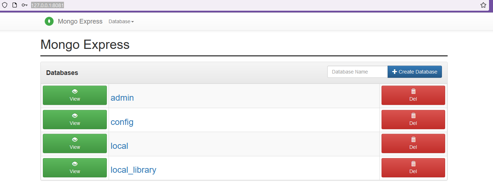
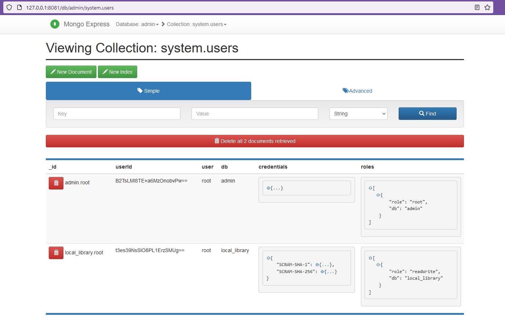
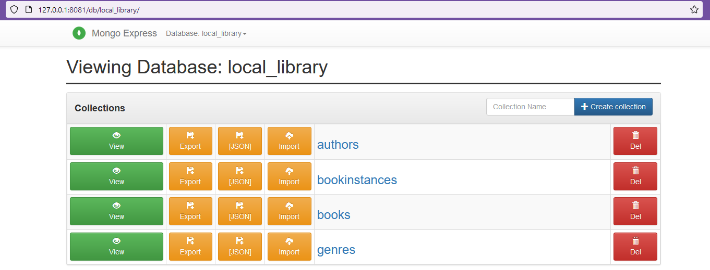
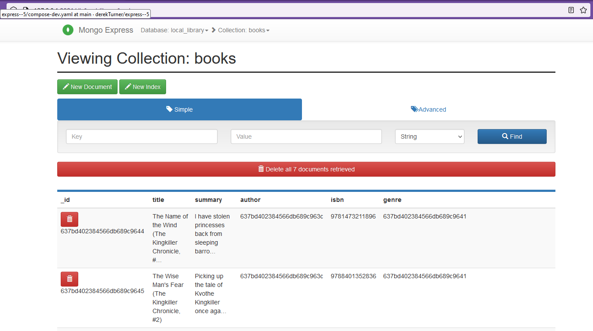
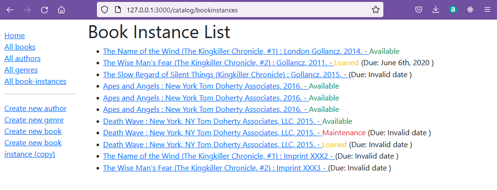
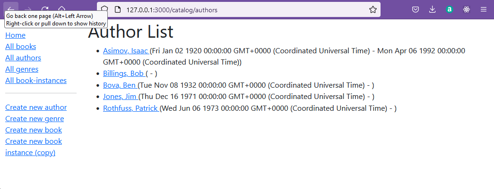

## Setting up views for express app.

The steps towards a full stack from here are:

1. Complete the express application to query the database from a browser page.

2. Complete a full CRUD implementation which uses pug views to render html on the server side.

3. Modify the resulting application to return json output rather than pug views and adapt a react app to interface with this.


## Developing the Mongo application

Create a new local folder express--5 and copy the folders, docker and myapp across together with mongo-init.js from express4 ready to start the next stage.


Start by creating a new public github repository express---5 with a node .gitignore file.


Create the local bare clone copy working in powershell;

> git clone --bare https://github.com/derekTurner/express--4.git

Move to the now local copy and Mirror push the thew repository

> cd express--4.git

> git push --mirror https://github.com/derekTurner/express--5.git

Then remove the local repository

> cd..

> rm -rf express--4.git

If necessary, manually remove the local copy of express--3.git which is probably in your users directory.

For docker to work it requires all references in the **compose-dev.yaml** file to be unique so make sure that old containers are removed from docker before trying to create the next environment.


This section is working through the Mozilla tutorial section 5 [Displaying Library data](https://developer.mozilla.org/en-US/docs/Learn/Server-side/Express_Nodejs/Displaying_data)

In order to work through the tutorial code in the context of docker it is important to consider some points of detail which are required for a successful outcome.

## Mongo initialisation

Some changes will need to be made to the **mongo-init.js** file editing on github. I will explain the changes and then give a full listing of the revised **mongo-init.js**

### Mongoose Pluralizes

Mongoose pluralises collections.  So alter mongo-init js so that collectons are authors rather than author and so on for each field.  It is possible to override this pluralisation, but in practice remembering to do so on every occasion is an unnecessary burden.  In the event of a mismatch in naming between collections such as author and authors the result of a query to the database would be the return of an empty dataset, no error would be raised, so the problem may be difficult to spot.

This will mean that the initialisation file must be modified to refer to plural collections db.books, db.authors, db.bookinstances and db.genres:

**mongo-init.js**
```javascript
let res = [
  db.books.drop(),
  db.authors.drop(),
  db.bookinstances.drop(),
  db.genres.drop(),

  db.books.createIndex({ title: 1 }, { unique: true }),
  db.books.createIndex({ summary: 1 }),
  db.books.createIndex({ author: 1 }),
  db.books.createIndex({ isbn: 1 }),
  db.books.createIndex({ genre: 1 }),

  db.authors.createIndex({ first_name: 1 }),
  db.authors.createIndex({ family_name: 1 }),
  db.authors.createIndex({ d_birth: 1 }),
  db.authors.createIndex({ d_death: 1 }),

  db.bookinstances.createIndex({ book: 1 }),
  db.bookinstances.createIndex({ imprint: 1 }),
  db.bookinstances.createIndex({ due_back: 1 }),
  db.bookinstances.createIndex({ status: 1 }),

  db.genres.createIndex({ name: 1 })
];
```


### Docker needs authority

To operate on a database an application needs both a valid connection string and to be an authorised user.  

The [standard form of the connection string](https://docs.mongodb.com/manual/reference/connection-string/) is:

```javascript
mongodb://[username:password@]host1[:port1][,...hostN[:portN]][/[database][?options]]
```

When containers are spun up by a single docker-compose file docker creates a network connection between them.  The name of the container which is runing the database service is the address to be added to the connection string rather than localhost, 127.0.0.1 or an external url.  

The connection string must include the name of the database being used.  When the mongo express administrative tool is used to inspect a 'database' it is found that there are actually several databases including admin, config and local.  One database named admin requires an admin user with a valid password to access it. The admin database contains details of the system users.  The admin user must be set up to match the initial application accessing it. The mongo express application is provided with this through environment variables set in the Docker-Compose file.

At the moment in compose-dev.yaml the passwords are set as 

```yaml
      MONGO_INITDB_ROOT_USERNAME: root
      MONGO_INITDB_ROOT_PASSWORD: example
```

Some programmers set up the values of these environment variables in a seperate file .env and then call them in as constants, but that has not been done here.

When the compose file is brought up the volume

```yaml
    - ./mongo-init.js:/docker-entrypoint-initdb.d/mongo-init.js:ro  
```
maps the initialising javascript file to an entrypoint and runs this to populate the database. The name of the database which becomes populated is also passed through an environmental variable.

```yaml
      MONGO_INITDB_DATABASE: local_library
```

Now the express app which is being written to interact with the database also needs to be a user listed in the system users database.  The app needs to be a user with read write access to the database containing application data, in this case named local_library.

A user can be added to the system users database by adding code to create a user at the top of the **mongo-init.js** file.

**mongo-init.js**
```yaml
db.createUser(
  {
      user: "root",
      pwd: "example",
      roles:[
          {
              role: "readWrite",
              db:   "local_library"
          }
      ]
  }
);
```

### Normalised or Denormalised database

[6 Rules of Thumb for MongoDB Schema Design](https://www.mongodb.com/blog/post/6-rules-of-thumb-for-mongodb-schema-design-part-1) discusses the trade off between *normalizing* data, so that every table is  complete with embedded data from one to many relationships and *denormalizing*, so that the collection for the many contains references to the one.

Denormalizing only becomes possible in a NoSQL database, relational databases are normalized and references are made between tables.

Denormalizing means that each collection is full and complete, it has an advantage on read that the full information is read without the need to join in data from other referenced collections.  This means that the data may now be held in two or more collections, which is a built in redundancy.  To keep all the embedded data correct this will have a cost when creating or updating a new element.

Normalising means that in a one to many relationship, the doument for the many will include references to the one.  This will have a cost on reading to populate the result from two or more collections, however the writing will be easier as the items in the one collection are isolated.

Advice is generally to prefer normalized collections.  Denormalised collections are preferred in the limitted case where the scale of the one to many connection is one to few and reading is much more common than updating.

Just because you can embed does not mean you should.

Mongoose provides a convenient command *populate()* to handle normalised referenced collections so the balance of benefit moves towards normalisation.

In the original version of mongo-init.js a denormalised database was set up.  The data for authors and genres were saved as arrays and then inserted into the book data.

```javascript
bookCreate('Test Book 1', 'Summary of test book 1', 'ISBN111111', authors[4], [genres[0],genres[1]]);
```
Provided the authors and genres arrays were pouplated before the bookCreate() this worked fine.

The Local-Library tutorial which is being dockerized is based on a normalised database, so mongo-init.js must be ajusted to match this format.

For a normalised database a reference to the .id of the authors and genres must be inserted into bookCreate.  That calls for a change in flow!.  The database entries for authors and genres must be made first.  Then the ids are read back from the database, stored in an array and added to the bookCreate. 

To write to the database after creating values we must printjson(res) immediately.

```javascript
authorCreate('Patrick', 'Rothfuss', new Date('1973-06-06'), false);
authorCreate('Ben', 'Bova', new Date('1932-11-8'), false);
authorCreate('Isaac', 'Asimov', new Date('1920-01-02'), new Date('1992-04-06'));
authorCreate('Bob', 'Billings', false, false);
authorCreate('Jim', 'Jones', new Date('1971-12-16'), false);

genreCreate("Fantasy");
genreCreate("Science Fiction");
genreCreate("French Poetry");

printjson(res);
```

Now before writing any more res needs to be reset to a null array so that we don't send duplicate information on the next printjson(res).

```javascript
res = [];
```

The authors and genres databases must now be read back and an array made of the results.  Note that we are using the MongoDB method [find].(https://docs.mongodb.com/manual/reference/method/db.collection.find/#find-projection) because mongoose is not invoked at this point.

```javascript
var myAuthorCursor = db.authors.find();
var authorsArray = myAuthorCursor.toArray();


var myGenreCursor = db.genres.find();
var genresArray = myGenreCursor.toArray();

```

Now the entry for Test Book 1 relates to the object ID of the authors and genres.

```javascript
bookCreate('Test Book 1', 'Summary of test book 1', 'ISBN111111', authorsArray[4]._id, [genresArray[0]._id,genresArray[1]._id]);

```

Another printjson(res) is needed.  finally the process is repeated to get the book object IDs for bookInstances.

Now update the full listing of **mongo-init.js** accordingly to:

```javascript
db.createUser(
  {
      user: "root",
      pwd: "example",
      roles:[
          {
              role: "readWrite",
              db:   "local_library"
          }
      ]
  }
);

let error = false

let genres = []
let authors = []
let books = []
let bookinstances = []
  

function authorCreate(first_name, family_name, date_of_birth, date_of_death) {
    authordetail = {first_name:first_name , family_name: family_name ,date_of_birth: null, date_of_death: null}
    if (date_of_birth != false) authordetail.date_of_birth = date_of_birth;
    if (date_of_death != false) authordetail.date_of_death = date_of_death;
    authors.push(authordetail)
    res.push(db.authors.insert(authordetail))
}

function genreCreate(name) {
  genredetail = {name: name};
  genres.push(genredetail)
  res.push(db.genres.insert(genredetail))
}


function bookCreate(title, summary, isbn, author, genre) {
    bookdetail = { 
      title: title,
      summary: summary,
      author: author,
      isbn: isbn,
      genre: null
    }
    if (genre != false) bookdetail.genre = genre;   
    books.push(bookdetail);
    res.push(db.books.insert(bookdetail))
}

function bookInstanceCreate(book, imprint, due_back, status) {
  bookinstancedetail = { 
    book: book,
    imprint: imprint,
    due_back: null,
    status: null
  }    
  if (due_back != false) bookinstancedetail.due_back = due_back
  if (status != false) bookinstancedetail.status = status
    bookinstances.push(bookinstancedetail);
    res.push(db.bookinstances.insert(bookinstancedetail))
}

  

let res = [
  db.books.drop(),
  db.authors.drop(),
  db.bookinstances.drop(),
  db.genres.drop(),
  
  db.books.createIndex({ title: 1 },{ unique: true }),
  db.books.createIndex({ summary: 1 }),
  db.books.createIndex({ author: 1 }),
  db.books.createIndex({ isbn: 1 }),
  db.books.createIndex({ genre: 1 }),                            
  
  db.authors.createIndex({first_name:1},{name:"first_name"}),
  db.authors.createIndex({family_name:1},{name:"family_name"}),
  db.authors.createIndex({date_of_birth:1},{name:"date_of_birth"}),
  db.authors.createIndex({date_of_death:1},{name:"date_of_death"}),

  db.bookinstances.createIndex({book: 1}),
  db.bookinstances.createIndex({imprint: 1}),
  db.bookinstances.createIndex({due_back: 1}),
  db.bookinstances.createIndex({status: 1}),

  db.genres.createIndex({name: 1}),
]

authorCreate('Patrick', 'Rothfuss', new Date('1973-06-06'), false);
authorCreate('Ben', 'Bova', new Date('1932-11-8'), false);
authorCreate('Isaac', 'Asimov', new Date('1920-01-02'), new Date('1992-04-06'));
authorCreate('Bob', 'Billings', false, false);
authorCreate('Jim', 'Jones', new Date('1971-12-16'), false);

genreCreate("Fantasy");
genreCreate("Science Fiction");
genreCreate("French Poetry");

printjson(res);
res = [];

var myAuthorCursor = db.authors.find();
var authorsArray = myAuthorCursor.toArray();


var myGenreCursor = db.genres.find();
var genresArray = myGenreCursor.toArray();


bookCreate('The Name of the Wind (The Kingkiller Chronicle, #1)', 'I have stolen princesses back from sleeping barrow kings. I burned down the town of Trebon. I have spent the night with Felurian and left with both my sanity and my life. I was expelled from the University at a younger age than most people are allowed in. I tread paths by moonlight that others fear to speak of during day. I have talked to Gods, loved women, and written songs that make the minstrels weep.', '9781473211896', authorsArray[0]._id, [genresArray[0]._id,]);
bookCreate("The Wise Man's Fear (The Kingkiller Chronicle, #2)", 'Picking up the tale of Kvothe Kingkiller once again, we follow him into exile, into political intrigue, courtship, adventure, love and magic... and further along the path that has turned Kvothe, the mightiest magician of his age, a legend in his own time, into Kote, the unassuming pub landlord.', '9788401352836', authorsArray[0]._id, [genresArray[0]._id,]);
bookCreate("The Slow Regard of Silent Things (Kingkiller Chronicle)", 'Deep below the University, there is a dark place. Few people know of it: a broken web of ancient passageways and abandoned rooms. A young woman lives there, tucked among the sprawling tunnels of the Underthing, snug in the heart of this forgotten place.', '9780756411336', authorsArray[0]._id, [genresArray[0]._id,]);
bookCreate("Apes and Angels", "Humankind headed out to the stars not for conquest, nor exploration, nor even for curiosity. Humans went to the stars in a desperate crusade to save intelligent life wherever they found it. A wave of death is spreading through the Milky Way galaxy, an expanding sphere of lethal gamma ...", '9780765379528', authorsArray[1]._id, [genresArray[1]._id,]);
bookCreate("Death Wave","In Ben Bova's previous novel New Earth, Jordan Kell led the first human mission beyond the solar system. They discovered the ruins of an ancient alien civilization. But one alien AI survived, and it revealed to Jordan Kell that an explosion in the black hole at the heart of the Milky Way galaxy has created a wave of deadly radiation, expanding out from the core toward Earth. Unless the human race acts to save itself, all life on Earth will be wiped out...", '9780765379504', authorsArray[1]._id, [genresArray[1]._id,]);
bookCreate('Test Book 1', 'Summary of test book 1', 'ISBN111111', authorsArray[4]._id, [genresArray[0]._id,genresArray[1]._id]);
bookCreate('Test Book 2', 'Summary of test book 2', 'ISBN222222', authorsArray[4]._id, false)
 
printjson(res);
res = [];

var myBookCursor = db.books.find();
var booksArray = myBookCursor.toArray();

bookInstanceCreate(booksArray[0]._id, 'London Gollancz, 2014.', false, 'Available');
bookInstanceCreate(booksArray[1]._id, ' Gollancz, 2011.', '2020-06-06', 'Loaned');
bookInstanceCreate(booksArray[2]._id, ' Gollancz, 2015.', false, false);
bookInstanceCreate(booksArray[3]._id, 'New York Tom Doherty Associates, 2016.', false, 'Available');
bookInstanceCreate(booksArray[3]._id, 'New York Tom Doherty Associates, 2016.', false, 'Available');
bookInstanceCreate(booksArray[3]._id, 'New York Tom Doherty Associates, 2016.', false, 'Available');
bookInstanceCreate(booksArray[4]._id, 'New York, NY Tom Doherty Associates, LLC, 2015.', false, 'Available');
bookInstanceCreate(booksArray[4]._id, 'New York, NY Tom Doherty Associates, LLC, 2015.', false, 'Maintenance');
bookInstanceCreate(booksArray[4]._id, 'New York, NY Tom Doherty Associates, LLC, 2015.', false, 'Loaned');
bookInstanceCreate(booksArray[0]._id, 'Imprint XXX2', false, false);
bookInstanceCreate(booksArray[1]._id, 'Imprint XXX3', false, false);

printjson(res)

if (error) {
  print('Error, exiting')
  quit(1)
}
```

### create docker environment
Now create an new Docker environment to continue working in.


Leading to running containers:


Use Mongo express to view the running database and note the changes which normalisation has brought about.

> http://127.0.0.1:8081/



Viewing the admin database system users shows the roles which can be expanded to view for the admin and local_library databases.



In the local library the collection names are pluralized.



Books contain references to author and genre in the normalised database format rather than the full details which were incuded in the first non-normalised version of the database.




## Install dependancies

Open server5 container in visual studio.

Working as root user 

>cd myapp

Change the password to 'node'

>passwd

```code
New password: 
Retype new password: 
passwd: password updated successfully
```

Change user to node

>su node

Install the dependancies listed in package.json

>npm install

```code
added 252 packages, and audited 253 packages in 16s

20 packages are looking for funding
  run `npm fund` for details

found 0 vulnerabilities
npm notice 
npm notice New major version of npm available! 8.19.2 -> 9.1.2
npm notice Changelog: https://github.com/npm/cli/releases/tag/v9.1.2
npm notice Run npm install -g npm@9.1.2 to update!
npm notice 
```

Updating npm to the latest version will need us to dip back into the root user:

>su root

Enter password as 'node'

>npm install -g npm@9.1.2

```code
removed 13 packages, changed 74 packages, and audited 223 packages in 5s

14 packages are looking for funding
  run `npm fund` for details

found 0 vulnerabilities
```
Now the app should be ready to run, so skipping back to the node user.

>su node

Start the app running.

>npm run start

Check that thapp operates as it did in express--4 and then it is ready to develop onwards.

## Server application

Now edit changes to **app.js** .

The mongo-express application can access the database already but app.js can't yet because the connection string has not been correctly completed with user authentication.

Add the connection and authorisation lines to the mongoose connection (taking care of mongodb5 and a comma after true):

```javascript
//Set up mongoose connection
const mongoose = require('mongoose');
const mongoDB = 'mongodb://mongodb:27017/local_library';
mongoose.Promise = global.Promise;
mongoose.connect(mongoDB, { 
  auth: {     
  username: "root",     
  password: "example"  
  }  
});
const db = mongoose.connection;
db.on('error', console.error.bind(console, 'MongoDB connection error:'));
```

Here the url 'mongodb' is the name of the container which the database runs in whch is established in the docker-compose file.

When the connection string is used to make a connection the auth object must match the user and password of the local_library user.

```javascript
mongoose.connect(mongoDB, { 
  auth: {
  user: "admin",
  password: "password"
  } 
});
```

The application can now successfully interact with the local_library database.


## Asynchronous flow

Information will be requested asynchonously.

If the information can be gained from a single request  the format of the query is relatively straightforward.

Specify an operation to perform and a callback function which will handle the results.  The callback function will have two parameters, the first is an error value, which is null if there is no error and the second is the results from the operation.

In this code, count is a [Mongoose Method](https://mongoosejs.com/docs/api.html#model_Model.count).


```javascript
exports.some_model_count = function(req, res, next) {
 
  SomeModel.count({ a_model_field:'match_value', 
  function (err, result) {// callback
    if (err){console.log('error ', err)
    }else{
      res.render('the_template', { data: result });
    }
  });
}
```

However if multiple asynchronous queries are made the result can't be displayed till all callbacks are complete.  to handle this use the npn *async* module.

The example below shows parallel callbacks which are passed as and object to async.parallel and the results come back in an object with the property names preserved.

```javascript
async.parallel({ 
  one: function(callback) { ... },
  two: function(callback) { ... },
  //...
  something: function(callback) { ... }
  }, 
  // optional callback
  function(err, results) {
    // 'results' is now equal to: 
    {one: 1, two: 2, ..., something: some_value}
  }
);
```

Async also allows for queries in series or waterfall ordering.  The current version of async is 3.2.4 and this is compatible.

Add [async](https://www.npmjs.com/package/async) to package.json

```json
{
  "name": "myapp",
  "version": "0.0.0",
  "private": true,
  "scripts": {
    "start": "nodemon ./bin/www"
  },
  "dependencies": {
    "cookie-parser": "~1.4.4",
    "core-js": "^3.33.2",
    "debug": "~2.6.9",
    "express": "^4.18.2",
    "http-errors": "~1.6.3",
    "morgan": "~1.9.1",
    "nodemon": "^3.0.1",
    "pug": "^3.0.2",
    "mongoose":"^8.0.0",
    "body-parser":"^1.20.2",
    "async":"^3.2.5"
  },
  "nodemonConfig": {
    "delay": "1500",
    "verbose": "true"
  }
}
```


In the folder myapp, install the dependancy file 'async'

>npm install

```code
added 1 package, and audited 254 packages in 769ms

20 packages are looking for funding
  run `npm fund` for details

found 0 vulnerabilities
```

Note that async is not required in app.js.  It is only needed in files which use it and the first of these is **bookController.js**  This will also require the author and genre models for normalised database operation.  Add these lines:

**bookController.js**
```javascript
var Book = require('../models/book');
var Author = require('../models/author');
var Genre = require('../models/genre');
var BookInstance = require('../models/bookinstance');

var async = require('async');

```
The details of this file are discussed in a later section.


## Views vs API

At the moment we are rendering data to a browser not passing it back as json to react so we use views, the files for which are saved in the views folder.

It will be a later stage to edit the application to send json back to react as a rest API should.

We will use pug to render the view according to a template.  The [template syntax is described here.](https://developer.mozilla.org/en-US/docs/Learn/Server-side/Express_Nodejs/Displaying_data/Template_primer)

To get a consistant look to a site a **base template** can be defined in **layout.pug:**

```pug
doctype html
html
  head
    title= title
    link(rel='stylesheet', href='/stylesheets/style.css')
  body
    block content
```

The **block** tag is then used for specific layout in **index.pug** by extending the layout template:

```pug
extends layout

block content
  h1= title
  p Welcome to #{title}
```

Modify **myapp/views/layout.pug** to create a local_library base template which will look like a home page for the application which will later be replaced by react code.

```javascript
doctype html
html(lang='en')
  head
    title= title
    meta(charset='utf-8')
    meta(name='viewport', content='width=device-width, initial-scale=1')
    link(rel='stylesheet', href='https://cdn.jsdelivr.net/npm/bootstrap@5.1.3/dist/css/bootstrap.min.css' integrity='sha384-1BmE4kWBq78iYhFldvKuhfTAU6auU8tT94WrHftjDbrCEXSU1oBoqyl2QvZ6jIW3', crossorigin='anonymous')
    link(rel='stylesheet', href='/stylesheets/style.css')

  body
    div(class='container-fluid')
      div(class='row')
        div(class='col-sm-2')
          block sidebar
            ul(class='sidebar-nav')
              li 
                a(href='/catalog') Home
              li 
                a(href='/catalog/books') All books
              li 
                a(href='/catalog/authors') All authors
              li 
                a(href='/catalog/genres') All genres
              li 
                a(href='/catalog/bookinstances') All book-instances
              li 
                hr
              li 
                a(href='/catalog/author/create') Create new author
              li 
                a(href='/catalog/genre/create') Create new genre
              li 
                a(href='/catalog/book/create') Create new book
              li 
                a(href='/catalog/bookinstance/create') Create new book instance (copy)
                
        div(class='col-sm-10')
          block content
```

Note that this uses bootstrap from the content delivery networks.  This could be replaced a links to a downloaded javascript library if required.

The view now includes a column with links to the application which match database enquiries.

Replace /public/stylesheets/style.css with:

```css
.sidebar-nav {
  margin-top: 20px;
  padding: 0;
  list-style: none;
}
```

## Creating a home page

The [home page](https://developer.mozilla.org/en-US/docs/Learn/Server-side/Express_Nodejs/Displaying_data/Home_page) is called when the request is '/' and a route for this is defined within **/routes/catalog.js** with a callback parameter book_controller.index.

```javascript
// GET catalog home page.
router.get('/', book_controller.index);
```

This callback index is defined in **/controllers/bookController.js**

```javascript
exports.index = function(req, res) {
    res.send('NOT IMPLEMENTED: Site Home Page');
};
```

The controller index will fetch information about how many Book, BookInstance, Author and Genre records are held in the database.  Render this as HTML and return it in an HTTP response.

The Mongoose [countDocuments()](https://mongoosejs.com/docs/api.html#model_Model.countDocuments) method is used to cound the number of instances for each model.

Edit **bookController.js**, replacing exports.index with:

```javascript
var Book = require('../models/book');
var Author = require('../models/author');
var Genre = require('../models/genre');
var BookInstance = require('../models/bookinstance');

var async = require('async');

exports.index = function(req, res) {   
    
    async.parallel({
        book_count: function(callback) {
            Book.countDocuments({}, callback); // Pass an empty object as match condition to find all documents of this collection
        },
        book_instance_count: function(callback) {
            BookInstance.countDocuments({}, callback);
        },
        book_instance_available_count: function(callback) {
            BookInstance.countDocuments({status:'Available'}, callback);
        },
        author_count: function(callback) {
            Author.countDocuments({}, callback);
        },
        genre_count: function(callback) {
            Genre.countDocuments({}, callback);
        }
    }, function(err, results) {
        res.render('index', { title: 'Local Library Home', error: err, data: results });
    });
};
```
This renders the page even if there is an error, so would need a bit of tidying for a public interface.

Now replace the contents of /views/index.pug with:

```pug
extends layout

block content
  h1= title
  p Welcome to #[em LocalLibrary], a very basic Express website developed as a tutorial example on the Mozilla Developer Network.

  h1 Dynamic content

  if error
    p Error getting dynamic content.
  else
    p The library has the following record counts:

    ul
      li #[strong Books:] !{data.book_count}
      li #[strong Copies:] !{data.book_instance_count}
      li #[strong Copies available:] !{data.book_instance_available_count} 
      li #[strong Authors:] !{data.author_count}
      li #[strong Genres:] !{data.genre_count}
```

The view offers an error message if an error is found otherwise it displays the data.

In the browser

> http://127.0.0.1:3000/catalog


## Book list page

Following the tutorial for the [Book list](https://developer.mozilla.org/en-US/docs/Learn/Server-side/Express_Nodejs/Displaying_data/Book_list_page)

Find a list of books and render these though a template.

In /controllers/bookController.js, replace

```javascript
// Display list of all books.
exports.book_list = function(req, res) {
    res.send('NOT IMPLEMENTED: Book list');
};

```

with the new exported book_list() method.

```javascript
// Display list of all Books.
exports.book_list = function(req, res, next) {

  Book.find({}, 'title author')
    .populate('author')
    .exec(function (err, list_books) {
      if (err) { return next(err); }
      //Successful, so render
      res.render('book_list', { title: 'Book List', book_list: list_books });
    }); 
};
```
Create /views/book_list.pug with the content:

```javascript
extends layout

block content
  h1= title
  
  ul
    - book_list.sort(function(a, b) {let textA = a.title.toUpperCase(); let textB = b.title.toUpperCase(); return (textA < textB) ? -1 : (textA > textB) ? 1 : 0;});
    each book in book_list
      li 
        a(href=book.url) #{book.title} 
        |  (#{book.author.name})

    else
      li There are no books.
```

> http://localhost:3000/catalog/books


This uses the models find function rather than async as there is only one question asked.

The method populate('author') uses the stored book author id to populate the result with the full author details. 


## Book Instances

In /controllers/bookinstanceController.js replace

```javascript
// Display list of all BookInstances.
exports.bookinstance_list = function(req, res) {
    res.send('NOT IMPLEMENTED: BookInstance list');
};
```

With code:

```javascript
// Display list of all BookInstances.
exports.bookinstance_list = function(req, res, next) {

  BookInstance.find()
    .populate('book')
    .exec(function (err, list_bookinstances) {
      if (err) { return next(err); }
      // Successful, so render
      res.render('bookinstance_list', { title: 'Book Instance List', bookinstance_list: list_bookinstances });
    });   
};
```
Create /views/bookinstance_list.pug with content:

```javascript
extends layout

block content
  h1= title

  ul
    each val in bookinstance_list
      li 
        a(href=val.url) #{val.book.title} : #{val.imprint} - 
        if val.status=='Available'
          span.text-success #{val.status}
        else if val.status=='Maintenance'
          span.text-danger #{val.status}
        else
          span.text-warning #{val.status} 
        if val.status!='Available'
          span  (Due: #{val.due_back} )

    else
      li There are no book copies in this library.
```

In the browser:

>http://127.0.0.1:3000/catalog/bookinstances


## Date formatting

The date formatting here is a bit rough so we will use the [npm moment module](https://momentjs.com/) to format dates.  Note current verion is 2.29.4.  

The original tutorial we are dockerizing used momentjs, however this is now in maintenance and for new projects you should consider using [Temporal](https://momentjs.com/docs/#/-project-status/future/) which is a stage 3 proposal. (for now I am sticking with moment).

Add this module to package.json (this will require a fresh install build to apply changes).

```json
{
  "name": "myapp",
  "version": "0.0.0",
  "private": true,
  "scripts": {
    "start": "nodemon ./bin/www"
  },
  "dependencies": {
    "cookie-parser": "~1.4.4",
    "core-js": "^3.33.2",
    "debug": "~2.6.9",
    "express": "^4.18.2",
    "http-errors": "~1.6.3",
    "morgan": "~1.9.1",
    "nodemon": "^3.0.1",
    "pug": "^3.0.2",
    "mongoose":"^8.0.0",
    "body-parser":"^1.20.2",
    "async":"^3.2.5",
    "moment":"2.29.4"
  },
  "nodemonConfig": {
    "delay": "1500",
    "verbose": "true"
  }
}
```

Stop the server running.

>CTRL + C

> npm install

```code
added 1 package, and audited 255 packages in 911ms

20 packages are looking for funding
  run `npm fund` for details

found 0 vulnerabilities
```

Restart the server

>npm run start

In **models/bookinstance.js**  require moment and add a 'due_back_formatted' virtual below the 'url' virtual.  Edit the BookInstance Schema:

```javascript
var mongoose = require('mongoose');
var moment = require('moment');

var Schema = mongoose.Schema;

var BookInstanceSchema = new Schema(
  {
    book: { type: Schema.Types.ObjectId, ref: 'Book', required: true }, //reference to the associated book
    imprint: {type: String, required: true},
    status: {type: String, required: true, enum: ['Available', 'Maintenance', 'Loaned', 'Reserved'], default: 'Maintenance'},
    due_back: {type: Date, default: Date.now}
  }
);

// Virtual for bookinstance's URL
BookInstanceSchema
.virtual('url')
.get(function () {
  return '/catalog/bookinstance/' + this._id;
});

BookInstanceSchema
.virtual('due_back_formatted')
.get(function () {
  return moment(this.due_back).format('MMMM Do, YYYY');
});

//Export model
module.exports = mongoose.model('BookInstance', BookInstanceSchema);
```

In **/views/bookinstance_list.pug** comment out and replace due_back with due_back_formatted.

```pug
extends layout

block content
  h1= title

  ul
    each val in bookinstance_list
      li 
        a(href=val.url) #{val.book.title} : #{val.imprint} - 
        if val.status=='Available'
          span.text-success #{val.status}
        else if val.status=='Maintenance'
          span.text-danger #{val.status}
        else
          span.text-warning #{val.status} 
        if val.status!='Available'
          // span  (Due: #{val.due_back} )
          span  (Due: #{val.due_back_formatted} )
    else
      li There are no book copies in this library.
```


Then check date format is month date year.

> http://localhost:3000/catalog/bookinstances




# Author and Genre

Still following [Author list and Genre tutorial]()

In /controllers/authorController.js  

Replace

```javascript
// Display list of all Authors.
exports.author_list = function(req, res) {
    res.send('NOT IMPLEMENTED: Author list');
};
```

With

```javascript
// Display list of all Authors.
exports.author_list = function(req, res, next) {

  Author.find()
    .sort([['family_name', 'ascending']])
    .exec(function (err, list_authors) {
      if (err) { return next(err); }
      //Successful, so render
      res.render('author_list', { title: 'Author List', author_list: list_authors });
    });

};
```

The models find(), sort() and exec() functions are used to list Authors in family_name order.


Create /views/author_list.pug with content:

```javascript
extends layout

block content
  h1= title
  
  ul
    each author in author_list
      li 
        a(href=author.url) #{author.name} 
        |  (#{author.date_of_birth} - #{author.date_of_death})

    else
      li There are no authors.
```

In controllers/genreController.js

replace

```javascript
// Display list of all Genre.
exports.genre_list = function(req, res) {
    res.send('NOT IMPLEMENTED: Genre list');
};
```

With code following a similar pattern:

```javascript
// Display list of all Genres.
exports.genre_list = function(req, res, next) {

    Genre.find()
      .sort([['name', 'ascending']])
      .exec(function (err, list_genres) {
        if (err) { return next(err); }
        //Successful, so render
        res.render('genre_list', { title: 'Genre List', genre_list: list_genres });
      });
  
  };
``` 

Create /views/genre_list.pug with content:

```javascript
extends layout

block content
  h1= title
  
  ul
    each genre in genre_list
      li 
        a(href=genre.url) #{genre.name} 
        | 

    else
      li There are no genres
```

> http://localhost:3000/catalog/authors



> http://localhost:3000/catalog/genres


At this point the database is successfully being read.

I leave it as an exercise to format the authorlist dates.

**Commit and synchronize your site to github**

# References

[6 Rules of Thumb for MongoDB Schema Design](https://www.mongodb.com/blog/post/6-rules-of-thumb-for-mongodb-schema-design-part-1) 

[Mozilla Express Web Framework Tutorial](https://developer.mozilla.org/en-US/docs/Learn/Server-side/Express_Nodejs)

