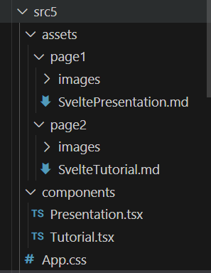
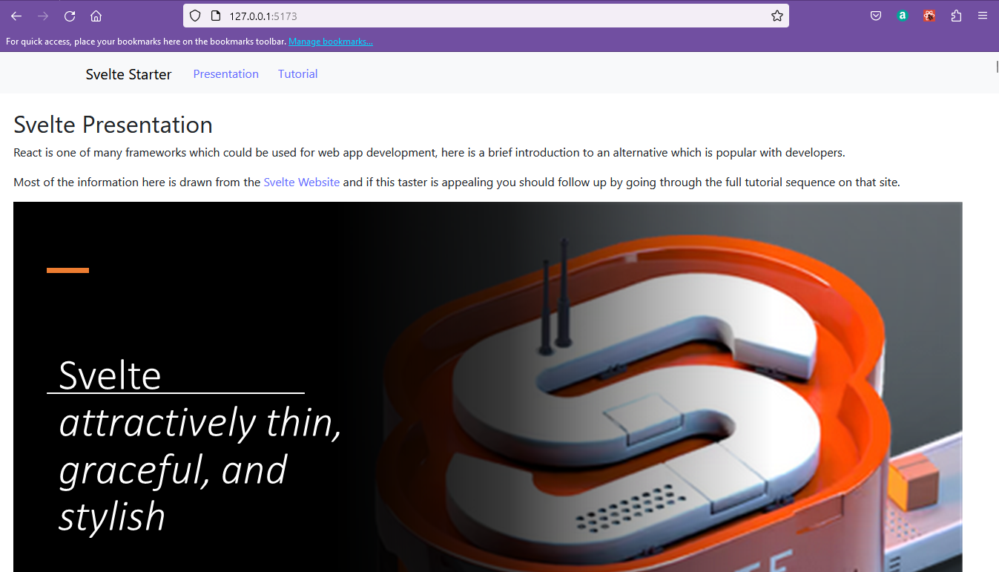
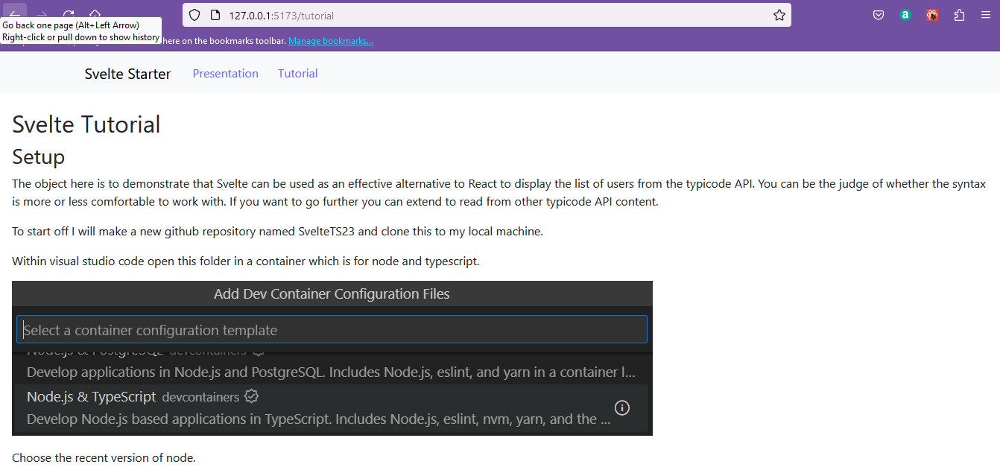
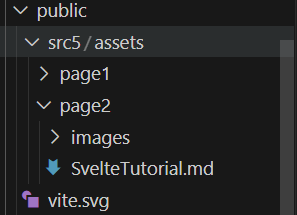
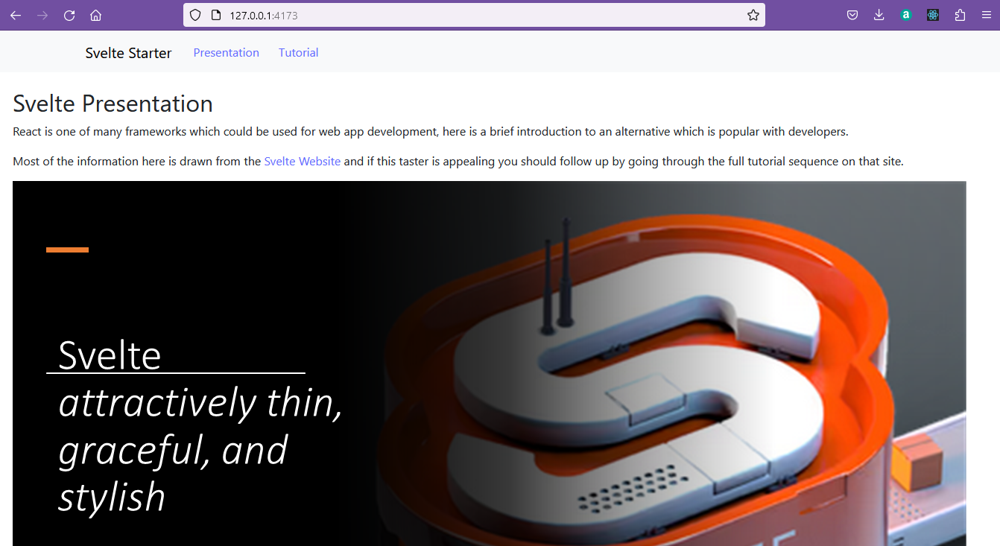
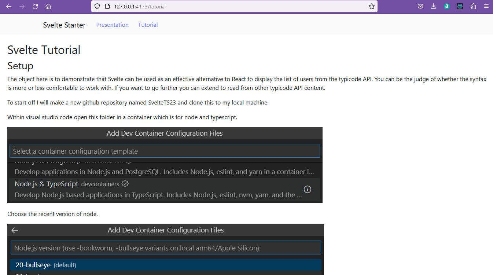
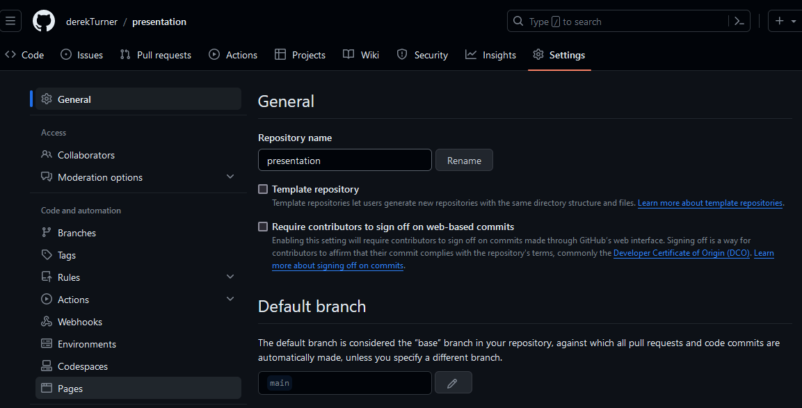
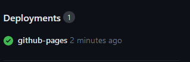
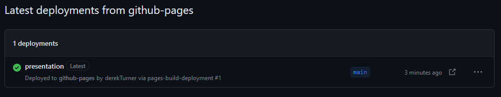

## React to github page

This  object here is to add a couple of markdown files to a React app, navigate between views of the two files and deploy as a github page.

The markdown files will be the svelte presentation and markdown descriptions, but the pages are being displayed in a react app.

### Setup

This app will use the [react router version 6](https://reactrouter.com/en/main) to navigate between views of different components so to setup return the the ReactTS23 folder and add the router so that it will be available for all react pages on the platform.

> npm install react-router-dom

Now add markdown handling, just for this particular project.

> cd react23
 
> npm install react-markdown --save

> ### Routing
>
> The addition of the react router enbles the app to move between views of multiple components.  One component will be for the display of the presentation file, and this willo be the home page.  The other component will be for the display of the tutorial.
>
> In to App.tsx the router and components will need to be imported.  The router has different options and in this case the BrowserRouter will be used.
>
  **App.tsx**
```javascript
import React from 'react';
import { BrowserRouter as Router, Routes, Route, Link } from 'react-router-dom';
import Presentation from './components/Presentation';
import Tutorial from './components/Tutorial';
```

Function App() should then display the selected component depending on the route selected.

```javascript
function App() {
  return (
    <Router>
      <Routes>
        <Route path="/" element={<Presentation />} />
        <Route path="/tutorial" element={<Tutorial />} />
      </Routes>
    </Router>
  );
}

export default App;
```

In case a route is seleted which does not match one of the prescribed selections, an error message should be displayed.  A function can be added to App.tsx

```javascript
function NoMatch() {
  return (
    <div style={{ padding: 20 }}>
      <h2>404: Page Not Found</h2>
      <p>The page selected does not exist.</p>
    </div>
  );
}
```

To test this out a route is added for any path which has not been caught by the defined routes "/" or "/tutorial".

```javascript
<Routes>
        <Route path="/" element={<Presentation />} />
        <Route path="/tutorial" element={<Tutorial />} />
        <Route path="*" element={<NoMatch />} />
      </Routes>
```

This would work if the user typed the url into the browser.  However it would be easier to manage by adding the simplest of navigation menus.  This uses the `<Link>` component of the Router.

```javascript
        <nav style={{ margin: 10 }}>
          <Link to="/" style={{ padding: 5 }}>
          Presentation
          </Link>
          <Link to="/tutorial" style={{ padding: 5 }}>
          Tutorial
          </Link>
      </nav>
```

There is a small amount of style added here, but this could be improved by using [react bootstrap navigation bar](https://react-bootstrap.netlify.app/docs/components/navbar/).   

Note that the routes are not hyperlinks to web addresses so you should not use the href attribute of the `<Nav.Link>` instead use this only for styling to enclose the router `<Link>`.

Bootstrap is already in the development environment so does not need to be installed again.

Import the required components.

```javascript
import Container from 'react-bootstrap/Container';
import Nav from "react-bootstrap/Nav";
import Navbar from "react-bootstrap/Navbar";
```

Then use these in the router.

```javascript
      <Navbar expand="lg" className="bg-body-tertiary">
        <Container>
          <Navbar.Brand href="#home">Svelte Starter</Navbar.Brand>
          <Navbar.Toggle aria-controls="basic-navbar-nav" />
          <Navbar.Collapse id="basic-navbar-nav">
            <Nav className="me-auto">
              <Nav.Link>
                <Link to="/" style={{ padding: 5 }}>
                  Presentation
                </Link>
              </Nav.Link>
              <Nav.Link>
                
                <Link to="/tutorial" style={{ padding: 5 }}>
                  Tutorial
                </Link>
              </Nav.Link>
            </Nav>
          </Navbar.Collapse>
        </Container>
      </Navbar>
```

The complete listing of **App.tsx** is then:

```javascript
import React from "react";
import { BrowserRouter as Router, Routes, Route, Link } from "react-router-dom";
import Presentation from "./components/Presentation";
import Tutorial from "./components/Tutorial";
import Container from 'react-bootstrap/Container';
import Nav from "react-bootstrap/Nav";
import Navbar from "react-bootstrap/Navbar";

function NoMatch() {
  return (
    <div style={{ padding: 20 }}>
      <h2>404: Page Not Found</h2>
      <p>The page selected does not exist.</p>
    </div>
  );
}

function App() {
  return (
    <Router>
      <Navbar expand="lg" className="bg-body-tertiary">
        <Container>
          <Navbar.Brand href="#home">Svelte Starter</Navbar.Brand>
          <Navbar.Toggle aria-controls="basic-navbar-nav" />
          <Navbar.Collapse id="basic-navbar-nav">
            <Nav className="me-auto">
              <Nav.Link>
                <Link to="/" style={{ padding: 5 }}>
                  Presentation
                </Link>
              </Nav.Link>
              <Nav.Link>
                
                <Link to="/tutorial" style={{ padding: 5 }}>
                  Tutorial
                </Link>
              </Nav.Link>
            </Nav>
          </Navbar.Collapse>
        </Container>
      </Navbar>

      <Routes>
        <Route path="/" element={<Presentation />} />
        <Route path="/tutorial" element={<Tutorial />} />
        <Route path="*" element={<NoMatch />} />
      </Routes>
    </Router>
  );
}

export default App;
```

### Displaying markdown.

The presentation and tutorial components are in the components folder.  These will display the markdown files which have been stored with their images in the assets folder separately within page 1 and page 2 folders.



For me these are in src5 folder, but you may have a different folder name here.

The markdown files are similar to their original form, but because they are now in a new folder structure the paths to the images has changed and each needs to be modified to reflect this.

For example an extract from **SveltePresentation.md** will be modified to:

```markdown
## Svelte Presentation

React is one of many frameworks which could be used for web app development, here is a brief introduction to an alternative which is popular with developers.

Most of the information here is drawn from the [Svelte Website](https://svelte.dev/) and if this taster is appealing you should follow up by going through the full tutorial sequence on that site.


Presentation front page with presenter names and appropriate theme.


React initially seems like a single framework so it may initially look as though Svelte is a framework and SvelteKit is some kind of development environment.
```
Take care that the case of PNG matches the image files.

The markdown file will be displayed using the [react-markdown tool](https://retool.com/blog/react-markdown-component-the-easy-way-to-create-rich-text) which has already been installed.

**Presentation.tsx** uses useEffect and useState hooks  to return the content fetched from the markdown file.

```javascript
import React, { useEffect, useState } from "react";
import ReactMarkdown from "react-markdown";

const Presentation = () => {
  const [content, setContent] = useState("");

  useEffect(() => {
    fetch("/src5/assets/page1/SveltePresentation.md")
      .then((res) => res.text())
      .then((text) => setContent(text));
  }, []);

  return (
    <div style={{ padding: 20 }}>
      <ReactMarkdown children={content} />
    </div>
  );
};

export default Presentation;
```
In an equivalent way **Tutorial.tsx** fetches code from SvelteTutorial.md.

```javascript
import React, { useEffect, useState } from "react";
import ReactMarkdown from "react-markdown";

const Tutorial = () => {
  const [content, setContent] = useState("");

  useEffect(() => {
    fetch("/src5/assets/page2/SvelteTutorial.md")
      .then((res) => res.text())
      .then((text) => setContent(text));
  }, []);

  return (
    <div style={{ padding: 20 }}>
      <ReactMarkdown children={content} />
    </div>
  );
};

export default Tutorial;
```

This code could be refactored to reduce duplication, but it is easy enough to use as it is.

The app then appears as:



Following navigation to the tutorial:



## github pages

Close the development server 

> CTRL + C

Before proceeding check that the case of any .png or .PNG images is correct.  The development server is not case sensitive, but the build process is.

In the public folder make a folder src5 to match the one already used and copy the assets into this.

The build process uses the assets in the public folder.



Then build the project

> npm run build

The build can be previewed

> npm run preview

The preview runs on port 4173.  Check that this works properly.



And the links should also be tested.



Stop the development server.

> CTRL + C

Make sure that all editor files are closed and then 

>CTRL + SHIFT + P

Reopen the container locally.


Make a new github repository named presentation with gitnore node.


Use github desktop to clone this to the local machine.


Copy the contents of the dist folder from the reactTS23 local folder to the presentation folder.


Open this folder in visual studio and check that the pages run on live server.

Then use github desktop to commit changes and push to the remote origin.

Back on github choose settings and then pages.



Choose the main branch as the source for your pages.


Then save.

Navigate back on github to the presentation repository and note that the github pages are `queued`.

Refresh the page and the deployment should get a green tick.



Click on this which is a link and you will see the deployment list.



The arrow icon on the right opens this in the browser.

You will see a blank site and ctl + i shows the reason why.   Loading an asset was blocked because of a disallowed MIME type (“text/html”).

This is a browser security feature which needs to be fixed.

Open index.html on the local machine in visual studio.


