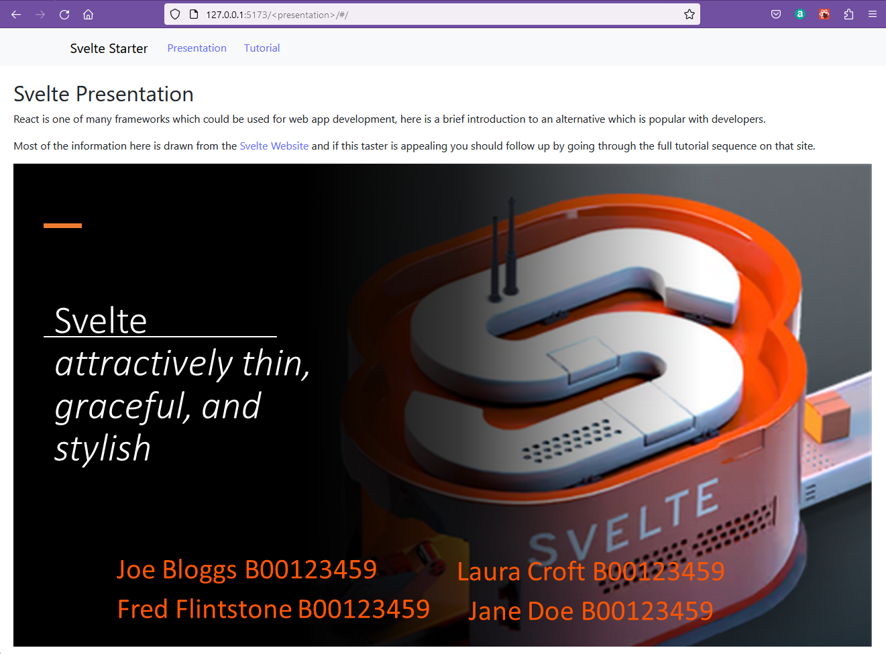
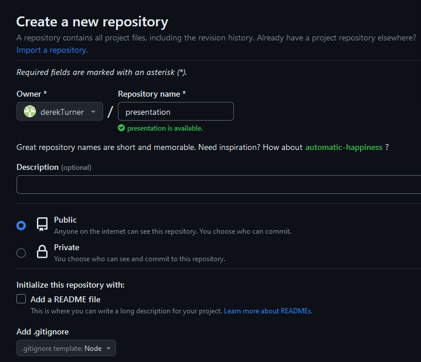
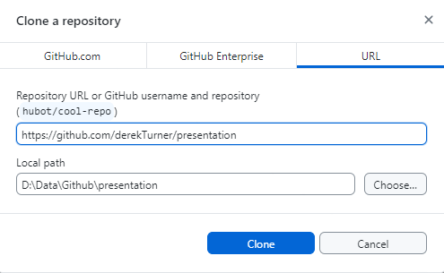
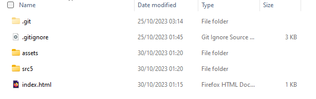
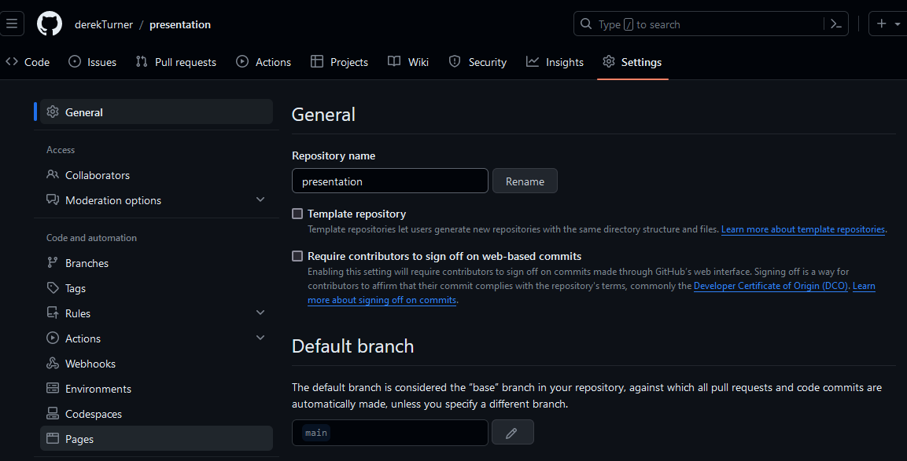
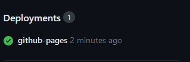
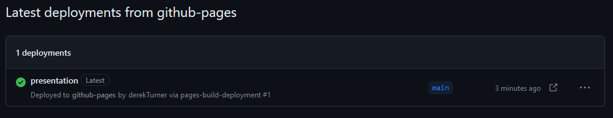

## Github pages

Web pages and apps can be deployed on github pages, however if you try this with the current application it will not work.

[GM Fuster](https://gmfuster.medium.com/deploying-a-react-app-to-github-pages-24c3e5485589) suggests the reasons for this.

1. The directory to the github repo will need to be accessed by the app.
2. Github pages can't use the Browser Router because they interpret the path of all but the indes page as a path to a page which does not exist and return a 404 error.

Many references use the gh-pages package to automate the deployment of gh-pages, but in this section I will deploy manually so that only the essential differences between local/html server and github pages are made.

Many references assume that the "create-react-app" template has been used to create the app and this is not the case if Vite is used, so there is specific [deployment advice for vite](https://vitejs.dev/guide/static-deploy.html#github-pages).

Addressing the first point, for github pages, a base must be set in the vite.config.ts site.

If you are deploying to

 ``https://<USERNAME>.github.io/<REPO>/``
 
 , for example your repository is at 
 
 ``https://github.com/<USERNAME>/<REPO>``
 
 , then set base to ``'/<REPO>/'``.

I will be deploying to a repository named 'presentation' so vite.config.ts becomes:

```javascript
import { defineConfig } from 'vite'
import react from '@vitejs/plugin-react'

// https://vitejs.dev/config/
export default defineConfig({
  plugins: [react()],
  base: `/presentation/`,
})
```
The second point is addresed by using the [react router ```<HashRouter```](https://reactrouter.com/en/main/router-components/hash-router).  Tis is recommended for use when the URL should not be sent to the server.

HashRouter should not be selected for general usage, only where it is genuinely needed.

Modify **App.tsx** to import HashRouter.

```javascript
import React from "react";
//import { BrowserRouter as Router, Routes, Route, Link } from "react-router-dom";
import { HashRouter as Router, Routes, Route, Link } from "react-router-dom";
import Presentation from "./components/Presentation";
import Tutorial from "./components/Tutorial";
import Container from "react-bootstrap/Container";
import Nav from "react-bootstrap/Nav";
import Navbar from "react-bootstrap/Navbar";
...
```

Then add the baseline attribute to the Router

```javascript
function App() {
  return (
    <Router baseline="/">
      <Navbar expand="lg" className="bg-body-tertiary">
        <Container>
        ...
```

Only two lines have been changed.

Change directory to /workspaces/reactTS23/react23/src5 and

> npm run dev

The pages should still run in the browser, but the ``<presentation>`` is shown in the browser url.



> ctrl + C

Now build the app again.

> npm run build

The files in the dist folder are updated.

Make sure that all editor files are saved and then 

>CTRL + SHIFT + P

Reopen the container locally.


Make a new github repository named presentation with gitnore node.



Use github desktop to clone this to the local machine.



Copy the contents of the dist folder from the reactTS23 local folder to the presentation folder.



Open this folder in visual studio and check that the pages run on live server.

Then use github desktop to commit changes and push to the remote origin.

Back on github choose settings and then pages.



Choose the main branch as the source for your pages.


Then save.

Navigate back on github to the presentation repository and note that the github pages are `queued`.

Refresh the page and the deployment should get a green tick.



Click on this which is a link and you will see the deployment list.



The arrow icon on the right opens this in the browser.

You will see a blank site and ctl + i shows the reason why.   Loading an asset was blocked because of a disallowed MIME type (“text/html”).

This is a browser security feature which needs to be fixed.

Mozilla lists [common Mime types](https://developer.mozilla.org/en-US/docs/Web/HTTP/Basics_of_HTTP/MIME_types/Common_types) indicating .js files as requiring "text/javascript"

Open index.html on the local machine in visual studio and edit to:

```html
<!doctype html>
<html lang="en">
  <head>
    <meta charset="UTF-8" />
    <link rel="icon" type="image/svg+xml" href="/vite.svg" />
    <meta name="viewport" content="width=device-width, initial-scale=1.0" />
    <title>Presentation</title>
    <script type="text/javascript" crossorigin src="/presentation/assets/index-34ff90ba.js"></script>
    <link rel="stylesheet" href="/presentation/assets/index-31c4b7a1.css">
  </head>
  <body>
    <div id="root"></div>
    
  </body>
```
Note that your index file identifiers may vary.

Use github desktop to comit and push changes.


