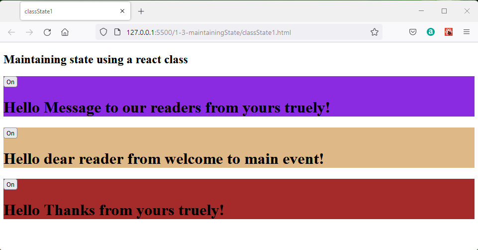
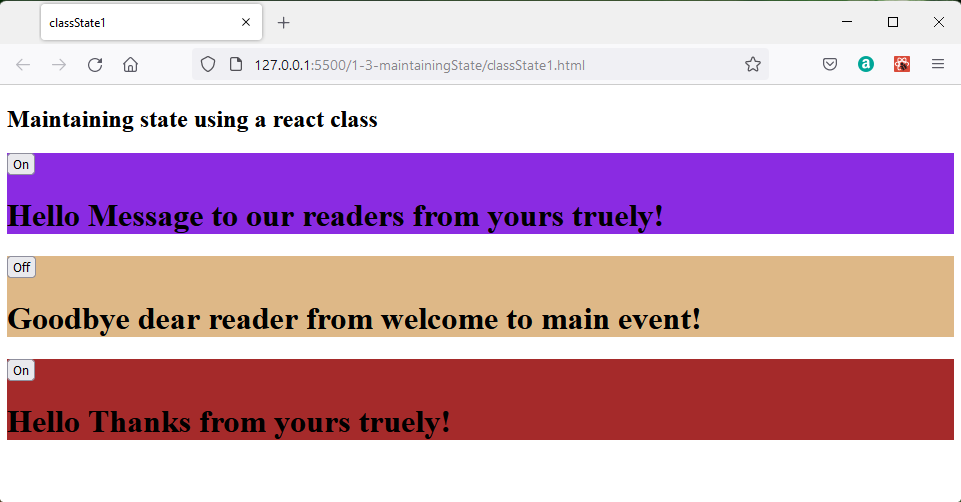
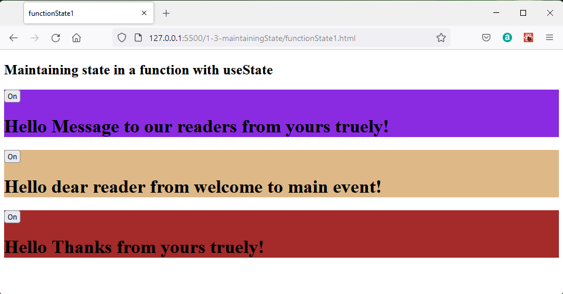
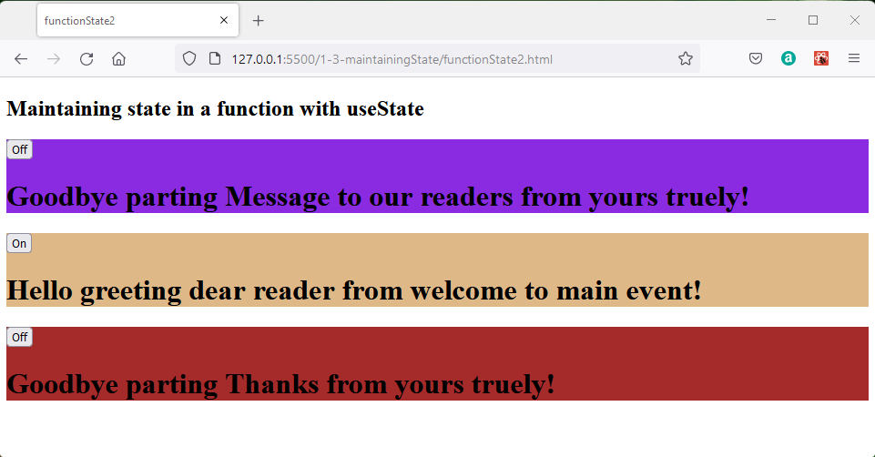
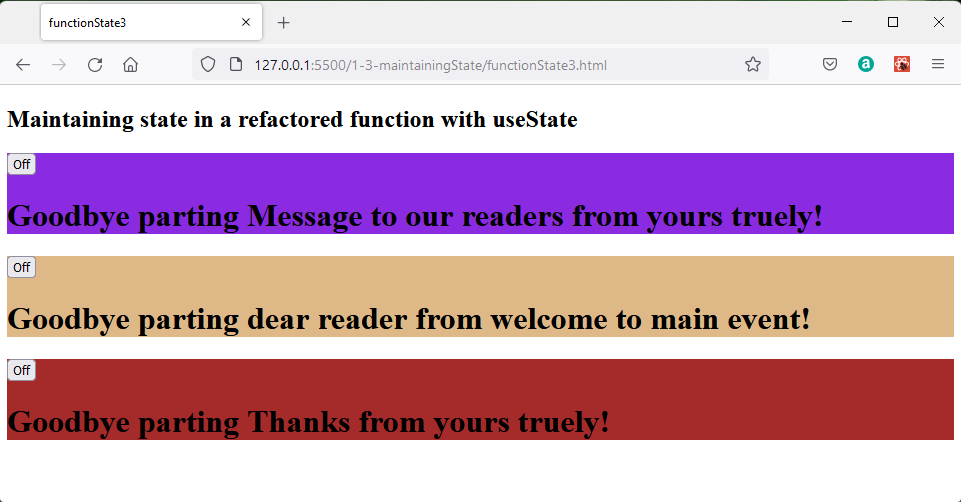

## Maintaining State

What maintaining state means is providing stored memory which can be associated with classes and functions and is available each time the class or function is called.

## Maintaining State with Class Components

Working files **classState1.html** and **classState1.js**.

A traditional class can be thought of as having properties and methods.  The properties are essentially maintaining state within the class and the methods are functions which may be called from the main code which can access the current values of the properties.  The properties may be changed from by interaction with the functions and so are said to be mutable.  An example of a mutable property would be a counter which changes each time a method was called.

A React class can be programmed to maintain state by adding a constructor function which:
 
 * picks up the props of the parent type; component in this case.

 * Uses a JSON object to define the inital value of this.state
  
 * Defines a handler function and binds it to this

Why is it necessary to bind the handler to this?  The keyword *this* is contextual, roughly translated it means the current object which should be the class instance.  However, when a button is clicked it is the button which is the current object and has the context of *this*, so if the event handler is not bound to the class context  *this*, it will not work.


```javascript
constructor(props) {
        super(props);
        this.state = { hello: true };
        this.handleClick = this.handleClick.bind(this);
      }
```
The click event handler function is then defined.  A function *setState()* is used to change the state of the state variable *state.hello*. In this simple example the handler inverted the logic state of hello as *true* or *false*.

```javascript
handleClick() {
        this.setState(state => ({hello: !state.hello}));
    }  
```
In the render method of the component a button is added which will call the handleClick function when it is clicked.

```javascript
<button onClick={this.handleClick}>
```
The renderer in the class then writes a message based on the state.  In this case the two way choice *on* or *off*.

Depending on the state *hello* the message printed on a button can be controlled by

```javascript
{this.state.hello ? "On": "Off"}
```

The message returned by the class render function is set by:

```javascript
 {this.state.hello ? 
    <h1>Hello {this.props.reader} from {this.props.author}!</h1>
    : 
    <h1>Goodbye {this.props.reader} from {this.props.author}!</h1>
}
```
As a reminder the full listing of classState1.js is:

```javascript
const header   = ReactDOM.createRoot(document.getElementById("header"));
const main     = ReactDOM.createRoot(document.getElementById("main"));
const footer   = ReactDOM.createRoot(document.getElementById("footer"));

class Message extends React.Component {
  constructor(props) {
      super(props);
      this.state = { hello: true };
      this.handleClick = this.handleClick.bind(this);
    }
   
  handleClick() {
      this.setState(state => ({hello: !state.hello}));
  }  

  render() {
      return(
      <span>   
      <button onClick={this.handleClick}>
           {this.state.hello ?  "On" : "Off" }
      </button>
      {this.state.hello ? 
              <h1>Hello {this.props.reader} from {this.props.author}!</h1>
              : 
              <h1>Goodbye {this.props.reader} from {this.props.author}!</h1>
          }
      </span>
      );
  }
} 

header.render(<Message reader="Message to our readers" author="yours truely"/>);  
main.render(  <Message reader="dear reader"            author="welcome to main event"/>);
footer.render(<Message reader="Thanks"                 author="yours truely"/>);
```
Which renders as:



Each button controls the state of a class instance independently so that when the button on the main section is clicked only this line changes.



## Maintaining State with functions

A normal javaScript function would not maintain state so the introduction of hooks is a React feature and not a javaScript feature.

### React Hooks


Functions are simpler to use than classes and can allow us to avoid some idiosynchratic syntax such as the need to bind to *this*.

Unfortunately when a javascript function is invoked memory is created and the function runs, on completion this is disposed so the function does not retain any state information.  When it is called for the second time it can not respond to reflect any activity from the first call.

One way round this would be to have some global variables which are read and modified by the function.  but this has its own disadvantages:

* The function cannot be reused in another programme unless all the relevant global variables on which it depends are identifed and copied over and in thes copying no naming conflicts arise.

For many years object oriented programming has been the dominant programming approach, but now functional programming is becoming popular.  This claims a number of advantages including application scaleability.

The essence of functional programming is that all functions used should be pure:

* The action or returned value of a function is determined only by the arguments provided to the function and should be completely predictable.

A function which refers to a global variable to generate a response is not pure because the result depends on some external value rather than the arguments.

One solution might be to pass the value of the global variable in as an argument to the function.  However this still means the function is not stand alone.

> A react hook is a function which when called returns a structure which includes a way to interact with state.

There are a number of react hooks the basic ones are:

* useState
* useEffect
* useContext
  
Other hooks include:

* useRef
* useReducer
* useMemo
* useCallback
* useLayoutEffect
* useDebugValue

The **useState** hook is the one we require to add state to functions to achieve the same results as demonstated for classes.

### Maintaining state with the useState hook

Working files **functionState1.html** and **functionState1.js**

The first step is normally to import the useState hook from react.

```javascript
import {useState} from 'react'
```
This is the line you will need when working in a node environment.  Node is a javascript server and this line represents the app asking for the javascript module to make useState work.  

Because we are working without a development environment we should just keep this line commented out for now to prevent errors.

```javascript
//import {useState} from 'react'
```
This will mean that as a work around, our code will need to refer to

```javascript
React.useState();
```
whereas normally it would be fine just to write:

```javascript
useState();
```
In the Message function when useState is called it returns an array which we store in a constant.  The first element is a named variable into which is placed the value of the state as defined by the parameter to .useState.  For this example this is *true*.  The second element is a variable which will contain the function required to change the state of the varable.  Sensible naming convention makes the connection of these two obvious.

```javascript
const [ hello, setHello ] = React.useState(true);
```

Next we have an event handler function which will be called when the button is clicked.  In this case the value on the clicked elenent is not of interest, we just need to use the setHello function to changd the value or the hello variable.  The ! symbol inverts the value.

```javascript
function handleClick(evt) {
  setHello(!hello);
}  
```
In other programmes we may want to use the value from the element which launched the event in which case we can refere to 

```javascript
evt.target.value 
```
The function should return the JSX required which is the button and a message displayed.

```javascript
return (
  <span>
      <button onClick={handleClick}>
          {hello ?  "On" : "Off" }
      </button>
      {hello ? 
              <h1>Hello   {reader} from {author}!</h1>
              : 
              <h1>Goodbye {reader} from {author}!</h1>
      }
  </span>
);
```
The button is linked to the handler {handleClick} but there is no binding required as the *this* keyword is not needed.

In refering the state it is enough simply to use the constant *hello* rather than needing *this.state.hello*.

The full listing of **functionState1.js** is:

```javascript
const header   = ReactDOM.createRoot(document.getElementById("header"));
const main     = ReactDOM.createRoot(document.getElementById("main"));
const footer   = ReactDOM.createRoot(document.getElementById("footer"));

// import {useState} from 'react'

function Message({reader, author} ) {
  const [ hello, setHello ] = React.useState(true);

  function handleClick(evt) {
      setHello(!hello);
  }  

  return (
      <span>
          <button onClick={handleClick}>
              {hello ?  "On" : "Off" }
          </button>
          {hello ? 
                  <h1>Hello   {reader} from {author}!</h1>
                  : 
                  <h1>Goodbye {reader} from {author}!</h1>
          }
      </span>
  );
} 

header.render(<Message reader="Message to our readers" author="yours truely"/>);  
main.render(  <Message reader="dear reader"            author="welcome to main event"/>);
footer.render(<Message reader="Thanks"                 author="yours truely"/>);
```
This renders exactly the same as the class based code:




Similarly when the button in the main element is toggled, the display changes only in this element.


## Refactoring useState example

In the first example the text for hello and goodbye was written in to the function.

```javascript
          {hello ? 
                  <h1>Hello   {reader} from {author}!</h1>
                  : 
                  <h1>Goodbye {reader} from {author}!</h1>
          }
```

These alternatives can be removed into sepatae functions greeting and parting These newly defined functions are expressed as constants within the Message function.

```javascript
    const greeting = () => <h1>Hello greeting  {reader} from {author}!</h1>;
    const parting  = () => <h1>Goodbye parting {reader} from {author}!</h1>;
```
The ternery expression which represents conditional execution is then simplified.

```javascript
{hello ? greeting() : parting() }
```
The code listing is then slightly shorter and easier to follow.

Full listing of **functionState2.js**:

```javascript
const header   = ReactDOM.createRoot(document.getElementById("header"));
const main     = ReactDOM.createRoot(document.getElementById("main"));
const footer   = ReactDOM.createRoot(document.getElementById("footer"));

// import {useState} from 'react'

function Message({reader, author} ) {
    const [ hello, setHello ] = React.useState(true);

    function handleClick(evt) {
        setHello(!hello);
    }  

    const greeting = () => <h1>Hello greeting  {reader} from {author}!</h1>;
    const parting  = () => <h1>Goodbye parting {reader} from {author}!</h1>;

    return (
        <span>
            <button onClick={handleClick}>
                {hello ?  "On" : "Off" }
            </button>
            {hello ? greeting() : parting() }
        </span>
    );
} 

header.render(<Message reader="Message to our readers" author="yours truely"/>);  
main.render(  <Message reader="dear reader"            author="welcome to main event"/>);
footer.render(<Message reader="Thanks"                 author="yours truely"/>);
```

This renders as before so pressing two of the buttons:



You could now use class components or function components.  The general guidance is to move towards function components as the norm for new programme development.

### Further refactoring

Programmes can always be written in different ways to achieve the same results and this is refactoring. Each programmer will come to a different endpoint with refactoring because they will make different judgements on the criteria they are aiming for between:
    * Compact code
    * Ease of reading
    * Modular code reuse
    * Efficiency and speed of code

As an example of refactoring, instead of having two functions, greeting and parting, a single greeting function can be created which  returns a value depending on the state of the hello state variable.  

```javascript
    const greeting = () => {return(hello ?
        <h1>Hello greeting  {reader} from {author}!</h1> :
        <h1>Goodbye parting {reader} from {author}!</h1>
        )
    }
```

Also here the handleclick can be refactored from

```javascript
    function handleClick(evt) {
        setHello(!hello);
    }  
```
which toggles the state of the hello variable, to:

```javascript
    <button onClick={handleClick}>{label()}</button>
```
which pipes the state of the event of a separate function:

```javascript
   const label = () => { return (hello ? "On":"Off" );} 
```
That sets the state of the hello depending on the state of the click.

The message can then be displayed by calling the greeting function.

```javascript
    {greeting()}
```

Now **functionState3.js** becomes:

```javascript
const header   = ReactDOM.createRoot(document.getElementById("header"));
const main     = ReactDOM.createRoot(document.getElementById("main"));
const footer   = ReactDOM.createRoot(document.getElementById("footer"));

// import {useState} from 'react'

function Message({reader, author} ) {
    const [ hello, setHello ] = React.useState(true);

    function handleClick(evt) {
        setHello(!hello);
    }  
 
    const greeting = () => {return(hello ?
        <h1>Hello greeting  {reader} from {author}!</h1> :
        <h1>Goodbye parting {reader} from {author}!</h1>
        )
    }

    const label = () => { return (hello ? "On":"Off" );}   

    return (
        <span>
            <button onClick={handleClick}>{label()}</button>
            {greeting()}
        </span>
    );
} 

header.render(<Message reader="Message to our readers" author="yours truely"/>);  
main.render(  <Message reader="dear reader"            author="welcome to main event"/>);
footer.render(<Message reader="Thanks"                 author="yours truely"/>);
```
The page operation is unchanged.



## Challenge

>Challenge: Write code based both class and function approaches to cycle around 5 different greeting messages each time the button is clicked.

>Challenge: Refactor your code examples so that 5 different sets of messages are cycled in each of the header, main and footer elements.


## References:

[Learn react hooks Daniel Bugl](https://www.packtpub.com/product/learn-react-hooks/9781838641443)

