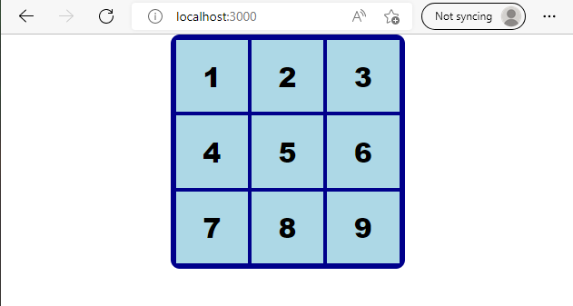

## Tic Tac Toe

Now a simple react Noughts and crosses game can be created.

This follows a [basic tutorial](https://reactjs.org/tutorial/tutorial.html) on the React website.

However this tutorial uses the class approach which is dated so I look at the hooks based approach for comparison.

I am not following the tutorial through to the very end, which you can.  There is a very good example of hooks based solution worked through to the end at  ["Tic Tac Toe - with React Hooks"](https://www.freecodecamp.org/news/learn-how-to-build-tic-tac-toe-with-react-hooks/)

This leads the reader through the [scrimba site](https://scrimba.com/scrim/cPkGD8Sm?pl=pgGEGtW)

Some of this is reproduced here.  Note that this uses React version 16 so I will be checking this against React 18 as I pass through.

## Components

We already have an index.js file which will be the starting point of the application.

```javascript
import React from 'react';
import ReactDOM from 'react-dom/client';
import './index.css';
import App from './App';
import reportWebVitals from './reportWebVitals';

const root = ReactDOM.createRoot(document.getElementById('root'));
root.render(
  <React.StrictMode>
    <App />
  </React.StrictMode>
);

// If you want to start measuring performance in your app, pass a function
// to log results (for example: reportWebVitals(console.log))
// or send to an analytics endpoint. Learn more: https://bit.ly/CRA-vitals
reportWebVitals();
```

This will render into an element with id = "root" on the HTML page.

Index.js imports App.js so  this will be the main module for the application.  This can be simplified to:

```javascript
import './App.css';

function App() {
  return (
    <div className="App">
      Tic Tac Toe
    </div>
  );
}

export default App;
```

Components will be added in a new folder src/components.

* src/components.Game.js will hold the game logic.
* src/components.Board.js will hold the playing area
* src/components.Square.js will define one playing square

These are initially set up with placeholder text.

**components/Board.js**

```javascript
import React from 'react';

const Board = () => <div>Board</div>

export default Board;
```
This uses and arrow function to define the Board, but regular functions will also work just as well.

**components/Game.js**
```javascript
import React from 'react';

  const Game = () => <div>Game</div>

export default Game;
```

**components/Square.js**
```javascript
import React from 'react';

const Square = () => <div>Square</div>

export default Square;
```

Now the Game can be imported into App.js and displayed.

```javascript
import './App.css';
import Game from 'components/Game';

function App() {
  return (
    <div className="App">
      <Game />;
    </div>
  );
}

export default App;
```

### Square

First component to create is the square in components/Square.js.  Using arrow functions the return is implicit.

```javascript
import React from 'react';

const Square = ({ value, onClick }) => (
    <button onClick={onClick}>
        {value}
    </button>
);

export default Square;
```
The button will receive a prop object which is destructured to separate out value and onClick within the function without the need to refer to props.onClick and props.value.

### Board

Modify components/Board.js to display nine squares with values ranging 1 - 9.

```javascript
import React from 'react';
import Square from './Square';

const Board = ({ squares, onClick }) => (
    <div>
        <Square value="1" onClick={() => onClick("dummy value")} />
        <Square value="2" onClick={() => onClick("dummy value")} />
        <Square value="3" onClick={() => onClick("dummy value")} />
        <Square value="4" onClick={() => onClick("dummy value")} />
        <Square value="5" onClick={() => onClick("dummy value")} />
        <Square value="6" onClick={() => onClick("dummy value")} />
        <Square value="7" onClick={() => onClick("dummy value")} />
        <Square value="8" onClick={() => onClick("dummy value")} />
        <Square value="9" onClick={() => onClick("dummy value")} />
    </div>
)

export default Board;
```

### Game

Import Board to the game and build the Game function.  This will hold the game logic so will need an explicit return function.

The board will need to handle a click and pass this through to the square.  This also needs empty stub functions for game logic to complete later to jumpTo and renderMoves.

```javascript
import React from 'react';
import Board from './Board';

const Game = () => {
    
    const handleClick = () => {
        
    }
    
    const jumpTo = () => {
        
    }
    
    return (
        <Board onClick={handleClick} />
    )
}

export default Game;
```

The app should now be viewable, but does nothing yet.


### Style on squares

Rather than using the css file for the moment, style can be defined as a constant using JSON object format.

This is created in components/square.js so that it is local to the Square function and can be referenced as a prop without the need to pass this through the props list.

The style is added by a style attribute in the `<button>` tag.

```javascript
import React from 'react';

const style = {
	background: "lightblue",
	border: "2px solid darkblue",
	fontSize: "30px",
	fontWeight: "800",
	cursor: "pointer",
	outline: "none",
};

const Square = ({ value, onClick }) => (
    <button style={style} onClick={onClick}>
        {value}
    </button>
);

export default Square;
```

### Style on Board

The style for the board can use the same const name as the code is encapsulated in a module.

The gridTemplate takes care of presenting the squares on three rows.

```javascript
import React from 'react';
import Square from './Square';

const style = {
	border: "4px solid darkblue",
	borderRadius: "10px",
	width: "250px",
	height: "250px",
	margin: "0 auto",
	display: "grid",
	gridTemplate: "repeat(3, 1fr) / repeat(3, 1fr)",
};

const Board = ({ squares, onclick }) => (
    <div style={style}>
        <Square value="1" onClick={() => onClick("dummy value")} />
        <Square value="2" onClick={() => onClick("dummy value")} />
        <Square value="3" onClick={() => onClick("dummy value")} />
        <Square value="4" onClick={() => onClick("dummy value")} />
        <Square value="5" onClick={() => onClick("dummy value")} />
        <Square value="6" onClick={() => onClick("dummy value")} />
        <Square value="7" onClick={() => onClick("dummy value")} />
        <Square value="8" onClick={() => onClick("dummy value")} />
        <Square value="9" onClick={() => onClick("dummy value")} />
    </div>
)

export default Board;
```



### Calculate Winner

This is copied from the original tutorial on the Reactjs.org site.

A function calculateWinner is added to helpers.js in the same folder as App.js (i.e. not in the components folder.).

The array of lines represents the sequence of sqares which would be covered drawing a lines across, down or cornerwise.
Each of these sequences needs to be tested in turn for the criterion of winning which is that three array elements in the sequence are identical and not null.

Null represents false so if(squares[a]) tests if the array is non-null.

**helpers.js**
```javascript
function calculateWinner(squares) {
  const lines = [
    [0, 1, 2],
    [3, 4, 5],
    [6, 7, 8],
    [0, 3, 6],
    [1, 4, 7],
    [2, 5, 8],
    [0, 4, 8],
    [2, 4, 6],
  ];
  for (let i = 0; i < lines.length; i++) {
    const [a, b, c] = lines[i];
    if (squares[a] && squares[a] === squares[b] && squares[a] === squares[c]) {
      return squares[a];
    }
  }
  return null;
}
```

### Game logic

