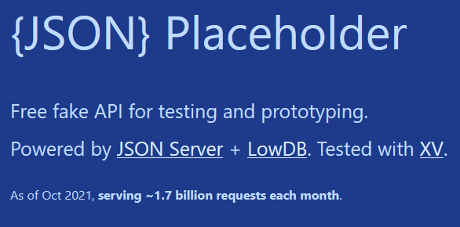
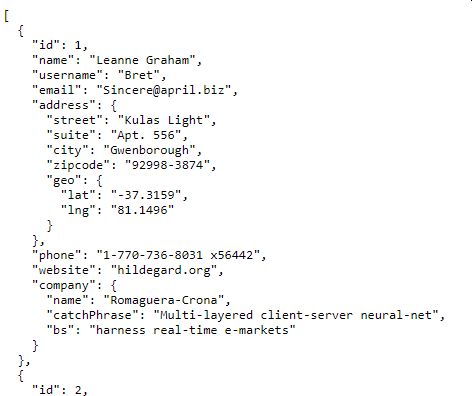
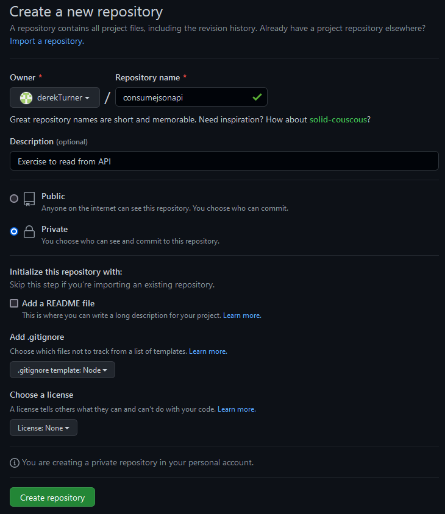
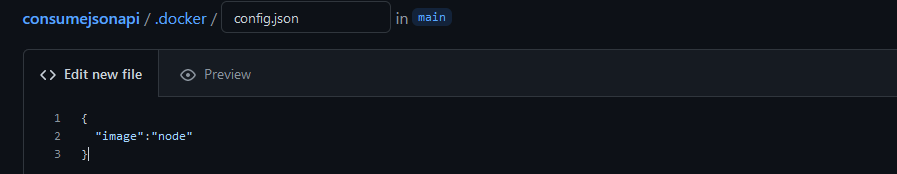
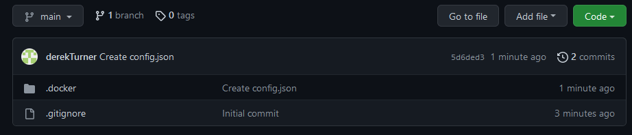
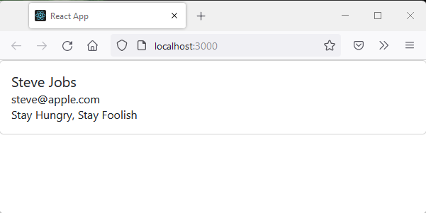
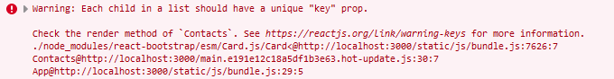

## Consume Json API

In this section we fetch information from a REST API and display the results.

## Sample Datasets

There is a json API for development at typicode.com. To view this browse to :

>https://jsonplaceholder.typicode.com/



On this page you will find a 'try it script', a link to a more detailed guide and and six common resources.

JSONPlaceholder comes with a set of 6 common resources:

/posts	100 posts
/comments	500 comments
/albums	100 albums
/photos	5000 photos
/todos	200 todos
/users	10 users


> http://jsonplaceholder.typicode.com/users

Another useful site for development is a placeholder.com where you can store images online as a developer before you have your own storage enacted.

> https://placeholder.com/


jsonplaceholder uses this as a link in its /photos repository.

With a Github repository you can also create a JSON file and let typicode produce a fake REST API based on your own data here.

As an example of use, to get a response from the JSON| placeholder API issue a GET request from the browser by entering:

>http://jsonplaceholder.typicode.com/users

See the data returned to the browser.



There are several tutorials on the web which utilise this resource.  For the [todo list for example](https://www.techiediaries.com/react-json-fetch-rest-api-bootstrap/)

For the user list there is a  [ tutorial on Pusher.com](https://pusher.com/tutorials/consume-restful-api-react) to retrieve data from the /user API

## Reading user API

I could carry on running with the development environment from the last section, but instead I will start a new one.

### setup environment

Create a github repository.




Add the .docker/config.json file

```code
{
  "image":"node"
}
```



Scroll down and commit this change.

Now you have two files ready.



In docker desktop, create a development environment.


Che that the dev environment you want to use ithe one which iscurrently running and open  in  vscode.

From the shell, load the create-react-app template.

> npx create-react-app my-app

Wait a while for this to run.

From time to time you may see update messages such as:

```code
New patch version of npm available! 8.19.1 -> 8.19.2
npm notice Changelog: https://github.com/npm/cli/releases/tag/v8.19.2
npm notice Run npm install -g npm@8.19.2 to update!
```

At the moment it won't work to follow such prompts to get your system up to date.

> npm install -g npm@8.19.2

```code
EACCES: permission denied
```

This is because you are not the root user.  Ignore this for now and we will return to this later.

Open the folder in visual studio code (or your preferred editor) and look in the src folder and find App.js.

> cd my-app

Find the starter code in App.js

```javascript
import logo from './logo.svg';
import './App.css';

function App() {
  return (
    <div className="App">
      <header className="App-header">
        
        <p>
          Edit <code>src/App.js</code> and save to reload.
        </p>
        <a
          className="App-link"
          href="https://reactjs.org"
          target="_blank"
          rel="noopener noreferrer"
        >
          Learn React
        </a>
      </header>
    </div>
  );
}

export default App;
```


The code from the following tutorial should now be copied to over write the App.js.

### Styling with Bootstrap

Modify App.js

Remove lines which are not needed for this example:

```javaScript
import logo from './logo.svg';
import './App.css';
```
Also remove the JSX which will be replaced:

```javascript
   <div className="App">
      <header className="App-header">
        
        <p>
          Edit <code>src/App.js</code> and save to reload.
        </p>
        <a
          className="App-link"
          href="https://reactjs.org"
          target="_blank"
          rel="noopener noreferrer"
        >
          Learn React
        </a>
      </header>
    </div>
```    
Add the Component into the import React line then App.js becomes for starters:

```javascript
import React, { Component } from 'react';
function App() {
  return (

  );
}

export default App;
```

The import line will appear light to denote a warning as you have not yet used the Component in the module.


In public/manifest.json you can remove the icons which are not going to be used:

```JSON
  "icons": [
    {
      "src": "favicon.ico",
      "sizes": "64x64 32x32 24x24 16x16",
      "type": "image/x-icon"
    },
    {
      "src": "logo192.png",
      "type": "image/png",
      "sizes": "192x192"
    },
    {
      "src": "logo512.png",
      "type": "image/png",
      "sizes": "512x512"
    }
  ],
```

In public/index.html remove the link to the favicon icon which is not being used.

You can also delete the logo png files.


```html
<link rel="icon" href="%PUBLIC_URL%/favicon.ico" />
```

To add style to the app [React Bootstrap](https://react-bootstrap.github.io/) can be used.

> npm install react-bootstrap bootstrap


Import bootstrap CSS  to the  beginning of src/index.js

```javascript
import 'bootstrap/dist/css/bootstrap.css';
// Put any other imports below so that CSS from your
// components takes precedence over default styles.
import React from 'react';
import ReactDOM from 'react-dom/client';
import './index.css';
import App from './App';
import reportWebVitals from './reportWebVitals';

const root = ReactDOM.createRoot(document.getElementById('root'));
root.render(
  <React.StrictMode>
    <App />
  </React.StrictMode>
);

// If you want to start measuring performance in your app, pass a function
// to log results (for example: reportWebVitals(console.log))
// or send to an analytics endpoint. Learn more: https://bit.ly/CRA-vitals
reportWebVitals();
```

Returning to **App.js** add the code to render a card using the bootstrap classes: [card, card-body etc](https://react-bootstrap.github.io/components/cards/)

```javascript
import React, { Component } from 'react';
import Card from 'react-bootstrap/Card';

function App() {
  return (
  <Card>
    <Card.Body>
      <Card.Title>Steve Jobs</Card.Title>
      <Card.Subtitle>steve@apple.com</Card.Subtitle>
      <Card.Text>Stay Hungry, Stay Foolish</Card.Text>
    </Card.Body>
  </Card>
  );
}

export default App;

```

To view the output

> npm start




### Reading Json with a class based solution

Calling the jsonplaceholder site from the the browser with 

>http://jsonplaceholder.typicode.com/users

Yields a JSON response which shows all users.

> http://jsonplaceholder.typicode.com/users/1

Shows the JSON data for user id 1 and this is typical of the REST format.

```JSON
{
  "id": 1,
  "name": "Leanne Graham",
  "username": "Bret",
  "email": "Sincere@april.biz",
  "address": {
    "street": "Kulas Light",
    "suite": "Apt. 556",
    "city": "Gwenborough",
    "zipcode": "92998-3874",
    "geo": {
      "lat": "-37.3159",
      "lng": "81.1496"
    }
  },
  "phone": "1-770-736-8031 x56442",
  "website": "hildegard.org",
  "company": {
    "name": "Romaguera-Crona",
    "catchPhrase": "Multi-layered client-server neural-net",
    "bs": "harness real-time e-markets"
  }
}
```

To store this create a class App in **App.js** which extends Component.  This will replace the function App(){ ... }.  Leaving both would leave an error because when the function was defined the name would already have been allocated to the class.

```javascript
class App extends Component {

  state = {
    contacts: []
  }

}  
```
Contacts can now hold an array of data.

To call the data add a componentDidMount() method in the App class which will run when the component starts.

Within this the fetch method calls for a JSON response which is a list of all users.

[MSDN provides a good reference for the action of Fetch and its options.](https://developer.mozilla.org/en-US/docs/Web/API/Fetch_API/Using_Fetch)

The format of Fetch is a promise which is completed by .then when the data is returned asynchronously.  [For more on promises look to Mozilla developer.](https://developer.mozilla.org/en-US/docs/Web/JavaScript/Reference/Global_Objects/Promise#:~:text=Promises%20in%20JavaScript%20represent%20processes%20that%20are%20already,the%20lazily-evaluated%20expression%2C%20and%20f%20%28%29%20to%20evaluate.)

For us we need to know that the .then lines below are a standard code format which we can reuse. .catch will provide an error message if the fetch fails. Then the results are added to the contacts state.

```javascript
import React, { Component } from 'react';
import Card from 'react-bootstrap/Card';

class App extends Component {

  state = {
    contacts: []
  }
  componentDidMount() {
    fetch('http://jsonplaceholder.typicode.com/users')
    .then(res => res.json())
    .then((data) => {
      this.setState({ contacts: data })
    })
    .catch(console.log)
  }
}  

export default App;
```

The line:

```javascript
.then(res => res.json())
```
Parses the result to JSON object and

```javascript
        .then((data) => {
          this.setState({ contacts: data })
```
Puts the JSON data into the contacts state.


Now a component is needed to display the data to a card.

Create a new directory components inside the src folder and in this create a new file **contacts.js**

Working with a components folder in this way is pretty standard.

The constant Contacts will receive a prop and use it to print out html with the classes required by bootsrap cards.

```javascript
// src/components/contacts.js

import React from 'react'
import Card from 'react-bootstrap/Card';

const Contacts = ({ contacts }) => {
  return (
    <div>
      <center><h1>Contact List</h1></center>
      {contacts.map((contact) => (
        <Card>
          <Card.Body>
          <Card.Title>{contact.name}</Card.Title>
          <Card.Subtitle>{contact.email}</Card.Subtitle>
          <Card.Text>{contact.company.catchPhrase}</Card.Text>
            </Card.Body>
        </Card>

      ))}
    </div>
  )
};

export default Contacts
```
[The use of .map is described by mozilla developer](https://developer.mozilla.org/en-US/docs/Web/JavaScript/Reference/Global_Objects/Array/map), it produces a new array which is the result of applying a specified function to every item in the array. So the function which provides html divs is applied to every item in the contacts array.

The component Contacts now must be rendered by **App.js**

So the component has to be imported into the App.  Note that the bootstrap code was imported into contacts.js so it no longer needs to be imported into app.js.

```javascript
// src/App.js

    import React, { Component } from 'react';
    import Contacts from './components/contacts';
```

Now add a render() method to the end of class App

```javascript
      render() {
        return (
          <Contacts contacts={this.state.contacts} />
        )
      }
```

The full listing of App.js now becomes:

```javascript
import React, { Component } from 'react';
import Contacts from './components/contacts';

class App extends Component {

  state = {
    contacts: []
  }
  componentDidMount() {
    fetch('http://jsonplaceholder.typicode.com/users')
    .then(res => res.json())
    .then((data) => {
      this.setState({ contacts: data })
    })
    .catch(console.log)
  }
  render() {
    return (
      <Contacts contacts={this.state.contacts} />
    )
  }
}  

export default App;
```
>CTRL C 

to close the development server and reissue

> npm start 


to restart and recompile.


When you are finished, don't forget to commit your changes and synchronise so that the vital code will be stored on github.

### key warning

Although this code is running, looking at the browser inspector will identify a warning.



This means that each time <Card> is created in the map it should have a uniqe key property.


To generats a unique key an index can be produced with the map structure and that will be unique on each pass.  This can be added as a prop to the Card.

      {contacts.map((contact, index) => (
        <Card key={index}>

This removes the warning, but the page operation is not changed.

The full listing of **components/contacts.js** becomes:

```javascript
// src/components/contacts.js

import React from 'react'
import Card from 'react-bootstrap/Card';

const Contacts = ({ contacts }) => {
  return (
    <div>
      <center><h1>Contact List</h1></center>
      {contacts.map((contact, index) => (
        <Card key={index}>
          <Card.Body>
          <Card.Title>{contact.name}</Card.Title>
          <Card.Subtitle>{contact.email}</Card.Subtitle>
          <Card.Text>{contact.company.catchPhrase}</Card.Text>
            </Card.Body>
        </Card>

      ))}
    </div>
  )
};

export default Contacts
```

### Challenge

Reconfigure this code to use a function component.

Experiment with bootstrap to change the style of the list.