___
title: "Build Tic Tac Toe App"  
metaTitle: "IT 05"  
metaDescription: "Week 5 Lab"
___


# Make and deploy a simple react app

[React](https://reactjs.org) is a javascript library for building user interfaces.

A docker image has been has created which will act as a template to create containers with a starting setup drawn from create-react-app.  A new container can be opened and in this a simple app can be developed.

OWhen the app is complete the it can be built and the publishable files will be just those left int he build folder, all the rest (including thousands of node modules) will be superfluous.

After building we will use a second docker container running a web server and transfer only the built artefact into it.  This will produce a much smaller image which should serve the final (production) version of the app.

## Building a simple app

I will follow through the develop and build stages of [simple tutorial](https://reactjs.org/tutorial/tutorial.html) on the react website.  All the code will be in my react1App folder.

### Set up Tic Tac Toe (alias noughts and crosses)

In the react1App src directory duplicate copies of App.js and App.css (just so you can get back to the starting point if you need to).

The full tutorial can be found [here](https://reactjs.org/tutorial/tutorial.html#overview
) The discussion in the tutorial follows the class component format and I will refactor this to the function component style with react hooks I go through.

The starter code for the tutorial is [here](https://codepen.io/gaearon/pen/oWWQNa?editors=0010).

Double click or drag on the left hand side codepen labels to open up the css and js tabs.

The tutorial uses a class called game and causes it to be rendered. Areas to edit are labelled such as /* TODO */ 

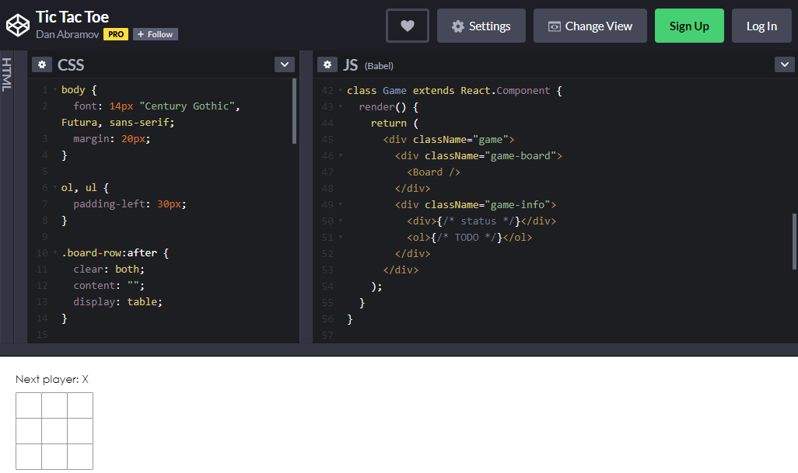

You will need to make a codepen account then return to this page.  At the very bottom of the page is an export buton which allows a zip file of the starter code to be downloaded. Or you could just cut and paste - there is not much code here.  Running on CodePen we are relying on the react dependancies being supplied by the platform.  For us we need the dependencies in our reactApp1 folder.

I could carry on running with the container from the previous lab sheet, but instead I will create a new container from my starting image.

> docker run -it --name tictactoe react_starter:1

```code
Welcome to Node.js v16.10.0.
Type ".help" for more information.
>
```

The docker desktop confirms the container is running.

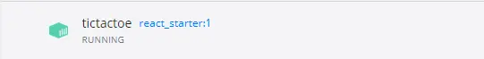

To see this from the console, open a second powershell console in visual studio code and issue a docker command line command.

>docker container ps

This shows only the running containers.

```code
CONTAINER ID   IMAGE             COMMAND                  CREATED         STATUS         PORTS     NAMES
edcc7a210dc0   react_starter:1   "docker-entrypoint.s…"   6 minutes ago   Up 6 minutes             tictactoe
```

I am going to use the code of the reactApp1 as the starting point for the noughts and crosses app so I will just copy my folder reactApp1 to ticTacToe.

Now I will open up the container using the remote containers VSC extension.

>Press f1

You can select the command to open a running container.

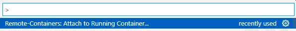

Then select the container for tictactoe.

Visual Studio Code opens a new window ready to work in this new container.

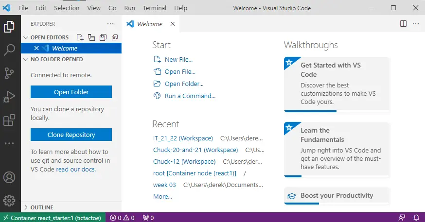

Close the welcome page and open the remote folder selecting the root folder.

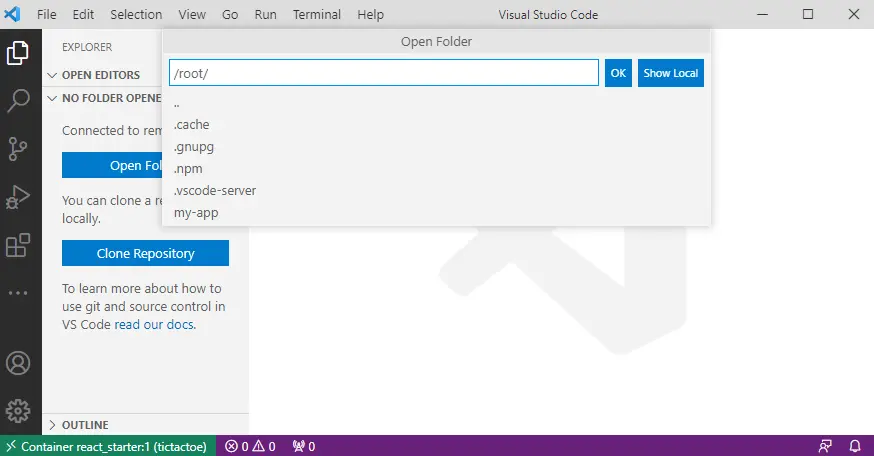


Open the folder in visual studio code (or your preferred editor) and look in the src folder and find App.js.

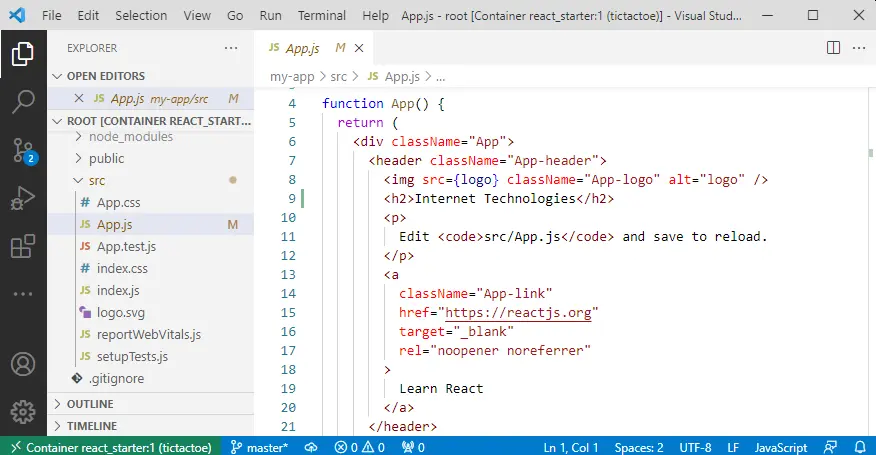

The code from the demo app class thould now be copied to over write the App.js.  The code pen environment included dependencies so we need to import thes at the top of the file.

App.js becomes:

```javascript
// tic tac toe tutorial
import React from 'react';
// eslint-disable-next-line
import logo from './logo.svg';
import './App.css';

class Square extends React.Component {
  render() {
    return (
      <button className="square">
        {/* TODO */}
      </button>
    );
  }
}

class Board extends React.Component {
  renderSquare(i) {
    return <Square />;
  }

  render() {
    const status = 'Next player: X';

    return (
      <div>
        <div className="status">{status}</div>
        <div className="board-row">
          {this.renderSquare(0)}
          {this.renderSquare(1)}
          {this.renderSquare(2)}
        </div>
        <div className="board-row">
          {this.renderSquare(3)}
          {this.renderSquare(4)}
          {this.renderSquare(5)}
        </div>
        <div className="board-row">
          {this.renderSquare(6)}
          {this.renderSquare(7)}
          {this.renderSquare(8)}
        </div>
      </div>
    );
  }
}


function App() {
  return (  
    <div className="game">
    <div className="game-board">
      <Board />
    </div>
    <div className="game-info">
      <div>{/* status */}</div>
      <ol>{/* TODO */}</ol>
    </div>
  </div>
  );
}

export default App;

```

This tutorial is using class components so I will refactor these as I go along.

App.js then is refactored and simplified to:

```javascript
// tic tac toe tutorial
import React from 'react';
import {useState} from 'react';
// eslint-disable-next-line
// import logo from './logo.svg';
import './App.css';

function Square({i}) {
  return (
    <button className="square">
      {/* TODO */}
    </button>
  );
  
}

function Board () {
   
    const [turn, setTurn] = React.useState('Next player: X');
    
    return (
      <div>
        <div className="status">{turn}</div>
        <div className="board-row"> 
          <Square i="0" />
          <Square i="1" />
          <Square i="2" />
        </div>
        <div className="board-row">
          <Square i="3" />
          <Square i="4" />
          <Square i="5" />
        </div>
        <div className="board-row">
          <Square i="6" />
          <Square i="7" />
          <Square i="8" /> 
            
        </div>
      </div>
    );
}


function App() {
  return (  
    <div className="game">
      <div className="game-board">
        <Board />
      </div>
      <div className="game-info">
        <div>{/* status */}</div>
        <ol>{/* TODO */}</ol>
      </div>
  </div>
  );
}

export default App;

```

The tutorial had style which can be copied to the bottom of App.css.  Any sections describing game have been merged into the App styles.

App.css can then be overwritten to:

```css
.App {
  text-align: center;
  display: flex;
  flex-direction: row;
}

.App-info {
  margin-left: 20px;
}

.App-logo {
  animation: App-logo-spin infinite 20s linear;
  height: 40vmin;
  pointer-events: none;
}

.App-header {
  background-color: #282c34;
  min-height: 100vh;
  display: flex;
  flex-direction: column;
  align-items: center;
  justify-content: center;
  font-size: calc(10px + 2vmin);
  color: white;
}

.App-link {
  color: #61dafb;
}

@keyframes App-logo-spin {
  from {
    transform: rotate(0deg);
  }
  to {
    transform: rotate(360deg);
  }
}

body {
  font: 14px "Century Gothic", Futura, sans-serif;
  margin: 20px;
}

ol, ul {
  padding-left: 30px;
}

.board-row:after {
  clear: both;
  content: "";
  display: table;
}

.status {
  margin-bottom: 10px;
}

.square {
  background: #fff;
  border: 1px solid #999;
  float: left;
  font-size: 24px;
  font-weight: bold;
  line-height: 34px;
  height: 34px;
  margin-right: -1px;
  margin-top: -1px;
  padding: 0;
  text-align: center;
  width: 34px;
}

.square:focus {
  outline: none;
}

.kbd-navigation .square:focus {
  background: #ddd;
}


```


The container now has refactored startup files from the ticTacToe codepen tutorial.  The container is acting as a development environment, you don't need a new container for each app you make, but it can be convenient and a container is a lot smaller than a whole new virtual machine. 

I am gong to keep working in the remote container VSC window. I can open a terminal in that and see a bash shell with prompt.

```code
root@edcc7a210dc0:~# 
```
The details of the container ID will vary with different instances.

Now to start the app serving, move to the app directory.

>cd my-app

Then start the testing server in the container.

>HOST=0.0.0.0 && npm start

View the App in the browser


--- 

### Complete code for Tic Tac Toe (alias noughts and crosses)


The next section of the tutorial is about [passing through the props](https://reactjs.org/tutorial/tutorial.html#passing-data-through-props).

In App.js modify 

```javascript
class Board extends React.Component {
  renderSquare(i) {
    return <Square />;
  }
```
to

```javascript
class Board extends React.Component {
  renderSquare(i) {
    return <Square value={i} />;
  }
```
so that a prop named value is passed to the Square component.

Then update the \/\*todo*/ section of the Square class

```javascript
class Square extends React.Component {
  render() {
    return (
      <button className="square">
        {/* TODO */}
      </button>
    );
  }
}
```
to


```javascript
class Square extends React.Component {
  render() {
    return (
      <button className="square">
        {this.props.value}
      </button>
    );
  }
}
```
so that the value will be passed written onto the button when the Square is rendered.

renderSquare is a method of the board class so from within the board is referenced as this.renderSquare().  Numbers are passed as parameters which are assigned to the value prop of each instance of the Square.

```javascript
 <div className="board-row">
          {this.renderSquare(0)}
          {this.renderSquare(1)}
          {this.renderSquare(2)}
        </div>
        <div className="board-row">
          {this.renderSquare(3)}
          {this.renderSquare(4)}
          {this.renderSquare(5)}
        </div>
        <div className="board-row">
          {this.renderSquare(6)}
          {this.renderSquare(7)}
          {this.renderSquare(8)}
        </div>
```


For our **hook based example** we simply have to print the value of i which is passed to the function Square({i}) as a property.

The code only needs to change on one line!  The todo comment is replaced on line 11.

```javascript
// tic tac toe tutorial
import React from 'react';
import {useState} from 'react';
// eslint-disable-next-line
// import logo from './logo.svg';
import './App.css';

function Square({i}) {
  return (
    <button className="square">
      {i}
    </button>
  );
}

function Board () {
   
    const [turn, setTurn] = React.useState('Next player: X');
    
    return (
      <div>
        <div className="status">{turn}</div>
        <div className="board-row">
          <Square i="0" />
          <Square i="1" />
          <Square i="2" />
        </div>
        <div className="board-row">
          <Square i="3" />
          <Square i="4" />
          <Square i="5" />
        </div>
        <div className="board-row">
          <Square i="6" />
          <Square i="7" />
          <Square i="8" /> 
            
        </div>
      </div>
    );
}


function App() {
  return (  
    <div className="game">
      <div className="game-board">
        <Board />
      </div>
      <div className="game-info">
        <div>{/* status */}</div>
        <ol>{/* TODO */}</ol>
      </div>
  </div>
  );
}

export default App;

```

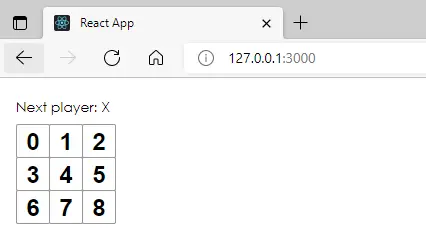


The next section of the tutorial is about [making an interactive component](https://reactjs.org/tutorial/tutorial.html#making-an-interactive-component).

Add an onClick event to the button to call the function alert using arrow function syntax.

```javascript
class Square extends React.Component {
  render() {
    return (
      <button className="square"  onClick={() => alert('click')}>
        {this.props.value}
      </button>
    );
  }
}
```
Add a constructor to the class Square so that it can have a state named value initilised to null.

```javascript
class Square extends React.Component {
  
  constructor(props) {
    super(props);
    this.state = {
      value: null,
    };
  }
  
  render() {
    return (
      <button className="square"  onClick={() => alert('click')}>
        {this.props.value}
      </button>
    );
  }
}
```
OK the alert function is just a built in javascript function to open an alert window that says click.  We need to swap this for the setState function which will change the value state to 'X' to denote a clicked square.

```javascript
 <button
        className="square"
        onClick={() => this.setState({value: 'X'})}
      >
```

Now modify the button tag so that it will cause the state.value to be displayed instead of the property value. (That's just to reinforce awareness of the difference between props and states).

```javascript
        {this.state.value}
```
Putting this together:

```javascript
  render() {
    return (
      <button
        className="square"
        onClick={() => this.setState({value: 'X'})}
      >
        {this.state.value}
      </button>
    );
  }
}
```
In the **hooks format** this means modifying the Square function so that it has a property value and a function to set this as setValue.  The value is always set to 'X' and this is displayed on the button when it renders.

The modified Square function is now.

```javascript
function Square({i}) {
  const [value, setValue] = React.useState(null);

  return (
    <button className="square"  onClick={() => setValue('X')}>
      {value}
    </button>
  );
}

```

Now clicking squares on the grid of buttons inserts X's.

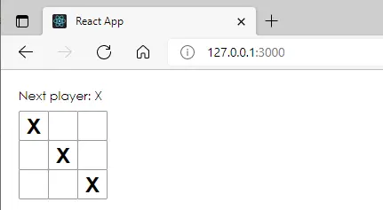

The next section of the tutorial is about [completing the game](https://reactjs.org/tutorial/tutorial.html#completing-the-game).

'X' and 'O' should be added in turn and a winner identified.

The board component will be modified to keep track of an array of 9 states corresponding to squares.  The state will be passed down from the board (as parent) to each square as a child).

Add a constructor to board and initialise its state with a squares array set to nulls.

```javascript
class Board extends React.Component {
  renderSquare(i) {
    return <Square value={i} />;
  }
```
becomes
```javascript
class Board extends React.Component {
  constructor(props) {
    super(props);
    this.state = {
      squares: Array(9).fill(null),
    };
  }

  renderSquare(i) {
    return <Square value={i} />;
  }
```
The array elements start as null and will be set to 'X' or 'O' as the game is played.

The boards method renderSquare is modified from:

```javascript
 renderSquare(i) {
    return <Square value={i} />;
  }
```
to

```javascript
 renderSquare(i) {
    return <Square value={this.state.squares[i]} />;
  }
```
to pass the array states down to the value prop of the square.

Now the Square class needs to display the value prop passed down rather than its own state.  

```javascript
{this.state.value}
```
becomes
```javascript
{this.props.value}
```

The *board* needs to control the onClick response.  The board will set a prop of the square named onClick.  By passing i as a parameter to handleClick the board handleClick method in the board will wb able to identify which square was clicked.  So the renderSquare method is changed from

```javascript
 renderSquare(i) {
    return <Square value={this.state.squares[i]} />;
  }
```
to

```javascript
renderSquare(i) {
    return (
      <Square
        value={this.state.squares[i]}
        onClick={() => this.handleClick(i)}
      />
    );
  }
```


The *Square* constructor can be *deleted* because the state of the square is no longer of interest.

The button tag in the Square class will now respond to the prop passed to it.

```javascript
onClick={() => this.setState({value: 'X'})}
```
will become

```javascript
onClick={() => this.props.onClick()}
```
Using the word onClick in two different contexts is a bit confusing here!

The board will need a handeClick method to read i to see which button was clicked and then add the response (for now 'X' ) to the appropriate array element.

```javascript
handleClick(i) {
    const squares = this.state.squares.slice();
    squares[i] = 'X';
    this.setState({squares: squares});
  }
```

In handleClick() the [javaScript slice function](https://www.w3schools.com/jsref/jsref_slice_array.asp) is used to create a copy of the state.squares array and assign this into the const squares.  (Again using the word squares for two different things is confusing).
The copy is then modified and written back to the state.squares array by setState.

React state data is treated as immutable, it should not be manipulated other than by setState.

If old copies of state are saved the programme will have a data history which can be undone.

An old copy could be compared with a new copy to see if it has changed.

Functional programming is a style in which the functions are pure.  

Pure functions:
 * return a value which depends only on input paramenters.
 * the same input parameters to a certain function always return the same value.

A pure function which multiplies the input by 4 cant be made to multiply by 3 by changing the value of a property.

React has an advanced concept of pure components.  Immutable data is a step towards this.

So Board becomes:
```javascript
class Board extends React.Component {
  constructor(props) {
    super(props);
    this.state = {
      squares: Array(9).fill(null),
    };
  }

  handleClick(i) {
    const squares = this.state.squares.slice();
    squares[i] = 'X';
    this.setState({squares: squares});
  }

  renderSquare(i) {
    return (
      <Square
        value={this.state.squares[i]}
        onClick={() => this.handleClick(i)}
      />
    );
  }

  render() {
    const status = 'Next player: X';

    return (
      <div>
        <div className="status">{status}</div>
        <div className="board-row">
          {this.renderSquare(0)}
          {this.renderSquare(1)}
          {this.renderSquare(2)}
        </div>
        <div className="board-row">
          {this.renderSquare(3)}
          {this.renderSquare(4)}
          {this.renderSquare(5)}
        </div>
        <div className="board-row">
          {this.renderSquare(6)}
          {this.renderSquare(7)}
          {this.renderSquare(8)}
        </div>
      </div>
    );
  }
}  

```

and Square becomes

```javascript
class Square extends React.Component {
  render() {
    return (
      <button
        className="square"
        onClick={() => this.props.onClick()}
      >
        {this.props.value}
      </button>
    );
  }
}
```
The square class does not have any state and only has a render method.  Since the board has a render all we need is to return the JSX to the board.  

There is no need for Square to be a class, expressing it as a (pure) function component makes it simpler without changing the result.

```javascript
function Square(props) {
  return (
    <button className="square" onClick={props.onClick}>
      {props.value}
    </button>
  );
}
```

In the **hooks format** this is now refactored to:

```javascript
// tic tac toe tutorial
import React from 'react';
import {useState} from 'react';
// eslint-disable-next-line
// import logo from './logo.svg';
import './App.css';

function Square({i, value, handler}) {
  const [sqareNumber, setSquareNumber] = React.useState({i});
  return (
    <button className="square" onClick={handler}>
      {value}
    </button>
  );
}

function Board () {
   
    const [turn, setTurn] = React.useState('Next player: X');
    const [squares, setSquares] = React.useState([null,null,null,null,null,null,null,null,null]);
    

    const setIndex = (index, newValue) => {
      const newSquares = [...squares];
      newSquares[index] = newValue;
      setSquares(newSquares);
    }

    function handleClick(index) {
      setIndex(index,'X');
    }  

    return (
      <div>
        <div className="status">{turn}</div>
        <div className="board-row">
          <button className="square" onClick={() => handleClick(0)}>{squares[0]}</button>
          <button className="square" onClick={() => handleClick(1)}>{squares[1]}</button>
          <button className="square" onClick={() => handleClick(2)}>{squares[2]}</button>
        </div>
        <div className="board-row">
          <button className="square" onClick={() => handleClick(3)}>{squares[3]}</button>
          <button className="square" onClick={() => handleClick(4)}>{squares[4]}</button>
          <button className="square" onClick={() => handleClick(5)}>{squares[5]}</button>
        </div>
        <div className="board-row">
          <button className="square" onClick={() => handleClick(6)}>{squares[6]}</button>
          <button className="square" onClick={() => handleClick(7)}>{squares[7]}</button>
          <button className="square" onClick={() => handleClick(8)}>{squares[8]}</button>
        </div>
      </div>
    );
}


function App() {
  return (  
    <div className="game">
      <div className="game-board">
        <Board />
      </div>
      <div className="game-info">
        <div>{/* status */}</div>
        <ol>{/* TODO */}</ol>
      </div>
  </div>
  );
}

export default App;

```

The visual operation of the app has not changed.

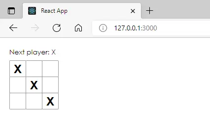

The next section of the tutorial is about [taking turns](https://reactjs.org/tutorial/tutorial.html#function-components).

A boolean state xIsNext is added to the board.  This is initially true, so the first square clicked is set to 'X', then it is toggled the handleClick() method to allow 'O', 'X' and so on.

The board constuctor:

```javascript
class Board extends React.Component {
  constructor(props) {
    super(props);
    this.state = {
      squares: Array(9).fill(null),
      xIsNext: true,
    };
  }
```
and handleClick():

```javascript
handleClick(i) {
    const squares = this.state.squares.slice();
    squares[i] = this.state.xIsNext ? 'X' : 'O';
    this.setState({
      squares: squares,
      xIsNext: !this.state.xIsNext,
    });
  }
```

Also update boards status from

```javascript
render() {
    const status = 'Next player: X';
```
to

```javascript
render() {
    const status = 'Next player: ' + (this.state.xIsNext ? 'X' : 'O');
```
So the full board code becomes:

```javascript
class Board extends React.Component {
  constructor(props) {
    super(props);
    this.state = {
      squares: Array(9).fill(null),
      xIsNext: true,
    };
  }

  handleClick(i) {
    const squares = this.state.squares.slice();
    squares[i] = this.state.xIsNext ? 'X' : 'O';
    this.setState({
      squares: squares,
      xIsNext: !this.state.xIsNext,
    });
  }

  renderSquare(i) {
    return (
      <Square
        value={this.state.squares[i]}
        onClick={() => this.handleClick(i)}
      />
    );
  }

  render() {
    const status = 'Next player: ' + (this.state.xIsNext ? 'X' : 'O');

    return (
      <div>
        <div className="status">{status}</div>
        <div className="board-row">
          {this.renderSquare(0)}
          {this.renderSquare(1)}
          {this.renderSquare(2)}
        </div>
        <div className="board-row">
          {this.renderSquare(3)}
          {this.renderSquare(4)}
          {this.renderSquare(5)}
        </div>
        <div className="board-row">
          {this.renderSquare(6)}
          {this.renderSquare(7)}
          {this.renderSquare(8)}
        </div>
      </div>
    );
  }
}  
```
The game now operates turns

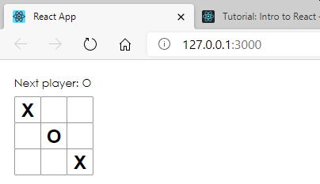


The next section of the tutorial is about [declaring a winner](https://reactjs.org/tutorial/tutorial.html#declaring-a-winner).

A function calculateWinner is added to App.js below class Board.

The array of lines represents the sequence of sqares which would be covered drawing a lines across, down or cornerwise.
Each of these sequences needs to be tested in turn for the criterion of winning which is that three array elements in the sequence are identical and not null.

Null represents false so if(squares[a]) tests if the array is non-null.


```javascript
function calculateWinner(squares) {
  const lines = [
    [0, 1, 2],
    [3, 4, 5],
    [6, 7, 8],
    [0, 3, 6],
    [1, 4, 7],
    [2, 5, 8],
    [0, 4, 8],
    [2, 4, 6],
  ];
  for (let i = 0; i < lines.length; i++) {
    const [a, b, c] = lines[i];
    if (squares[a] && squares[a] === squares[b] && squares[a] === squares[c]) {
      return squares[a];
    }
  }
  return null;
}
```

The calculateWinner() function is called in the Boards render function and then either the next go or congrats can be displayed.  The player who entered the last move is the winner.

```javascript
render() {
    const winner = calculateWinner(this.state.squares);
    let status;
    if (winner) {
      status = 'Winner: ' + winner;
    } else {
      status = 'Next player: ' + (this.state.xIsNext ? 'X' : 'O');
    }
```

Once the game is won further clicks should be ignored,and also a square should not be able to be clicked twice so handleClick() is modified:

```javascript
handleClick(i) {
    const squares = this.state.squares.slice();
    if (calculateWinner(squares) || squares[i]) {
      return;
    }
    squares[i] = this.state.xIsNext ? 'X' : 'O';
    this.setState({
      squares: squares,
      xIsNext: !this.state.xIsNext,
    });
  }
 ``` 
This is slightly inefficient because calculateWinner is called again.

The game should now work.

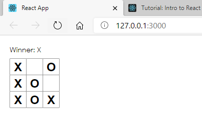

Enough!  The tutorial goes on to refine the game (and I leave this as an exercise below) but what I wan't to do is build this stage of the game.

Close the game in the terminal

>CTRL + C

Build the game.

> yarn build

Watch the terminal output:

```code
yarn run v1.22.4
$ react-scripts build
Creating an optimized production build...
Compiled successfully.

File sizes after gzip:

  40.23 KB  build/static/js/2.41ab7e33.chunk.js
  1017 B    build/static/js/main.e2da8b43.chunk.js
  770 B     build/static/js/runtime-main.a7dc1534.js
  733 B     build/static/css/main.efafe645.chunk.css

The project was built assuming it is hosted at /.
You can control this with the homepage field in your package.json.

The build folder is ready to be deployed.
You may serve it with a static server:

  yarn global add serve
  serve -s build

Find out more about deployment here:

  bit.ly/CRA-deploy

Done in 127.25s.
root@16d0b58ec69c:/usr/src#
```

The built files are added to a build folder in the reactApp1 folder.

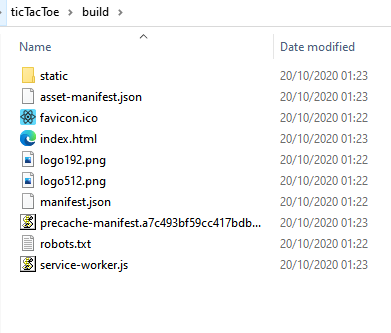

This is as static site.  It does not need node any more.  If you just point a browser directly at the index file to test it will not work.  A multifile page needs to be delivered by a server so that the browser can request all the files it needs.

You have a testing server in visual code.  So point visual code at the index file and open the file in the server.

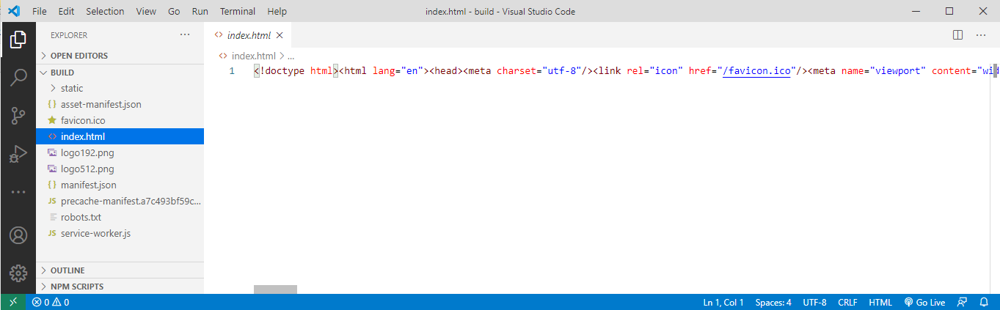

Note that the browser port has changed indicating that this is running in the testing server (which is not running node).

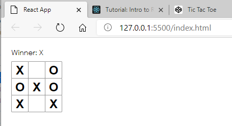

You could upload this to any server you liked!

---
# References

[Using arrays with react hooks](https://dev.to/andyrewlee/cheat-sheet-for-updating-objects-and-arrays-in-react-state-48np)
